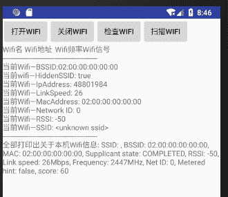

# Android WiFi 开发（WiFi 编程）实例演示

> 原文：[`c.biancheng.net/view/3186.html`](http://c.biancheng.net/view/3186.html)

Android SDK 提供了 WIFI 开发的相关 API，被保存在 android.net.wifi 和 android.net.wifi.p2p 包下。借助于 Android SDK 提供的相关开发类，可以方便地在 Android 系统的手机上开发基于 WIFI 的应用程序。

实例 WIFIDemo 演示了使用 WIFI 进行连接设备搜索并获取相应信息的过程，运行效果如图 1 所示。


图 1  WIFIDemo 运行结果
实例 WIFIDemo 中所使用的布局文件 main.xml 的内容如下：

```

<?xml version="1.0" encoding="utf-8"?>
<ScrollView xmlns:android="http://schemas.android.com/apk/res/android"
    android:id="@+id/mScrollView"
    android:layout_width="fill_parent"
    android:layout_height="wrap_content"
    android:scrollbars="vertical">

    <LinearLayout xmlns:android="http://schemas.android.com/apk/res/android"
        android:layout_width="fill_parent"
        android:layout_height="fill_parent"
        android:orientation="vertical">

        <LinearLayout
            android:layout_width="wrap_content"
            android:layout_height="wrap_content"
            android:orientation="horizontal">

            <Button
                android:id="@+id/open_bt"
                android:layout_width="wrap_content"
                android:layout_height="wrap_content"
                android:text="打开 wifi" />

            <Button
                android:id="@+id/close_bt"
                android:layout_width="wrap_content"
                android:layout_height="wrap_content"
                android:text="关闭 wifi" />

            <Button
                android:id="@+id/check_bt"
                android:layout_width="wrap_content"
                android:layout_height="wrap_content"
                android:text="检查 wifi" />

            <Button
                android:id="@+id/search_bt"
                android:layout_width="wrap_content"
                android:layout_height="wrap_content"
                android:text="扫描 wifi" />
        </LinearLayout>

        <TextView
            android:id="@+id/text"
            android:layout_width="wrap_content"
            android:layout_height="wrap_content"
            android:text="null" />
    </LinearLayout>
</ScrollView>
```

实例 WIFIDemo 中 AndroidManifest.xml 文件的代码如下：

```

<?xml version="1.0" encoding="utf-8"?>
<manifest xmlns:android="http://schemas.android.com/apk/res/android"
    package="introduction.android.wifidemo">

    <uses-sdk android:minSdkVersion="10" />

    <uses-permission android:name="android.permission.CHANGE_NETWORK_STATE" />
    <uses-permission android:name="android.permission.CHANGE_WIFI_STATE" />
    <uses-permission android:name="android.permission.ACCESS_NETWORK_STATE" />
    <uses-permission android:name="android.permission.ACCESS_WIFI_STATE" />

    <application
        android:allowBackup="true"
        android:icon="@mipmap/ic_launcher"
        android:label="@string/app_name"
        android:roundIcon="@mipmap/ic_launcher_round"
        android:supportsRtl="true"
        android:theme="@style/AppTheme">
        <activity android:name=".MainActivity">
            <intent-filter>
                <action android:name="android.intent.action.MAIN" />
                <category android:name="android.intent.category.LAUNCHER" />
            </intent-filter>
        </activity>
    </application>

</manifest>
```

实例 WIFIDemo 中主 Activity 文件 MainActivity.java 的代码如下：

```

package introduction.android.wifidemo;

import java.util.List;

import android.R.string;
import android.app.Activity;
import android.content.Context;
import android.net.wifi.ScanResult;
import android.net.wifi.WifiInfo;
import android.net.wifi.WifiManager;
import android.os.Bundle;
import android.view.View;
import android.view.View.OnClickListener;
import android.widget.Button;
import android.widget.ScrollView;
import android.widget.TextView;
import android.widget.Toast;

public class MainActivity extends Activity {
    private Button open_bt, close_bt, check_bt, search_bt;
    private TextView textView;
    private WifiManager wifiManager;
    private WifiInfo wifiInfo;
    private ScrollView scrollView;
    private List WifiConfiguration;
    private ScanResult scanResult;
    private List<ScanResult> WifiList;
    private StringBuffer stringBuffer = new StringBuffer();

    /**
     * Called when the activity is first created.
     */
    public void onCreate(Bundle savedInstanceState) {
        super.onCreate(savedInstanceState);
        setContentView(R.layout.activity_main);

        scrollView = (ScrollView) findViewById(R.id.mScrollView);
        open_bt = (Button) findViewById(R.id.open_bt);
        close_bt = (Button) findViewById(R.id.close_bt);
        check_bt = (Button) findViewById(R.id.check_bt);
        search_bt = (Button) findViewById(R.id.search_bt);
        textView = (TextView) findViewById(R.id.text);

        open_bt.setOnClickListener(new open_btListener());
        close_bt.setOnClickListener(new close_btListener());
        check_bt.setOnClickListener(new check_btListener());
        search_bt.setOnClickListener(new search_btListener());

    }

    class search_btListener implements OnClickListener {
        public void onClick(View v) {
            // TODO Auto-generated method stub
            wifiManager.startScan();
            WifiList = wifiManager.getScanResults();
            wifiInfo = wifiManager.getConnectionInfo();
            if (stringBuffer != null) {
                stringBuffer = new StringBuffer();
            }
            stringBuffer = stringBuffer.append("Wifi 名").append(" ").append("Wifi 地址").append(" ")
                    .append("Wifi 频率").append("").append("Wifi 信号")
                    .append("\n");
            if (WifiList != null) {
                for (int i = 0; i < WifiList.size(); i++) {
                    scanResult = WifiList.get(i);
                    stringBuffer = stringBuffer.append(scanResult.SSID).append(" ")
                            .append(scanResult.BSSID).append(" ")
                            .append(scanResult.frequency).append(" ")
                            .append(scanResult.level).append("\n");
                    textView.setText(stringBuffer.toString());
                }

                stringBuffer = stringBuffer.append
                        ("-----------------------------------------------").append("\n");
                textView.setText(stringBuffer.toString());
                stringBuffer = stringBuffer.append("当前 Wifi—BSSID").append(":").append(wifiInfo.getBSSID()).append("\n")
                        .append("当前 wifi—HiddenSSID").append(": ").append(wifiInfo.getHiddenSSID()).append("\n")
                        .append("当前 Wifi—IpAddress").append(": ").append(wifiInfo.getIpAddress()).append("\n")
                        .append("当前 Wifi—LinkSpeed").append(": ").append(wifiInfo.getLinkSpeed()).append("\n")
                        .append("当前 Wifi—MacAddress").append(": ").append(wifiInfo.getMacAddress()).append("\n")
                        .append("当前 Wifi—Network ID").append(": ").append(wifiInfo.getNetworkId()).append("\n")
                        .append("当前 Wifi—RSSI").append(": ").append(wifiInfo.getRssi()).append("\n")
                        .append("当前 Wifi—SSID").append(": ").append(wifiInfo.getSSID()).append("\n")
                        .append("-----------------------------------------------").append("\n")
                        .append("全部打印出关于本机 Wifi 信息").append(": ").append
                                (wifiInfo.toString());
                textView.setText(stringBuffer.toString());
            }
            //stringBuffer=stringBuffer.append("-----------------------------------------------").append("\n");
            //textView.setText()
        }
    }

    class check_btListener implements OnClickListener {
        public void onClick(View v) {
            // TODO Auto-generated method stub
            wifiManager = (WifiManager) MainActivity.this
                    .getSystemService(Context.WIFI_SERVICE);
            System.out.println(wifiManager.getWifiState());
            Toast.makeText(MainActivity.this,
                    "当前网卡状态为:" + change(), Toast.LENGTH_SHORT)
                    .show();
        }
    }

    class close_btListener implements OnClickListener {
        public void onClick(View v) {
            // TODO Auto-generated method stub
            wifiManager = (WifiManager) MainActivity.this
                    .getSystemService(Context.WIFI_SERVICE);
            wifiManager.setWifiEnabled(false);
            System.out.println(wifiManager.getWifiState());
            Toast.makeText(MainActivity.this,
                    "当前网卡状态为" + change(), Toast.LENGTH_SHORT)
                    .show();
        }
    }

    class open_btListener implements OnClickListener {
        public void onClick(View v) {
            // TODO Auto-generated method stub
            wifiManager = (WifiManager) MainActivity.this.getSystemService(Context.WIFI_SERVICE);
            wifiManager.setWifiEnabled(true);
            System.out.println(wifiManager.getWifiState());
            Toast.makeText(MainActivity.this,
                    "当前网卡状态为" + change(), Toast.LENGTH_SHORT)
                    .show();
        }
    }

    public String change() {
        String temp = null;
        switch (wifiManager.getWifiState()) {
            case 0:
                temp = "wifi 正在关闭 ING";
                break;
            case 1:
                temp = "wifi 已经关闭";
                break;
            case 2:
                temp = "wifi 正在打开 ING";
                break;
            case 3:
                temp = "wifi 已经打开";
                break;
            default:
                break;
        }
        return temp;
    }
}
```