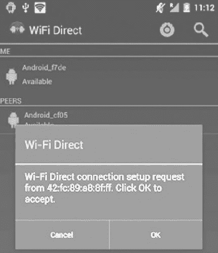

# Android WIFI Direct 开发实例演示

> 原文：[`c.biancheng.net/view/3199.html`](http://c.biancheng.net/view/3199.html)

实例 WIFIDirectDemo 改编 Android SDK 提供的实例，演示了通过 WIFI 搜寻连接点，建立连接，并进行数据传输的过程。

该实例包含 5 个类，说明说下：

*   WIFIDirectDemoActivity：用于注册 BroadcastReceiver，处理 UI，并管理连接点的生命周期。
*   WiFiDirectBroadcastReceiver：用于接收与 WIFI Direct 功能相关的 Intent。
*   DeviceListFragment：用于显示可以连接点列表及其状态。
*   FileTransferService：通过 TCP 协议在客户端与服务器之间进行文件传输的 IntentService。
*   IntentService：Sevice 的子类，用于处理异步请求。

该实例的运行效果如图 1 所示。
图 1  实例 WIFIDirectDemo 的运行效果
WIFIDirectDemo 的 AndroidManifest.xml 文件内容如下：

```

<?xml version="1.0" encoding="utf-8"?>
<manifest xmlns:android="http://schemas.android.com/apk/res/android"
    package="introduction.android.wifidirectdemo">

    <uses-sdk android:minSdkVersion="14" />

    <uses-permission android:name="android.permission.ACCESS_WIFI_STATE" />
    <uses-permission android:name="android.permission.CHANGE_WIFI_STATE" />
    <uses-permission android:name="android.permission.CHANGE_NETWORK_STATE" />
    <uses-permission android:name="android.permission.INTERNET" />
    <uses-permission android:name="android.permission.ACCESS_NETWORK_STATE" />
    <uses-permission android:name="android.permission.READ_CONTACTS" />
    <uses-permission android:name="android.permission.WRITE_EXTERNAL_STORAGE" />

    <!--Market filtering -->
    <uses-feature
        android:name="android.hardware.wifi.direct"
        android:required="true" />
    <application
        android:allowBackup="true"
        android:icon="@mipmap/ic_launcher"
        android:label="@string/app_name"
        android:roundIcon="@mipmap/ic_launcher_round"
        android:supportsRtl="true"
        android:theme="@style/AppTheme">
        <activity android:name=".WIFIDirectDemoActivity">
            <intent-filter>
                <action android:name="android.intent.action.MAIN" />

                <category android:name="android.intent.category.LAUNCHER" />
            </intent-filter>
        </activity>
    </application>

</manifest>
```

WIFIDirectDemoActivity.java 的代码如下：

```

package introduction.android.wifidirectdemo;

import android.app.Activity;
import android.content.BroadcastReceiver;
import android.content.Context;
import android.content.Intent;
import android.content.IntentFilter;
import android.net.wifi.p2p.WifiP2pConfig;
import android.net.wifi.p2p.WifiP2pDevice;
import android.net.wifi.p2p.WifiP2pManager;
import android.net.wifi.p2p.WifiP2pManager.ActionListener;
import android.net.wifi.p2p.WifiP2pManager.Channel;
import android.net.wifi.p2p.WifiP2pManager.ChannelListener;
import android.os.Bundle;
import android.provider.Settings;
import android.util.Log;
import android.view.Menu;
import android.view.MenuInflater;
import android.view.MenuItem;
import android.view.View;
import android.widget.Toast;

public class WIFIDirectDemoActivity extends Activity implements ChannelListener, DeviceListFragment.WiFiPeerListAdapter.DeviceActionListener {

    public static final String TAG = "wifidirectdemo";
    private WifiP2pManager manager;
    private boolean isWifiP2pEnabled = false;
    private boolean retryChannel = false;
    private final IntentFilter intentFilter = new IntentFilter();
    private Channel channel;
    private BroadcastReceiver receiver = null;

    public void setIsWifiP2pEnabled(boolean isWifiP2pEnabled) {
        this.isWifiP2pEnabled = isWifiP2pEnabled;
    }

    public void onCreate(Bundle savedInstanceState) {
        super.onCreate(savedInstanceState);
        setContentView(R.layout.main);

        // add necessary intent values to be matched.
        intentFilter.addAction(WifiP2pManager.WIFI_P2P_STATE_CHANGED_ACTI0N);
        intentFilter.addAction(WifiP2pManager.WIFI_P2P_PEERS_CHANGED_ACTI0N);
        intentFilter.addAction(WifiP2pManager.WIFI_P2P_C0NNECTI0N_CHANGED_ACTI0N);
        intentFilter.addAction(WifiP2pManager.WIFI_P2P_THIS_DEVICE_CHANGED_ACTI0N);
        manager = (WifiP2pManager) getSystemService(Context.WIFI_P2P_SERVICE);
        channel = manager.initialize(this, getMainLooper(), null);
    }

    /**
     * register the BroadcastReceiver with the intent values to be matched
     */
    public void onResume() {
        super.onResume();
        receiver = new WiFiDirectBroadcastReceiver(manager, channel, this);
        registerReceiver(receiver, intentFilter);
    }

    public void onPause() {
        super.onPause();
        unregisterReceiver(receiver);
    }
    /*
    *Remove all peers and clear all fields.This is called on
    *BroadcastReceiver receiving a state change event.
    */

    public void resetData() {
        DeviceListFragment fragmentList = (DeviceListFragment) getFragmentManager()
                .findFragmentById(R.id.frag_list);
        DeviceDetailFragment1 fragmentDetails = (DeviceDetailFragment1) getFragmentManager().findFragmentById(R.id.frag_detail);
        if (fragmentList != null) {
            fragmentList.clearPeers();
        }
        if (fragmentDetails != null) {
            fragmentDetails.resetViews();
        }
    }

    public boolean onCreateOptionsMenu(Menu menu) {
        MenuInflater inflater = getMenuInflater();
        inflater.inflate(R.menu.action_items, menu);
        return true;
    }

    public boolean onOptionsItemSelected(MenuItem item) {
        switch (item.getItemId()) {
            case R.id.atn_direct_enable:
                if (manager != null && channel != null) {
                    startActivity(new Intent(Settings.ACTION_WIRELESS_SETTINGS));
                } else {
                    Log.e(TAG, "channel or manager is null");
                }
                return true;
            case R.id.atn_direct_discover:
                if (!isWifiP2pEnabled) {
                    Toast.makeText(WIFIDirectDemoActivity.this, R.string.p2p_off_warning, Toast.LENGTHJSHORT).show();
                    return true;

                }
                final DeviceListFragment fragment = (DeviceListFragment) getFragmentManager().findFragmentByld(R.id.frag_list);
                fragment.onInitiateDiscovery();
                manager.discoverPeers(channel, new WifiP2pManager.ActionListener() {
                    public void onSuccess() {
                        Toast.makeText(WIFIDirectDemoActivity.this, "Discovery Initiated", Toast.LENGTH_SHORT).show();
                    }

                    public void onFailure(int reasonCode) {
                        Toast.makeText(WIFIDirectDemoActivity.this, "Discovery Failed " + reasonCode, Toast.LENGTH_SHORT).show();
                    }
                });
                return true;
            default:
                return super.onOptionsItemSelected(item);
        }
    }

    public void showDetails(WifiP2pDevice device) {
        DeviceDetailFragmentl fragment = (DeviceDetailFragmentl) getFragmentManager().findFragmentById(R.id.frag_detail);
        fragment.showDetails(device);
    }

    public void connect(WifiP2pConfig config) {
        manager.connect(channel, config, new ActionListener() {
            public void onSuccess() {
                // WiFiDirectBroadcastReceiver will notify us. Ignore for now.
            }

            public void onFailure(int reason) {
                Toast.makeText(WIFIDirectDemoActivity.this, "Connect failed. Retry.", Toast.LENGTH_SHORT).show();
            }
        });
    }

    public void disconnect() {
        final DeviceDetailFragmentl fragment = (DeviceDetailFragmentl) getFragmentManager().findFragmentById(R.id.frag_detail);
        fragment.resetViews();
        manager.removeGroup(channel, new ActionListener() {
            public void onFailure(int reasonCode) {
                Log.d(TAG, "Disconnect failed. Reason :" + reasonCode);
            }

            public void onSuccess() {
                fragment.getView().setVisibility(View.GONE);
            }
        });
    }

    public void onChannelDisconnected() {
        if (manager != null && !retryChannel) {
            Toast.makeText(this, "Channel lost. Trying again", Toast.LENGTH_LONG).show();
            resetData();
            retryChannel = true;
            manager.initialize(this, getMainLooper(), this);
        } else {
            Toast.makeText(this,
                    "Severe! Channel is probably lost premanently. Try Disable/Re-Enable P2P.",Toast.LENGTH_LONG).show();
        }
    }

    public void cancelDisconnect() {
        if (manager != null) {
            final DeviceListFragment fragment = (DeviceListFragment) getFragmentManager().findFragmentById(R.id.frag_list);
            if (fragment.getDevice() == null
                    || fragment.getDevice().status == WifiP2pDevice.CONNECTED) {
                disconnect();
            } else if (fragment.getDevice().status == WifiP2pDevice.AVAILABLE || fragment.getDevice().status == WifiP2pDevice.INVITED) {
                manager.cancelConnect(channel, new ActionListener() {
                    public void onSuccess() {
                        Toast.makeText(WIFIDirectDemoActivity.this, "Aborting connection", Toast.LENGTH_SHORT).show();
                    }

                    public void onFailure(int reasonCode) {
                        Toast.makeText(WIFIDirectDemoActivity.this,
                                "Connect abort request failed. Reason Code: " + reasonCode, Toast.LENGTH_SHORT).show();
                    }
                });
            }
        }
    }
}
```

WiFiDirectBroadcastReceiver.java 的代码如下：

```

package introduction.android.wifidirectdemo;

import android.content.BroadcastReceiver;
import android.content.Context;
import android.content.Intent;
import android.net.NetworkInfo;
import android.net.wifi.p2p.WifiP2pDevice;
import android.net.wifi.p2p.WifiP2pManager;
import android.net.wifi.p2p.WifiP2pManager.Channel;
import android.net.wifi.p2p.WifiP2pManager.PeerListListener;
import android.util.Log;

public class WiFiDirectBroadcastReceiver extends BroadcastReceiver {
    private WifiP2pManager manager;
    private Channel channel;
    private WIFIDirectDemoActivity activity;

    public WiFiDirectBroadcastReceiver(WifiP2pManager manager, Channel channel, WIFIDirectDemoActivity wifiDirectDemoActivity) {
        super();
        this.manager = manager;
        this.channel = channel;
        this.activity = wifiDirectDemoActivity;
    }

    @Override
    public void onReceive(Context context, Intent intent) {
        String action = intent.getAction();
        if (WifiP2pManager.WIFI_P2P_STATE_CHANGED_ACTION.equals(action)) {
            // UI update to indicate wifi p2p status.
            int state = intent.getIntExtra(WifiP2pManager.EXTRA_WIFI_STATE, -1);
            if (state == WifiP2pManager.WIFI_P2P_STATE_ENABLED) {
                // Wifi Direct mode is enabled activity.setlsWifiP2pEnabled (true) ;
            } else {
                activity.setIsWifiP2pEnabled(false);
                activity.resetData();
            }
            Log.d(WIFIDirectDemoActivity.TAG, "P2P state changed - " + state);
        } else if (WifiP2pManager.WIFI_P2P_PEERS_CHANGED_ACTION.equals(action)) {
            // request available peers from the wifi p2p manager. This is an
            // asynchronous call and the calling activity is notified with a
            // callback on PeerListListener.onPeersAvailable() if (manager !=null) {
            manager.requestPeers(channel, (PeerListListener) activity.getFragmentManager().findFragmentById(R.id.frag_list));
            Log.d(WIFIDirectDemoActivity.TAG, "P2P peers changed");
        } else if (WifiP2pManager.WIFI_P2P_CONNECTION_CHANGED_ACTION.equals(action)) {
            if (manager == null) {
                return;
            }
            NetworkInfo networkInfo = (NetworkInfo) intent
                    .getParcelableExtra(WifiP2pManager.EXTRA_NETWORK_INFO);
            if (networkInfo.isConnected()) {
                // we are connected with the other device, request connection
                // info to find group owner IP
                DeviceDetailFragment1 fragment = (DeviceDetailFragmentl) activity.getFragmentManager().findFragmentById(R.id.frag_detail);
                manager.requestConnectionlnfo(channel, fragment);
            } else {
                // It's a disconnect
                activity.resetData();
            }
        } else if (WifiP2pManager.WIFI_P2P_THIS_DEVICE_CHANGED_ACTION.equals(action)){
            DeviceListFragment fragment = (DeviceListFragment) activity.getFragmentManager()
                    .findFragmentById(R.id.frag_list);
            fragment.updateThisDevice((WifiP2pDevice) intent.getParcelableExtra(
                    WifiP2pManager.EXTRA_WIFI_P2P_DEVICE));
        }
    }
}
```

DeviceListFragment.java 的代码如下：

```

package introduction.android.wifidirectdemo;

import android.app.ListFragment;
import android.app.ProgressDialog;
import android.content.Context;
import android.content.DialogInterface;
import android.net.wifi.p2p.WifiP2pConfig;
import android.net.wifi.p2p.WifiP2pDevice;
import android.net.wifi.p2p.WifiP2pDeviceList;
import android.net.wifi.p2p.WifiP2pManager.PeerListListener;
import android.os.Bundle;
import android.util.Log;
import android.view.LayoutInflater;
import android.view.View;
import android.view.ViewGroup;
import android.widget.ArrayAdapter;
import android.widget.ListView;
import android.widget.TextView;

import java.util.ArrayList;
import java.util.List;

public class DeviceListFragment extends ListFragment implements PeerListListener {
    private List<WifiP2pDevice> peers = new ArrayList<WifiP2pDevice>();
    ProgressDialog progressDialog = null;
    View mContentView = null;
    private WifiP2pDevice device;

    @Override
    public void onActivityCreated(Bundle savedInstanceState) {
        super.onActivityCreated(savedInstanceState);
        this.setListAdapter(new WiFiPeerListAdapter(getActivity(), R.layout.row_devices,
                peers));
    }

    @Override
    public View onCreateView(LayoutInflater inflater, ViewGroup container, Bundle
            savedInstanceState) {
        mContentView = inflater.inflate(R.layout.device_list, null);
        return mContentView;
    }

    /* return this device */
    public WifiP2pDevice getDevice() {
        return device;
    }

    private static String getDeviceStatus(int deviceStatus) {
        Log.d(WIFIDirectDemoActivity.TAG, "Peer status :" + deviceStatus);
        switch (deviceStatus) {
            case WifiP2pDevice.AVAILABLE:
                return "Available";
            case WifiP2pDevice.INVITED:
                return "Invited";
            case WifiP2pDevice.CONNECTED:
                return "Connected";
            case WifiP2pDevice.FAILED:
                return "Failed";
            case WifiP2pDevice.UNAVAILABLE:
                return "Unavailable";
            default:
                return "Unknown";
        }
    }

    /**
     * Initiate a connection with the peer.
     */
    @Override
    public void onListItemClick(ListView l, View v, int position, long id) {
        WifiP2pDevice device = (WifiP2pDevice) getListAdapter().getItem(position);
        ((DeviceActionListener) getActivity()).showDetails(device);
    }

    /*
        Array adapter for ListFragment that maintains WifiP2pDevice list.
    */
    public class WiFiPeerListAdapter extends ArrayAdapter<WifiP2pDevice> {
        private List<WifiP2pDevice> items;

        public WiFiPeerListAdapter(Context context, int textViewResourceId, List<WifiP2pDevice> objects) {
            super(context, textViewResourceId, objects);
            items = objects;
        }

        @Override
        public View getView(int position, View convertView, ViewGroup parent) {
            View v = convertView;
            if (v == null) {
                LayoutInflater vi = (LayoutInflater) getActivity().getSystemService(Context.LAYOUT_INFLATER_SERVICE);
                v = vi.inflate(R.layout.row_devices, null);
            }
            WifiP2pDevice device = items.get(position);
            if (device != null) {
                TextView top = (TextView) v.findViewById(R.id.device_name);
                TextView bottom = (TextView) v.findViewById(R.id.device_details);
                if (top != null) {
                    top.setText(device.deviceName);
                }
                if (bottom != null) {
                    bottom.setText(getDeviceStatus(device.status));
                }
            }
            return v;
        }

        public void updateThisDevice(WifiP2pDevice device) {
            this.device = device;
            TextView view = (TextView) mContentView.findViewById(R.id.my_name);
            view.setText(device.deviceName);
            view = (TextView) mContentView.findViewById(R.id.my_status);
            view.setText(getDeviceStatus(device.status));
        }

        public void onPeersAvailable(WifiP2pDeviceList peerList) {
            if (progressDialog != null && progressDialog.isShowing()) {
                progressDialog.dismiss();
            }
            peers.clear();
            peers.addAll(peerList.getDeviceList());
            ((WiFiPeerListAdapter) getListAdapter()).notifyDataSetChanged();
            if (peers.size() == 0) {
                Log.d(WIFIDirectDemoActivity.TAG, "No devices found");
                return;
            }
        }

        public void clearPeers() {
            peers.clear();
            ((WiFiPeerListAdapter) getListAdapter()).notifyDataSetChanged();
        }

        public void onInitiateDiscovery() {
            if (progressDialog != null && progressDialog.isShowing()) {
                progressDialog.dismiss();
            }
            progressDialog = ProgressDialog.show(getActivity(), "Press back to cancel", true,
                    true, new DialogInterface.OnCancelListener() {
                        public void onCancel(DialogInterface dialog) {
                        }
                    });
        }

        public interface DeviceActionListener {
            void showDetails(WifiP2pDevice device);

            void cancelDisconnect();

            void connect(WifiP2pConfig config);

            void disconnect();
        }
    }
}
```

FileTransferService.java 的代码如下：

```

package introduction.android.wifidirectdemo;

import android.app.IntentService;
import android.content.ContentResolver;
import android.content.Context;
import android.content.Intent;
import android.net.Uri;
import android.util.Log;

import java.io.FileNotFoundException;
import java.io.IOException;
import java.io.InputStream;
import java.io.OutputStream;
import java.net.InetSocketAddress;
import java.net.Socket;

public class FileTransferService extends IntentService {
    private static final int SOCKET_TIMEOUT = 5000;
    public static final String ACTION_SEND_FILE = "com.example.android.wifidirect.SEND_FILE"
    public static final String EXTRAS_FILE_PATH = "file_url";
    public static final String EXTRAS_GROUP_OWNER_ADDRESS = "go_host";
    public static final String EXTRAS_GROUP_OWNER_PORT = "go_port";

    public FileTransferService(String name) {
        super(name);
    }

    public FileTransferService() {
        super("FileTransferService");
    }

    @Override
    protected void onHandleIntent(Intent intent) {
        Context context = getApplicationContext();
        if (intent.getAction().equals(ACTION_SEND_FILE)) {
            String fileUri = intent.getExtras().getString(EXTRAS_FILE_PATH);
            String host = intent.getExtras().getString(EXTRAS_GROUP_OWNER_ADDRESS);
            Socket socket = new Socket();
            int port = intent.getExtras().getInt(EXTRAS_GROUP_OWNER_PORT);
            try {
                Log.d(WIFIDirectDemoActivity.TAG, "Opening client socket - ");
                socket.bind(null);
                socket.connect((new InetSocketAddress(host, port)), SOCKET_TIMEOUT);
                Log.d(WIFIDirectDemoActivity.TAG, "Client socket - " + socket.isConnected())
                OutputStream stream = socket.getOutputStream();
                ContentResolver cr = context.getContentResolver();
                InputStream is = null;
                try {
                    is = cr.openInputStream(Uri.parse(fileUri));
                } catch (FileNotFoundException e) {
                    Log.d(WIFIDirectDemoActivity.TAG, e.toString());
                }
                DeviceDetailFragment1.copyFile(is, stream);
                Log.d(WIFIDirectDemoActivity.TAG, "Client: Data written");
            } catch (IOException e) {
                Log.e(WIFIDirectDemoActivity.TAG, e.getMessage());
            } finally {
                if (socket != null) {
                    if (socket.isConnected()) {
                        try {
                            socket.close();
                        } catch (IOException e) {
                            // Give up
                            e.printStackTrace();
                        }
                    }
                }
            }
        }
    }
}
```