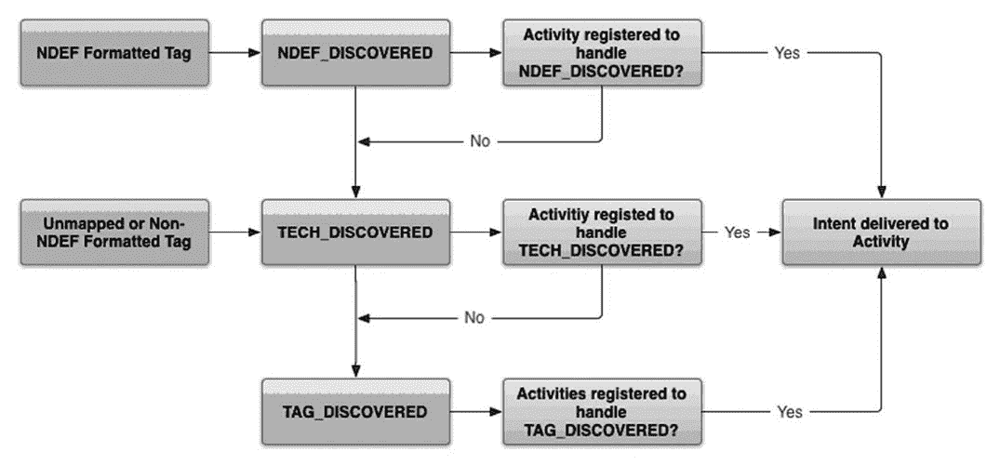

# Android NFC 开发教程

> 原文：[`c.biancheng.net/view/3202.html`](http://c.biancheng.net/view/3202.html)

Android 提供了 android.nfc 和 android.nfc.tech 包，它们对 NFC 技术进行了支持。常用类介绍如下。

**1\. NfcManager**

Android 设备的 NFC 适配器管理器，可以通过 getSystemService(String) 获得对象实例。

NfcManager 可以获取到当前 Android 设备支持的所有 NFC 适配器列表。

**2\. NfcAdapter**

代表设备的 NFC 适配器。NFC 适配器是进行 NFC 操作的入口。

通常情况下，每个 Android 设备只有一个 NFC 适配器，可以通过 NfcAdapter.getDefaultAdapter(android.content.Context) 方法或者 NfcManager.getDefaultAdapter() 方法来获取当前 Android 设备的 NFC 适配器。

**3\. NdefMessage**

代表 NDEF 消息。NDEF 是 NFC Forum 定义的标准数据结构，用于在设备和 NFC Tags 之间传递数据。一个 NdefMessage 对象包含多个 NdefRecord 对象。

**4\. NdefRecord**

代表一条记录。每条 NDEF 记录都有一个 MIME 数据类型，比如文本、URL、智慧型海报等。NDEF 记录被存放在 NDEF 消息中。

**5\. Tag**

表示被检测到的 NFC 目标，可以是一个标签、一个卡片、一个钥匙扣等。

Android.nfc.tech 包中包含对 NFC Tag 进行查询和 I/O 操作的类。

如果 Android 设备没有关闭掉 NFC 功能，当设备的屏幕没有被锁定时，Android 设备会一直搜寻附件的 NFC Tag。当一个 NFC Tag 被检测到，一个包含该 NFC Tag 信息的 Tag 对象将被创建并且封装到一个 Intent 里，然后 NFC 发布系统将这个 Intent 用 startActivity 发送到已注册的用于处理这种类型的 Intent 的 Activity 中进行处理。

当 Android 设备扫描到一个 NFC Tag，通用的行为是自动搜寻最合适的 Activity 处理这个包含 Tag 对象的 Intent，而不需要用户来选择哪个 Activity 来处理。

因为设备扫描 NFC Tag 是在很短的范围和时间内，如果让用户选择的话，就有可能需要移动设备，这样将会打断这个扫描过程。因此，开发者应该开发只处理需要处理的 Tag 的 Activity，以防止发生让用户选择使用哪个 Activity 来处理的情况。

Android 系统提供了一个 Tag 发布系统（Tag Dispatch System）帮助分析扫描到的 NFC Tag，从中提取相关数据，封装到 Intent 并且定位到对这些数据有兴趣的 Activity。

如果同时有多个 Activity 都可以对封装了 Tag 数据的 Intent 进行处理，那么会出现一个选择列表，让用户来选择要处理的 Activity。

Tag 发布系统定义了三种 Intent，按照顺序优先级从高到低说明如下。

**1）android.nfc.action.NDEF_DISCOVERED**

当一个包含 NDEF 负载的 Tag 被检测到时，该 Intent 被启动，这是最高优先级的 Intent。

如果检测到的是一个未知的 Tag 或者不包含 NDEF 负载的 Tag，那么该 Intent 不会被启动。

若 NDEF_DISCOVERED Intent 已经被启动，则 TECH_DISCOVERED 和 TAG_DISCOVERED Intent 将不会被启动。

处理该 Intent 的 Activity 需要对应设置 intent-filter 属性，例如：

```

<intent-filter>
    <action android:name="android.nfc.action.NDEF_DISCOVERED" />
    <category android:name="android.intent.category.DEFAULT" />
    <data android:mimeType="text/plain"/>
</intent-filter>
```

表明当前 Activity 可以处理 NDEF_DISCOVERED 类型的 Intent，但是其携带数据的类型需要是“text/plain”类型。

**2）android.nfc.action.TECH_DISCOVERED**

当一个包含 NDEF 负载的 Tag 被检测到，并且没有 Activity 处理 NDEF_DISCOVERED Intent 时，该 Intent 会被启动。若该 Intent 被启动，则 TAG_DISCOVERED 不会被启动。

**3）android.nfc.action.TAG_DISCOVERED**

当一个包含 NDEF 负载的 Tag 被检测到，并且没有 Activity 处理 NDEF_DISCOVERED 和 TECH_DISCOVERED Intent 时，或者 Tag 被检测为未知的，该 Intent 被启动。

总的来说，Tag 发布系统的运行过程如图 1 所示。
图 1  Tag 发布系统运行图
要进行 NFC 访问，需要在工程的 AndroidManifest.xml 文件中添加如下代码：

**1）用于获取 NFC 硬件访问权限。**

<uses-permission android:name="android.permission.NFC" />

**2）指定最小 SDK 版本的代码。**

支持 NFC 功能的最小 SDK 版本为 API Level 9，但是仅支持有限的 Tag 发布和访问 NDEF 信息，不支持其他 Tag 的输入输出操作。

API Level 10 增加了对 Tag 的读写方式，并添加了前台 NDEF 推数据的方式。

API Level 14 提供了将 NDEF 数据传送到其他设备的方式。建立 SDK 的最小版本要高于 10。

<uses-sdk android:minSdkVersion="10"/>

**3）设置 uses-feature 属性，以便在 Google Play Store 发布时，仅使具有 NFC 硬件的设备可以搜索到。**

<uses-feature android:name="android.hardware.nfc" android:required="true" />

## 前台发布系统

前台发布系统允许 Activity 截获到 Intent 并且获得比其他的能够处理该 Intent 的 Activity 更高的权限。

使用前台发布系统涉及为 Android 系统构建一些数据结构，以便能够发送合适的 Intent 到应用程序。

要使用前台发布系统，需要执行以下操作。

**1）在 Activity 的 onCreate() 方法中添加以下代码：**

创建一个 PendingIntent 对象，以便当 Android 系统检测到 Tag 时能够获取到这个对象的详细信息。

PendingIntent pendingIntent=PendingIntent.getActivity(
       this,0, new Intent(this, getClass()).addFlags(Intent.FLAG_ACTIVITY_SINGLE_TOP),0);

定义用于处理要截获的 Intent 的 Intent Filter。

当系统检测到 NFC Tag 时，前台发布系统会核实当前 Activity 的 Intent Filter 是否与要截获的 Intent 符合。

*   符合，则由当前的 Activity 对 Intent 进行处理；
*   不符合，则前台发布系统将 Intent 发送给 Intent 发布系统。

下面的代码处理了所有的 MIME 数据类型。

```

IntentFilter ndef=new IntentFilter (NfcAdapter.ACTION_NDEF_DISCOVERED);
try {
    ndef.addDataType ("*/*");
    /* Handles all MIME based dispatches.You should specify only the ones that you need. */
}catch (MalformedMimeTypeException e) {
    throw new RuntimeException ("fail", e) ;
}
intentFiltersArray=new IntentFilter[] {ndef, };
```

设置要处理的 Tag Technology 列表。

techListsArray=new String[][] { new String[] { NfcF.class.getName()} };

**2）覆盖 onPause() 和 onResume() 方法来打开或关闭前台发布系统。**

enableForegroundDispatch() 方法只能在主线程中并且 Activity 在前台时被调用。另外，应该实行 onNewIntent() 方法对从 NFC Tag 中获取到的数据进行处理。相关代码如下：

```

public void onPause(){
    super.onPause();
    mAdapter.disableForegroundDispatch (this);
}

public void onResume(){
    super.onResume();
    mAdapter.enableForegroundDispatch (this,pendingIntent, intentFiltersArray, techListsArray);
}

public void onNewIntent (Intent intent) {
    Tag tagFromIntent=intent.getParcelableExtra (NfcAdapter.EXTRA_TAG);
    //do something with tagFromIntent
}
```

**3）读写 NFC Tag 数据。**

下面的代码演示了处理 TAG_DISCOVERED Intent 并且使用迭代器读取 NFC Tag 中的 NDEF 数据的方法：

```

NdefMessage[] getNdefMessages(Intent intent) {
    // Parse the intent
    NdefMessage[] msgs = null;
    String action = intent.getAction();
    if (NfcAdapter.ACTION_TAG_DISCOVERED.equals(action)) {
        Parcelable[] rawMsgs = intent.getParcelableArrayExtra(NfcAdapter.EXTRA_NDEF_MESSAGES);
            if (rawMsgs != null) {
                msgs = new NdefMessage[rawMsgs.length];
                for (int i = 0; KrawMsgs.length; i++) {
                    msgs[i] = (NdefMessage) rawMsgs[i];
                }
            } else {
                // Unknown tag type
                byte[] empty = new byte[]{};
                NdefRecord record = new NdefRecord(NdefRecord.TNF_UNKNOWN, empty, empty, empty);
                NdefMessage msg = new NdefMessage(new NdefRecord[]{record});
                msgs = new NdefMessage[]{msg};
            }
    else{
        Log.e(TAG, "Unknown intent " + intent);
        finish();
    }
    return msgs;
}
```

下面的代码演示了写简单的文本到 NFC Tag 中的方法：

```

NdefFormatable tag=NdefFormatable.get (t);
Locale locale=Locale.US;
final byte[] langBytes=locale.getLanguage().getBytes (Charsets.US_ASCII);
String text="Tag, you're it!";
final byte[] textBytes=text.getBytes (Charsets.UTF_8); final int utfBit=0;
final char status= (char) (utfBit+langBytes.length);
final byte[] data=Bytes.concat (new byte[] { (byte) status}, langBytes, textBytes);
NdefRecord record=NdefRecord (NdefRecord.TNF_WELL_KNOWN, NdefRecord.RTD_TEXT, new byte[0], data);

try {
    NdefRecord[] records={text};
    NdefMessage message=new NdefMessage (records); tag.connect (); tag.format (message);
}catch (Exception e) {
    //do error handling
}
```