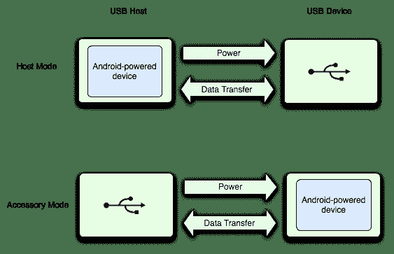

# Android USB 开发简介

> 原文：[`c.biancheng.net/view/3206.html`](http://c.biancheng.net/view/3206.html)

Android 系统支持多种 USB 外围设备，提供两种模式来支持实现 Android 附件协议 USB 外设接入系统：USB 附件模式和 USB 主机模式。

在 USB 附件模式下，接入的 USB 设备充当 USB 主机，并为 USB 总线供电。

USB 附件的例子包括机器人控制器、诊断和音乐设备、读卡器等。这种模式使不具备主机功能的 Android 设备具有了与 USB 硬件交互的能力。

Android USB 附件被设计用来与装有 Android 的设备一起工作，并且必须遵循 Android 附件通信协议（Android Accessory Communication Protocol）。

在 USB 主机模式下，Android 设备扮演主机的角色。这种设备的例子包括数码相机、键盘、鼠标和游戏手柄等。

那些适应面很广的 USB 设备可以与 Android 应用程序交互，只要 Android 系统可以正确地与这些设备进行通信。

图 1 展示了两种模式的异同。当 Android 设备处于主机模式时，它扮演 USB 主机的角色并为总线供电。当 Android 设备处于附件模式时，连接的 USB 设备扮演主机角色并给总线供电。
图 1  两种 USB 模式
USB 附件模式和 USB 主机模式在 Android 3.1（API level 12）或更高的 SDK 平台中被直接支持。

在 Android 2.3.4（API level 10）系统中也可以通过添加附加库的方式来获得支持。设备生产商可以选择是否在设备的系统中包含该附加库。