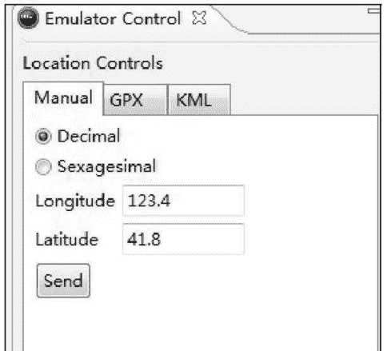
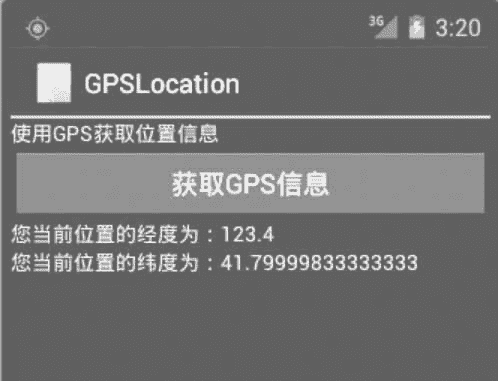

# Android GPS 定位开发教程

> 原文：[`c.biancheng.net/view/3224.html`](http://c.biancheng.net/view/3224.html)

要获取精确的位置服务信息需要 GPS 硬件的支持。在应用程序开发阶段，由于模拟器中并没有真正的 GPS 硬件，因此不能获得真实的 GPS 信息。但是可以使用 Eclipse 视图模式的 DDMS 模式模拟 GPS 服务，在如图 1 所示的 Emulator Control 界面中手动发送经纬度信息来测试位置服务。


图 1  Emulator Control 界面
获取用户当前位置，需要实现以下 4 个基本步骤。

**1）在 AndroidManifest.xml 文件中声明相应的权限。**

使用 GPS_PROVIDER 定位服务需要以下权限：

<uses-permission android:name="android.permission.ACCESS_FINE_LOCATION"/>

使用 NETWORK_PROVIDER 定位服务需要以下权限：

<uses-permission android:name="android.permission.ACCESS_COARSE_LOCATION"/>

**2）获取 LocationManager 对象。**

**3）选择合适的 LocationProvider。**

**4）通过 LocationListener 接口获取位置信息。**

实例 GPSLocationDemo 演示了使用 GPS 获取用户信息的过程，运行效果如图 2 所示。


图 2  实例 GPSLocationDemo 的运行效果
该运行效果所对应的布局文件 main.xml 内容如下：

```

<?xml version="1.0" encoding= "utf-8"l>
<LinearLayout xmlns:android="http://schemas.android.com/apk/res/android"
    android:layout_width="fill_parent"
    android:layout_height="fill_parent"
    android:orientation="vertical">

    <TextView
        android:layout_width="fill_parent"
        android:layout_height="wrap_content"
        android:text="@string/hello" />

    <Button
        android:id="@+id/btn_listen"
        android:layout_width="fill_parent"
        android:layout_height="wrap_content"
        android:text="@string/btn_listen" />

    <TextView
        android:id="@+id/tv_01"
        android:layout_width="fill_parent"
        android:layout_height="wrap_content"
        android:text="" />

    <TextView
        android:id="@+id/tv_02"
        android:layout_width="fill_parent"
        android:layout_height="wrap_content"
        android:text="" />
</LinearLayout>
```

该布局文件所使用的资源文件 strings.xml 内容如下：

```

<resources>
    <string name="app_name">GPSLocation</string>
    <string name="hello">使用 GPS 获取位置信息</string>
    <string name="btn_listen">获取 GPS 信息</string>
</resources>
```

实例 GPSLocationDemo 中的主 Activity 文件 GPSLocationActivity.java 的代码如下：

```

package introduction.android.wifidirectdemo;

import android.app.Activity;
import android.content.Context;
import android.location.Location;
import android.location.LocationListener;
import android.location.LocationManager;
import android.os.Bundle;
import android.util.Log;
import android.view.View;
import android.view.View.OnClickListener;
import android.widget.Button;
import android.widget.TextView;

public class GPSLocationActivity extends Activity {
    /**
     * Called when the activity is first created.
     */
    private Button btn_listen;
    private TextView tv_01, tv_02;

    @Override
    public void onCreate(Bundle savedInstanceState) {
        super.onCreate(savedInstanceState);
        setContentView(R.layout.main);
        btn_listen = (Button) findViewById(R.id.btn_listen);
        tv_01 = (TextView) findViewById(R.id.tv_01);
        tv_02 = (TextView) findViewById(R.id.tv_02);
        btn_listen.setOnClickListener(new OnClickListener() {
            @Override
            public void onClick(View v) {
                LocationManager locationManager = (LocationManager)
                        GPSLocationActivity.this.getSystemService(Context.LOCATION_SERVICE);
                locationManager.requestLocationUpdates(LocationManager.GPS_PROVIDER, 0, 0, new MyLocationListener());
            }
        });
    }

    class MyLocationListener implements LocationListener {
        @Override
        public void onLocationChanged(Location location) {
            // TODO Auto-generated method stub
            tv_01.setText("您当前位置的经度为" + location.getLongitude());
            tv_02.setText("您当前位置的纬度为" + location.getLatitude());
        }

        @Override
        public void onProviderDisabled(String provider) {
            //当 provider 被用户关闭时调用
            Log.i("GpsLocation", "provider 被关闭! ");
        }

        @Override
        public void onProviderEnabled(String provider) {
            //当 provider 被用户开启后调用
            Log.i("GpsLocation", "provider 被开启! ");
        }

        @Override
        public void onStatusChanged(String provider, int status, Bundle extras) {
            //当 provider 的状态在 OUT_OF_SERVICE、TEMPORARILY_UNAVAILABLE 和 AVAILABLE 之间发生变化时调用
            Log.i("GpsLocation", "provider 状态发生改变!");
        }
    }
}
```

由以上代码可见，借助于 Android SDK 提供的位置服务 API，仅仅几行代码就可以实现使用 GPS 定位的功能。

LocationListener 用于接收位置发生改变时的通知。当 Provider 提供的位置信息发生改变时，onLocationChanged() 方法会被调用。当不需要使用 LocationListener 进行位置更新时，可以通过 LocationManager.removeUpdates(locationListener) 方法将其移除。