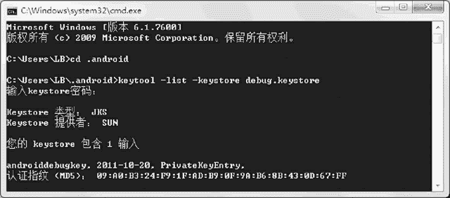
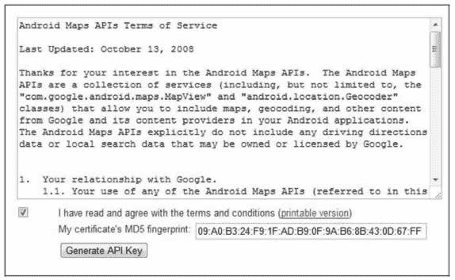
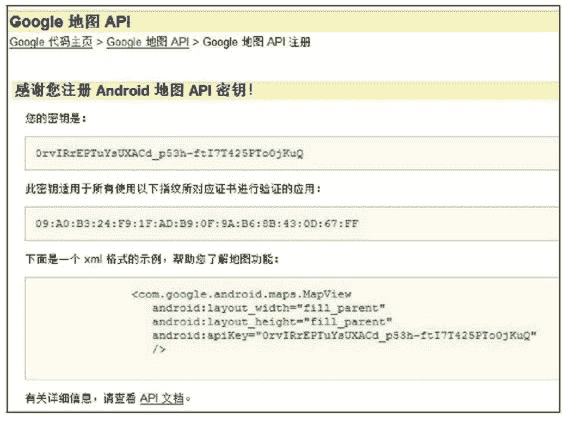

# Android Google Map API Key 详细申请步骤

> 原文：[`c.biancheng.net/view/3252.html`](http://c.biancheng.net/view/3252.html)

要使用 Google Map 提供的地图服务数据，必须要申请一个 Android Map API Key。

在申请 Android Map API Key 之前，必须要准备 Google 的账号和给应用程序签名的证书。如果没有 Google 账号，可以到 [google 官网](http://www.google.com/)申请一个（如果 google 官网打不开，可参考网址：[`jingyan.baidu.com/article/af9f5a2d600e7343140a4526.html`](https://jingyan.baidu.com/article/af9f5a2d600e7343140a4526.html)）。

Android 应用程序发布时，必须使用证书进行签名。在之前的开发过程中，虽然一直没有涉及证书的问题，但是实际上，我们一直在使用 Android 开发环境提供的 Debug 版本的证书来签名应用程序。

在调试阶段，所有的应用程序都是使用预定义的 debug.keystore 中的 androiddebugkey 来签名的。

如果是 Windows XP 系统，该文件被存放在 Documents and Settings/<user>/Local Settings/Application Data/Android 目录下；如果是 Windows 7 或者 Windows 10 系统，则存放在 user/<user>/.android 目录下。

在程序调试阶段，可以使用 Debug 版的证书申请签名密钥。下面是申请 Android Map API Key 的具体步骤。

#### 1) 找到自己的 debug.keystore 文件

运行 cmd 命令，跳转到 debug.keystore 所在目录。计算机是 Windows 7 或 Windows 10 系统，直接输入“cd .android”，按回车键即可。

#### 2) 获取 debug.keystore 文件的 MD5 值

继续在上一步的基础上输入“keytool –list –keystore debug.keystore”命令，按回车键，然后输入 keystore 密码，默认密码为 android，然后按回车键，即可得到根据调试密钥生成的 MD5 认证指纹的值。

如图 1 所示。该 MD5 认证指纹唯一，在调试程序时应该重新生成自己的 MD5 认证指纹。

Keytool.exe 是 Java JDK 提供的密钥工具，被放置在 <JDK 安装目录>/bin 目录下，需要将该目录设置到 Path 环境变量里才能在 CMD 窗口中直接使用该命名。

参数 -list 表示在 CMD 窗口中打印生成的 MD5 指纹，-keystore<kestore_name>.keystore 表示证书所在的 keystore 文件，具体操作如图 1 所示。

图 1  获取 debug.keystore 的 MD5 值

#### 3）申请 Android Map API Key

打开浏览器，并在浏览器中输入网址：[`developers.google.com/android/maps-api-signup?hl=zh-CN`](https://developers.google.com/android/maps-api-signup?hl=zh-CN)，登录自己的 Google 账号，在申请页面选择“I have read and agree with the terms and conditions”选项，然后输入步骤 2 得到的 MD5 认证指纹值，单击 Generate API Key 按钮，页面跳转后即可得到 Android Map API Key，如图 2 所示。
图 2  申请 Android Map API Key 页面
根据 MD5 生成的密钥信息如图 3 所示，并且提供了使用 MapView 的示例代码，将该代码作为一个组件复制到工程的布局 XML 文件中，就可以直接使用了。

使用 MapView 组件必须制定 apiKey 属性，若 apiKey 不能与签名密钥匹配，则不能正常显示地图。

图 3  MD5 生成的密钥信息