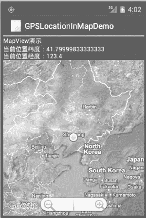
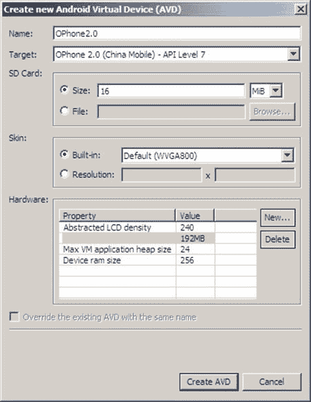

# Google Map API 开发 Android 地图应用实例

> 原文：[`c.biancheng.net/view/3255.html`](http://c.biancheng.net/view/3255.html)

下面通过一个实例完成一个简单的定位系统，并且在地图上显示当前的位置，实例的详细代码在 GPSLocationInMapDemo 项目中，实际调试时需要在真机上进行并且需要开启 GPS。运行效果如图 1 所示。


图 1  一个简单的定位系统具体步骤如下：

**1）创建一个新的工程并命名为 GPSLocationInMapDemo。**

需要注意的是，由于要使用 Google Map API，因此创建的主 Activity 需要继承自 MapActivity，而不是 Activity。当选择 Build Target 时，应选择 Google APIs，如图 2 所示。


图 2  New Andriod Project 对话框
**2）在 AndroidManifest.xml 文件中的 <application> 标签中加入：**

<uses-library android:name="com.google.android.maps" />

以便可以使用 Google Map API。为了使用 GPS 数据，在 <application> 标签之外加入如下权限：

<uses-permission android:name="android.permission.ACCESS_FINE_LOCATION" />

为了从 Internet 获取地图数据，需要网络访问权限：

<uses-permission android:name="android.permission.INTERNET"/>

**3）编写 main.xml 布局文件，具体代码如下：**

```

<?xml version="1.0" encoding="utf-8"?>

<LinearLayout xmlns:android="http://schemas.android.com/apk/res/android"
    android:layout_width="fill_parent"
    android:layout_height="fill_parent"
    android:orientation="vertical">

<TextView
    android:layout_width="fill_parent"
    android:layout_height="wrap_content"
    android:text="string/hello" />

<TextView
    android:id="@+id/myLocationText"
    android:layout_width="fill_parent"
    android:layout_height="wrap_content"/>

<com.google.android.maps.MapView
    android:id="@+id/myMapView"
    android:layout_width="fill_parent"
    android:layout_height="fill_parent"
    android:apiKey="OrvIRrEPTuYsUXACd_p53h-ftI7T425PToOjKuQ"
    android:clickable="true" />
</LinearLayout>
```

在 main.xml 布局中放置了两个 TextView 和一个 MapView 组件。

GPSLocationInMapDemoActivity.java 的代码如下：

```

package introduction.android.gpsLocationInMapDemo;

import android.content.Context;
import android.location.Location;
import android.location.LocationListener;
import android.location.LocationManager;
import android.os.Bundle;
import android.widget.TextView;

import com.google.android.maps.GeoPoint;
import com.google.android.maps.MapActivity;
import com.google.android.maps.MapController;
import com.google.android.maps.MapView;
import com.google.android.maps.MyLocationOverlay;

public class GPSLocationInMapDemoActivity extends MapActivity {
    /**
     * Called when the activity is first created.
     */
    // 定义 Location 对象
    protected Location location;
    //定义 MapView 对象
    private MapView map;
    // 定义 MyLocationOverlay 对象，在地图上标注当前位置
    private MyLocationOverlay myLocation;
    private MapController mapController;
    private TextView myLocationText;
    private GeoPoint geopoint;
    private double latitude;
    private double longitude;

    /**
     * Called when the activity is first created.
     */
    protected boolean isRouteDisplayed() {
        return false;
    }

    public void onCreate(Bundle savedInstanceState) {
        super.onCreate(savedInstanceState);
        setContentView(R.layout.main);
        myLocationText = (TextView) findViewById(R.id.myLocation_Text);
        //定义 LocationManager 对象
        LocationManager locationManager;
        String seviceName = Context.LOCATION_SERVICE;
        // 获取 LocationManager 对象
        locationManager = (LocationManager) getSystemService(seviceName);
        locationManager.requestLocationUpdates(LocationManager.GPS_PROVIDER, 2000, 10, locationListener);
        // 得到 MapView 对象
        map = (MapView) findViewById(R.id.myMapView);
        //得到 MapView 对象的控制器
        mapController = map.getController();
        //设置 map 支持缩放工具条
        map.setBuiltInZoomControls(true);
        map.setSatellite(true);
    }

    //得到 LocationListener 对象
    private final LocationListener locationListener = new LocationListener() {
        //当 Provider 处于不能使用时触发
        public void onProviderDisabled(String provider) {

        }

        //当状态发生改变时触发
        public void onStatusChanged(String provider, int status, Bundle extras) {

        }

        //当位置发生变化时触发
        @Override
        public void onLocationChanged(Location location) {
            // TODO Auto-generated method stub
            // 得到当前位置的纬度
            latitude = location.getLatitude();
            //得到当前时间的经度
            longitude = location.getLongitude();
            geopoint = new GeoPoint(new Double(latitude * 1E6).intValue(), new Double(longitude * 1E6).intValue());
            mapController.setCenter(geopoint);

            //得到当前时间的 MyLocationOverlay 对象
            myLocation = new MyLocationOverlay(
                    GPSLocationInMapDemoActivity.this, map);
            myLocation.enableMyLocation();
            // 将当前位置添加到地图上
            map.getOverlays().add(myLocation);
            //设置地图为卫星模式
            myLocationText.setText("当前位置纬度" + latitude + "\n 当前位置经度"
                    + longitude);
        }

        //当 Provider 处于可用时触发
        @Override
        public void onProviderEnabled(String provider) {
            // TODO Auto-generated method stub
        }
    };
}
```

MapView 组件通过网络载入所需地图，并且提供了拖曳地图的接口，用户可以直接在 MapView 中移动地图。MapView 提供了地图控制器，通过

mapController=map.getController();

方法可以获取到。通过控制器可以方便地控制 MapView 组件中地图的缩放和窗口移动。本实例中通过

mapController.setCenter(geopoint);

控制器将当前位置 geopoint 设置为 MapView 组件的中心。GeoPoint 代表的是地图上特定的点，需要注意的是，在 MapView 中使用的 geoPoint 的经纬度位置与从 GPS 中获取的经纬度存在一个 1E6 的比例差，需要经过转换后才能正确显示当前位置。本实例中的坐标转换代码为：

latitude = location.getLatitude();
longitude = location.getLongitude();
geopoint = new GeoPoint(new Double(latitude * 1E6).intValue(), new Double(longitude * 1E6).intValue());

MapView 提供了更加方便地对地图数据进行缩放的方式，通过

map.setBuiltInZoomControls(true);

在地图上放置一个缩放条（如图 3 所示），用户可以直接使用该缩放条对地图进行放大和缩小，而无须编写任何代码。
图 3  缩放条
Overlay 是 Google Map API 提供的专门在地图上进行标记的类。本实例中使用 Overlay 标记当前的位置点。相关代码为：

```

//得到当前时间的 MyLocationOverlay 对象
myLocation = new MyLocationOverlay(GPSLocationInMapDemoActivity.this, map);
myLocation.enableMyLocation();
// 将当前位置添加到地图上
map.getOverlays().add(myLocation);
```

至此，该实例开发完成。运行该实例需要支持 Google APIs 的 AVD，如图 4 所示。若没有，则可以通过 AVD Manager 创建一个。

图 4  创建支持 Google APIs 的 AVD