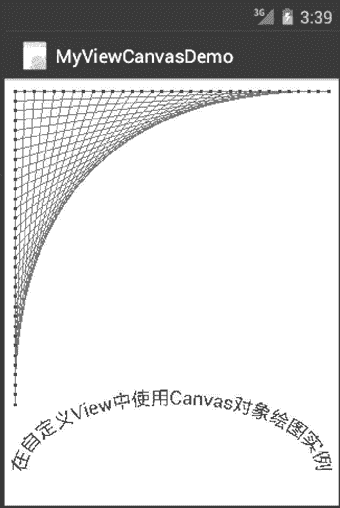

# Android 使用自定义 View 绘图

> 原文：[`c.biancheng.net/view/3289.html`](http://c.biancheng.net/view/3289.html)

## 使用自定义 View 绘图

实例 MyViewCanvasDemo 自定义一个名为 MyView 的 View 类，并在其 onDraw() 方法中绘制简单的图像，运行效果如图 1 所示。


图 1  简单的 View 绘图
实例 MyViewCanvasDemo 没有使用布局文件，而是将自定义的 MyView 对象显示出来。主 Activity MyViewCanvasDemoActivity 的代码如下：

```

public class MyViewCanvasDemoActivity extends Activity{
    /**Called when the activity is first created.*/
    @Override
    public void onCreate(Bundle savedInstanceState){
        super.onCreate(savedInstanceState);
        setContentView(new MyView(this));
    }
}
```

MyView 类的定义代码如下：

```

package introduction.android.MyViewCanvas;

import android.content.Context;
import android.graphics.Canvas;
import android.graphics.Color;
import android.graphics.Paint;
import android.view.View;

public class MyView extends View {
    public MyView(Context context) {
        super(context);
        // TODO Auto-generated constructor stub
        buildPoints();
    }

    private float[] mPts;
    private static final float SIZE = 300;
    private static final int SEGS = 32;
    private static final int X = 0;
    private static final int Y = 1;

    @Override
    protected void onDraw(Canvas canvas) {
        // TODO Auto-generated method stub
        super.onDraw(canvas);
        //使用 Canvas 绘图
        //画布移动到(10,10)位置
        canvas.translate(10, 10);
        canvas.drawColor(Color.WHITE);
        //创建红色画笔，使用单像素宽度，绘制直线
        Paint paint = new Paint();
        paint.setColor(Color.RED);
        paint.setStrokeWidth(0);
        canvas.drawLines(mPts, paint);
        //创建蓝色画笔，宽度为 3，绘制相关点
        paint.setColor(Color.BLUE);
        paint.setStrokeWidth(3);
        canvas.drawPoints(mPts, paint);
        //创建 Path, 并沿着 path 显示文字信息
        RectF rect = new RectF(10, 300, 290, 430);
        Path path = new Path();
        path.addArc(rect, -180, 180);
        paint.setTextSize(18);
        paint.setColor(Color.BLUE);
        canvas.drawTextOnPath("在自定义 View 中使用 Canvas 对象绘图实例", path, 0, 0, paint)
    }

    private void buildPoints() {
        //生成一系列点
        final int ptCount = (SEGS + 1) * 2;
        mPts = new float[ptCount * 2];

        float value = 0;
        final float delta = SIZE / SEGS;
        for (int i = 0; i <= SEGS; i++) {
            mPts[i * 4 + X] = SIZE - value;
            mPts[i * 4 + Y] = 0;
            mPts[i * 4 + X + 2] = 0;
            mPts[i * 4 + Y + 2] = value;
            value += delta;
        }
    }
}
```

所有具体的绘图工作都由 Canvas 类来完成。Canvas 类提供了 drawXXX() 方法来完成对特定形式的图形的绘制。

在 Canvas 绘图过程中，涉及以下几个类：

#### 1）Color

颜色类，其中以静态常量的方式定义常见的各种颜色，例如黑色 Color.BLACK，蓝色 Color.BLUE 等，同时也可以通过以下方法指定颜色的具体值来建立颜色对象。

*   static int argb(int alpha, int red, int green, int blue)：构造一个包含透明要素的颜色对象。
*   static int rgb(int red, int green, int blue)：构造一个由 RGB 三色组成的颜色对象。

#### 2）Paint

画笔类，通过该类的对象创建绘图时使用的画笔的样式。使用 Paint.setColor() 方法设置画笔的颜色，使用 setStrokeWidth() 方法设置画笔的宽度。

#### 3）Path

路径类，可用于自定义各种路径。本实例中使用 Path.addArc() 方法定义了一个弧线路径，并沿着该路径显示了说明文字。

Android 提供各种各样的用于绘制图形的方法，在此不可能一一介绍，详细内容读者可以参考 [Android SDK 文档](http://www.android-doc.com/sdk/)。