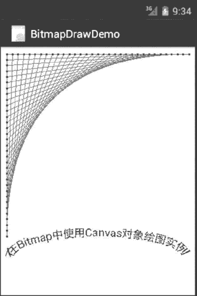

# Android 使用 Bitmap 绘图

> 原文：[`c.biancheng.net/view/3269.html`](http://c.biancheng.net/view/3269.html)

可以通过新建 Bitmap 对象并在其上使用 Canvas 绘图的方式创建图像。

实例 BitmapDrawDemo 演示了 Canvas 使用 Bitmap 对象绘图的过程。该实例绘制的内容与《Android 使用自定义 View 绘图实例》教程中绘制的内容完全相同，只不过不是直接绘制在 View 上，而是绘制在一个 Bitmap 对象上，绘制完成后，将 Bitmap 图像显示到视图上，其运行效果如图 1 所示。


图 1  Bitmap 对象的绘图效果
该视图显示的是一幅 Bitmap 图像。实例 BitmapDrawDemo 的主 Activity 为 BitmapDraw-DemoActivity，其代码如下：

```

import java.io.ByteArrayOutputStream;

import android.app.Activity;
import android.content.Context;
import android.graphics.Bitmap;
import android.graphics.BitmapFactory;
import android.graphics.Canvas;
import android.graphics.Color;
import android.graphics.Paint;
import android.graphics.Path;
import android.graphics.RectF;
import android.os.Bundle;
import android.view.View;

public class BitmapDrawDemoActivity extends Activity {
    private static final int WIDTH = 320;
    private static final int HEIGHT = 480;
    private static final int STRIDE = 64; // must be>=WIDTH

    /**
     * Called when the activity is first created.
     */
    @Override
    public void onCreate(Bundle savedInstanceState) {
        super.onCreate(savedInstanceState);
        setContentView(new MyBitmapView(this));
    }

    private static Bitmap codec(Bitmap src, Bitmap.CompressFormat format, int quality) {
        ByteArrayOutputStream os = new ByteArrayOutputStream();
        src.compress(format, quality, os);
        byte[] array = os.toByteArray();

        return BitmapFactory.decodeByteArray(array, 0, array.length);
    }

    private static class MyBitmapView extends View {
        private Bitmap myBitmap;
        private float[] mPts;
        private static final float SIZE = 300;
        private static final int SEGS = 32;
        private static final int X = 0;
        private static final int Y = 1;

        @Override
        protected void onDraw(Canvas canvas) {
            // TODO Auto-generated method stub
            super.onDraw(canvas);
            canvas.drawBitmap(myBitmap, 0, 0, null);
        }

        public MyBitmapView(Context context) {
            super(context);
            // TODO Auto-generated constructor stub
            buildPoints();
            myBitmap = Bitmap.createBitmap(WIDTH, HEIGHT, Bitmap.Config.ARGB_8888);
            Canvas canvas = new Canvas(myBitmap);
            //使用 Canvas 绘图
            //画布移动到（10，10）位置
            canvas.translate(10, 10);
            //画布使用白色填充
            canvas.drawColor(Color.WHITE);
            //创建红色画笔，使用带像素宽度，绘制直线
            Paint paint = new Paint();
            paint.setColor(Color.RED);
            paint.setStrokeWidth(0);
            canvas.drawLines(mPts, paint);
            //创建蓝色画笔，宽度为 3，绘制相关点
            paint.setColor(Color.BLUE);
            paint.setStrokeWidth(3);
            canvas.drawPoints(mPts, paint);
            //创建 Path,并沿着 path 显示文字信息
            RectF rect = new RectF(10, 300, 290, 370);
            Path path = new Path();
            path.addArc(rect, -180, 180);
            paint.setTextSize(18);
            paint.setColor(Color.BLUE);
            canvas.drawTextOnPath("在 Bitmap 中使用 Canvas 对象绘图", path, 0, 0, paint);
            myBitmap = codec(myBitmap, Bitmap.CompressFormat.JPEG, 80);
        }

        private void buildPoints() {
            //生成一系列的点
            final int ptCount = (SEGS + 1) * 2;
            mPts = new float[ptCount * 2];
            float value = 0;
            final float delta = SIZE / SEGS;
            for (int i = 0; i <= SEGS; i++) {
                mPts[i * 4 + X] = SIZE - value;
                mPts[i * 4 + Y] = 0;
                mPts[i * 4 + X + 2] = 0;
                mPts[i * 4 + Y + 2] = value;
                value += delta;
            }
        }
    }
}
```

该实例新建了一个名为 MyBitmapView 的 View 组件，在该组件的构造方法中创建了一个名为 myBitmap 的 Bitmap 对象，在该对象上新建了 Canvas 对象并绘制了图像。

绘制完成后，通过 MyBitmapView 组件的 onDraw() 方法将 myBitmap 绘制到该 View 上，最后通过 BitmapDrawDemoActivity 将 MyBitmapView 显示到视图上。