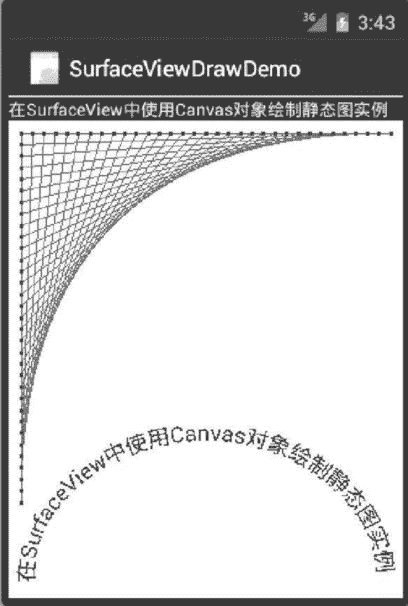

# Android 使用 SurfaceView 绘制静态图像

> 原文：[`c.biancheng.net/view/3270.html`](http://c.biancheng.net/view/3270.html)

使用 SurfaceView 绘图需要为 SurfaceView 对象添加 SurfaceHoloder.Callback 接口，并在该接口的 surfaceCreated() 方法中通过 lockCanvas() 方法获取 Canvas 对象，以此保证当获取 Canvas 时，SurfaceView 对象可用。

当绘图工作完成后，通过 SurfaceHoloder.unlockCanvas-AndPost() 方法将绘制的图像显示出来，并释放 Canvas 对象。

实例 SurfaceViewDrawDemo 演示了使用 SurfaceView 组件绘制静态图像的过程，其绘制的内容与《Android 使用 Bitmap 绘图实例》教程中绘制的内容完全相同。

通过该实例，我们可以清楚地认识到使用 SurfaceView 绘图与使用 View 绘图的不同之处，该实例运行效果如图 1 所示。


图 1  SurfaceView 绘图效果
实例 SurfaceViewDrawDemo 使用的布局文件 main.xml 内容如下：

```

<?xml version="1.0" encoding="utf-8"?>

<LinearLayout xmlns:android="http://schemas.android.com/apk/res/android"
    android:layout_width="fill_parent"
    android:layout_height="fill_parent"
    android:orientation="vertical">

    <TextView
        android:layout_width="fill_parent"
        android:layout_height="wrap_content"
        android:text="@string/hello" />

    <SurfaceView
        android:id="@+id/surfaceViewl"
        android:layout_width="fill_parent"
        android:layout_height="fill_parent" />

</LinearLayout>
```

在 LinearLayout 布局中添加了一个 SurfaceView 组件，通过该组件进行绘图。

实例 SurfaceViewDrawDemo 的主 Activity 为 SurfaceDrawDemoActivity，其代码如下：

```

import android.app.Activity;
import android.graphics.Canvas;
import android.graphics.Color;
import android.graphics.Paint;
import android.graphics.Path;
import android.graphics.RectF;
import android.os.Bundle;
import android.view.SurfaceHolder;
import android.view.SurfaceView;

public class SurfaceDrawDemoActivity extends Activity {
    private SurfaceView mySurfaceView;
    private float[] mPts;
    private static final float SIZE = 300;
    private static final int SEGS = 32;
    private static final int X = 0;
    private static final int Y = 1;

    /**
     * Called when the activity is first created.
     */
    @Override
    public void onCreate(Bundle savedInstanceState) {
        super.onCreate(savedInstanceState);
        setContentView(R.layout.main);
        buildPoints();
        mySurfaceView = (SurfaceView) findViewById(R.id.surfaceView1);
        SurfaceHolder surfaceHolder = mySurfaceView.getHolder();
        SurfaceHolder.addCallback(new SurfaceHolder.Callback() {

            @Override
            public void surfaceChanged(SurfaceHolder holder, int format, int width, int height) {
                // TODO Auto-generated method stub
            }

            @Override
            public void surfaceCreated(SurfaceHolder holder) {
                //必须在该方法中获取 Canvas 对象，才能保证 SurfaceView 可用
                Canvas canvas = holder.lockCanvas(); //获得 canvas 对象
                //使用 Canvas 绘图
                //画布移动到(10, 10)位置
                canvas.translate(10, 10);
                //画布使用白色填充
                canvas.drawColor(Color.WHITE);
                //创建红色画笔，使用单像素宽度，绘制直线
                Paint paint = new Paint();
                paint.setColor(Color.RED);
                paint.setStrokeWidth(0);
                canvas.drawLines(mPts, paint);
                //创建蓝色画笔，宽度为 3，绘制相关点
                paint.setColor(Color.BLUE);
                paint.setStrokeWidth(3);
                canvas.drawPoints(mPts, paint);
                //创建 Path,并沿着 path 显示文字信息
                RectF rect = new RectF(10, 250, 290, 480);
                Path path = new Path();
                path.addArc(rect, -180, 180);
                paint.setTextSize(18);
                paint.setColor(Color.BLUE);
                canvas.drawTextOnPath("在 SurfaceView 中使用 Canvas 对象绘制静态图实例", path, 0,
                        0, paint);
                holder.unlockCanvasAndPost(canvas); //释放 canvas 对象
            }

            @Override
            public void surfaceDestroyed(SurfaceHolder holder) {
                // TODO Auto-generated method stub
            }
        });
    }

    private void buildPoints() {
        //生成一系列点
        final int ptCount = (SEGS + 1) * 2;
        mPts = new float[ptCount * 2];
        float value = 0;
        final float delta = SIZE / SEGS;
        for (int i = 0; i <= SEGS; i++) {
            mPts[i * 4 + X] = SIZE - value;
            mPts[i * 4 + Y] = 0;
            mPts[i * 4 + X + 2] = 0;
            mPts[i * 4 + Y + 2] = value;
            value += delta;
        }
    }
}
```