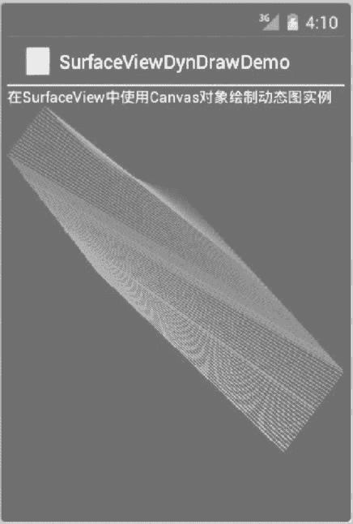

# Android 使用 SurfaceView 绘制动态图像

> 原文：[`c.biancheng.net/view/3272.html`](http://c.biancheng.net/view/3272.html)

实例 SurfaceViewDrawDemo 绘制的是一幅静态图像，而使用 SurfaceView 可以绘制动态图像。

绘制动态图像的过程应该在一个单独的线程中完成，而不应该在主线程中进行。实例 SurfaceViewDynDrawDemo 演示了使用 SurfaceView 组件绘制动态图像的过程。

该实例修改自 Android SDK 提供的实例，绘制的是类似于 Windows 中的变幻线屏保的效果，运行效果如图 1 所示。
图 1  实例 SurfaceViewDynDrawDemo 的运行效果
实例 SurfaceViewDynDrawDemo 的布局文件 main.xml 内容如下：

```

<?xml version="1.0" encoding="utf-8"?>

<LinearLayout xmlns:android="http://schemas.android.com/apk/res/android"
    android:layout_width="fill_parent"
    android:layout_height="fill_parent"
    android:orientation="vertical">

    <TextView
        android:layout_width="fill_parent"
        android:layout_height="wrap_content"
        android:text="@string/hello" />

    <SurfaceView
        android:id="@+id/surfaceViewl"
        android:layout_width="fill_parent"
        android:layout_height="fill_parent" />

</LinearLayout>
```

实例 SurfaceViewDynDrawDemo 的主 Activity 为 SurfaceViewDynDrawDemoActivity，其代码如下：

```

import android.app.Activity;
import android.graphics.Canvas;
import android.graphics.Paint;
import android.os.Bundle;
import android.util.Log;
import android.view.SurfaceHolder;
import android.view.SurfaceView;

public class SurfaceViewDynDrawDemoActivity extends Activity {
    private SurfaceView mySurfaceView;
    private DrawingThread mDrawingThread;
    SurfaceHolder surfaceHolder;

    /**
     * Called when the activity is first created.
     */
    @Override
    public void onCreate(Bundle savedInstanceState) {
        super.onCreate(savedInstanceState);
        setContentView(R.layout.main);
        mySurfaceView = (SurfaceView) findViewById(R.id.surfaceViewl);
        surfaceHolder = mySurfaceView.getHolder();
        surfaceHolder.addCallback(new SurfaceHolder.Callback() {

            @Override
            public void surfaceChanged(SurfaceHolder holder, int format, int width, int height) {
                // TODO Auto-generated method stub
            }

            @Override
            public void surfaceCreated(SurfaceHolder holder) {
                // TODO Auto-generated method stub
                mDrawingThread = new DrawingThread();
                mDrawingThread.mSurface = surfaceHolder;
                mDrawingThread.start();
            }

            @Override
            public void surfaceDestroyed(SurfaceHolder holder) {
                // TODO Auto-generated method stub
                mDrawingThread.mQuit = true;
            }
        });
    }

    static final class MovingPoint {
        float x, y, dx, dy;

        void init(int width, int height, float minStep) {
            x = (float) ((width - 1) * Math.random());
            y = (float) ((height - 1) * Math.random());
            dx = (float) (Math.random() * minStep * 2) + 1;
            dy = (float) (Math.random() * minStep * 2) + 1;
        }

        float adjDelta(float cur, float minStep, float maxStep) {
            cur += (Math.random() * minStep) - (minStep / 2);
            if (cur < 0 && cur > -minStep) cur = -minStep;
            if (cur >= 0 && cur < minStep) cur = minStep;
            if (cur > maxStep) cur = maxStep;
            if (cur < -maxStep) cur = -maxStep;
            return cur;
        }

        void step(int width, int height, float minStep, float maxStep) {
            x += dx;
            if (x <= 0 || x >= (width - 1)) {
                if (x <= 0) x = 0;
                else if (x >= (width - 1)) x = width - 1;
                dx = adjDelta(-dx, minStep, maxStep);
            }
            y += dy;
            if (y <= 0 || y >= (height - 1)) {
                if (y <= 0) y = 0;
                else if (y >= (height - 1)) y = height - 1;
                dy = adjDelta(-dy, minStep, maxStep);
            }
        }
    }

    class DrawingThread extends Thread {
        // These are protected by the Thread's lock
        SurfaceHolder mSurface;
        boolean mRunning;
        boolean mActive;
        boolean mQuit;
        // Internal state
        int mLineWidth;
        float mMinStep;
        float mMaxStep;

        boolean mInitialized = false;
        final MovingPoint mPoint1 = new MovingPoint();
        final MovingPoint mPoint2 = new MovingPoint();

        static final int NUM_OLD = 100;
        int mNum0ld = 0;
        final float[] m0ld = new float[NUM_OLD * 4];
        final int[] m01dColor = new int[NUM_OLD];
        int mBrightLine = 0;

        // X is red, Y is blue
        final MovingPoint mColor = new MovingPoint();

        final Paint mBackground = new Paint();
        final Paint mForeground = new Paint();

        int makeGreen(int index) {
            int dist = Math.abs(mBrightLine - index);
            if (dist > 10) return 0;
            return (255 - (dist * (255 / 10))) << 8;
        }

        @Override
        public void run() {
            mLineWidth = (int) (getResources().getDisplayMetrics().density * 1.5);
            if (mLineWidth < 1) mLineWidth = 1;
            mMinStep = mLineWidth * 2;
            mMaxStep = mMinStep * 3;

            mBackground.setColor(0xff000000);
            mForeground.setColor(0xff00ffff);
            mForeground.setAntiAlias(false);
            mForeground.setStrokeWidth(mLineWidth);

            while (true) {
                if (mQuit) {
                    return;
                }
                // Lock the canvas for drawing
                Canvas canvas = mSurface.lockCanvas();
                if (canvas == null) {
                    Log.i("WindowSurface", "Failure locking canvas");
                    continue;
                }

                // Update graphics
                if (!mInitialized) {
                    mInitialized = true;
                    mPoint1.init(canvas.getWidth(), canvas.getHeight(), mMinStep);
                    mPoint2.init(canvas.getWidth(), canvas.getHeight(), mMinStep);
                    mColor.init(127, 127, 1);
                } else {
                    mPoint1.step(canvas.getWidth(), canvas.getHeight(), mMinStep, mMaxStep);
                    mPoint2.step(canvas.getWidth(), canvas.getHeight(), mMinStep, mMaxStep);
                    mColor.step(127, 127, 1, 3);
                }
                mBrightLine += 2;
                if (mBrightLine > (NUM_OLD * 2)) {
                    mBrightLine = -2;
                }

                // Clear background
                canvas.drawColor(mBackground.getColor());
                // Draw old lines
                for (int i = mNum0ld - 1; i >= 0; i--) {
                    mForeground.setColor(m01dColor[i] | makeGreen(i));
                    mForeground.setAlpha(((NUM_OLD - i) * 255) / NUM_OLD);
                    int p = i * 4;
                    canvas.drawLine(m0ld[p], m0ld[p + 1], m0ld[p + 2], m0ld[p + 3], mForeground);
                }
                // Draw new line
                int red = (int) mColor.x + 128;
                if (red > 255) red = 255;
                int blue = (int) mColor.y + 128;
                if (blue > 255) blue = 255;
                int color = 0xff000000 | (red << 16) | blue;
                mForeground.setColor(color | makeGreen(-2));
                canvas.drawLine(mPoint1.x, mPoint1.y, mPoint2.x, mPoint2.y, mForeground);

                // Add in the new line
                if (mNum0ld > 1) {
                    System.arraycopy(m0ld, 0, m0ld, 4, (mNum0ld - 1) * 4);
                    System.arraycopy(m01dColor, 0, m01dColor, 1, mNum0ld - 1);
                }
                if (mNum0ld < NUM_OLD) mNum0ld++;
                m0ld[0] = mPoint1.x;
                m0ld[1] = mPoint1.y;
                m0ld[2] = mPoint2.x;
                m0ld[3] = mPoint2.y;
                m01dColor[0] = color;
                // All done
                mSurface.unlockCanvasAndPost(canvas);
            }
        }
    }
}
```

需要注意的是，就像前面所提到的，绘制动态图像的过程必须在一个单独的线程中完成，而不能在主线程中进行。在该实例中，绘图过程是在 DrawingThread 中完成的。