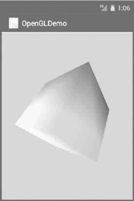

# Android 3D 绘图开发简介

> 原文：[`c.biancheng.net/view/3277.html`](http://c.biancheng.net/view/3277.html)

3D 图像的绘制使用的是 OpenGL ES，所以我们先介绍 OpenGL ES。

OpenGL 是一组跨平台的 3D 图像处理 API，OpenGL ES 是 OpenGL 的嵌入式版本，Android 系统从 Android 1.0 开始支持 OpenGL ES 1.0 和 1.1，自 Android 2.2（API Level 8）开始，Android 框架开始支持 OpenGL 2.0 API。

在这里仅介绍其使用方法。详细资料可以查询 Android SDK 的相关文档。

使用 OpenGL ES API 绘制 3D 图像有两个基础的相关类，一个是 GLSurfaceView 类，另一个是 GLSurfaceView.Renderer 接口。

#### 1）GLSurfaceView 类

GLSurfaceView 类是 SurfaceView 的子类，使用内嵌的 Surface 进行 OpenGL 绘图渲染。GLSurfaceView 提供以下功能：

*   管理 Surface，Surface 是一块内存，可以被加载到 View 视图中。
*   管理一个 EGL 显示，能够使用 OpenGL 把内容渲染到 Surface 上。
*   接受用户自定义渲染器用于实际渲染。
*   使渲染器在单独的线程中运行，与更新 UI 的线程相分离。
*   支持按需渲染（on-demand rendering）和连续渲染（continuous rendering）。
*   提供一些可选工具，如 OpenGL 调用的跟踪调试和错误检查等。

#### 2）GLSurfaceView.Renderer 接口

GLSurfaceView.Renderer 接口定义了使用 OpenGL 绘图时所需的方法。该接口通过 GLSurfaceView.setRenderer() 与 GLSurfaceView 关联在一起。

该接口实现以下三个方法。

*   onSurfaceCreated()：当创建 GLSurfaceView 对象后，该方法被系统调用一次。通常在该方法中设置 OpenGL 环境的相关参数，初始化 OpenGL 图形对象等。
*   onDrawFrame()：GLSurfaceView 对象每一次重绘时系统都会调用该方法。该方法应该执行具体的绘图工作。
*   onSurfaceChanged()：当 GLSurfaceView 对象的几何外形改变时，包括 GLSurfaceView 的尺寸发生改变、设备屏幕的方向发生改变等情况，该方法被系统调用。

实例 OpenGLDemo 演示了在 Activity 中使用 GLSurfaceView 和 GLSurfaceView.Renderer 合作绘制三维图形的过程。

该实例绘制了一个不断旋转的立方体，运行效果如图 1 所示。


图 1  实例 OpenGLDemo 的运行效果
该立方体为 MyCube 类的对象。MyCube.java 的代码如下：

```

import java.nio.ByteBuffer;
import java.nio.ByteOrder;
import java.nio.IntBuffer;

import javax.microedition.khronos.opengles.GL10;

class MyCube {

    private IntBuffer vertexBuffer;
    private IntBuffer colorBuffer;
    private ByteBuffer indexBuffer;

    public MyCube() {
        int one = 65536;
        int vertex[] = {
                -one, -one, -one, one, -one, -one,
                one, one, -one,
                -one, one, -one,
                -one, -one, one,
                one, -one, one,
                one, one, one,
                -one, one, one
        };
        int colors[] = {
                0, 0, 0, one,
                one, 0, 0, one,
                one, one, 0, one,
                0, one, 0, one,
                0, 0, one, one,
                one, 0, one, one,
                one, one, one, one,
                0, one, one, one
        };
        byte index[] = {
                0, 4, 5, 0, 5, 1,
                1, 5, 6, 1, 6, 2,
                2, 6, 7, 2, 7, 3,
                3, 7, 4, 3, 4, 0,
                4, 7, 6, 4, 6, 5,
                3, 0, 1, 3, 1, 2
        };

        ByteBuffer vbb = ByteBuffer.allocateDirect(vertex.length * 4);
        vbb.order(ByteOrder.nativeOrder());
        vertexBuffer = vbb.asIntBuffer();
        vertexBuffer.put(vertex);
        vertexBuffer.position(0);

        ByteBuffer cbb = ByteBuffer.allocateDirect(colors.length);
        cbb.order(ByteOrder.nativeOrder());
        colorBuffer = cbb.asIntBuffer();
        colorBuffer.put(colors);
        colorBuffer.position(0);

        indexBuffer = ByteBuffer.allocateDirect(index.length);
        indexBuffer.put(index);
        indexBuffer.position(0);
    }

    public void draw(GL10 gl) {
        gl.glFrontFace(GL10.GL_CW);
        gl.glVertexPointer(3, GL10.GL_FIXED, 0, vertexBuffer);
        gl.glColorPointer(4, GL10.GL_FIXED, 0, colorBuffer);
        gl.glDrawElements(GL10.GL_TRIANGLES, 36, GL10.GL_UNSIGNED_BYTE, indexBuffer);
    }
}
```

该立方体被显示在 GLSurfaceView 对象中，由 GLSurfaceView.Renderer 接口绘制。GLSurfaceView 在主 Activity 的 onCreate() 方法中被创建，相关代码如下：

```

package introduction.android.openglDemo;

import android.app.Activity;
import android.opengl.GLSurfaceView;
import android.os.Bundle;

public class OpenGLDemoActivity extends Activity {
    private GLSurfaceView myGLSurfaceView;

    /**
     * Called when the activity is first created.
     */
    @Override
    protected void onCreate(Bundle savedInstanceState) {
        super.onCreate(savedInstanceState);
        myGLSurfaceView = new GLSurfaceView(this);
        myGLSurfaceView.setRenderer(new CubeRenderer());
        setContentView(myGLSurfaceView);
    }

    @Override
    protected void onResume() {
        super.onResume();
        myGLSurfaceView.onResume();
    }

    @Override
    protected void onPause() {
        super.onPause();
        myGLSurfaceView.onPause();
    }
}
```

其中：

myGLSurfaceView.setRenderer(new CubeRenderer());

指定了 GLSurfaceView 的渲染器为 CubeRenderer，由该渲染器控制图像绘制过程。渲染器被定义在 CubeRenderer.java 中，具体代码如下：

```

package introduction.android.openglDemo;

import android.opengl.GLSurfaceView;

import javax.microedition.khronos.egl.EGLConfig;
import javax.microedition.khronos.opengles.GL10;

class CubeRenderer implements GLSurfaceView.Renderer {
    private MyCube myCube;
    private float roate;

    public CubeRenderer() {
        myCube = new MyCube();
    }

    public void onDrawFrame(GL10 gl) {
        //填充屏幕
        gl.glClear(GL10.GL_COLOR_BUFFER_BIT | GL10.GL_DEPTH_BUFFER_BIT)
        //设置模型视景矩阵为当前操作矩阵
        gl.glMatrixMode(GL10.GL_MODELVIEW);
        //将坐标原点移动到屏幕中心
        gl.glLoadIdentity();
        //移动坐标系
        gl.glTranslatef(0, 0, -3.0f);
        //在 Y 轴方向旋转坐标系
        gl.glRotatef(roate, 0, 1, 0);
        //在 X 轴方向旋转坐标系
        gl.glRotatef(roate * 0.25f, 1, 0, 0);
        //开启顶点坐标
        gl.glEnableClientState(GL10.GL_VERTEX_ARRAY);
        //开启颜色
        gl.glEnableClientState(GL10.GL_COLOR_ARRAY);
        //绘制图形
        myCube.draw(gl);
        roate += 1.0f;
    }

    public void onSurfaceChanged(GL10 gl, int width, int height) {
        gl.glViewport(0, 0, width, height);
        float ratio = (float) width / height;
        gl.glMatrixMode(GL10.GL_PROJECTION);
        gl.glLoadIdentity();
        gl.glFrustumf(-ratio, ratio, -1, 1, 1, 10);
    }

    public void onSurfaceCreated(GL10 gl, EGLConfig config) {
        gl.glEnable(GL10.GL_CULL_FACE);
        gl.glClearColor(0.5F, 0.5F, 0.5F, 1.0F);
    }
}
```