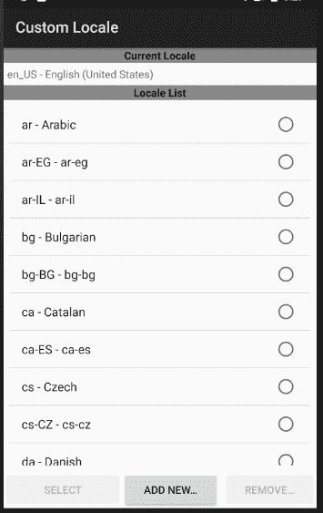
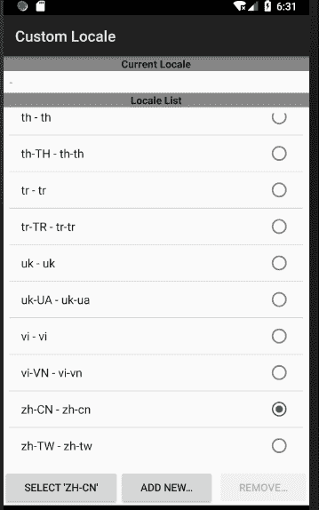
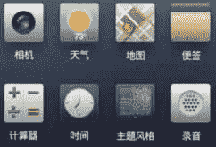
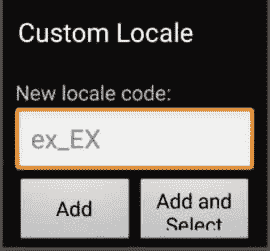

# Android 手机区域设置详细步骤

> 原文：[`c.biancheng.net/view/3297.html`](http://c.biancheng.net/view/3297.html)

可以通过手机的区域设置获得手机的本地化功能。在主菜单目录下，有一个 Custom Locale 应用程序，如图 1 所示。

图 1  主菜单
该应用程序用于对手机的区域进行设置。单击启动该应用程序，运行效果如图 2 所示。可以看到，默认情况下，当前 AVD 的区域设置为“en_US”，即语言为英语，区域，为 United States。

图 2   Custom Locale 应用程序
若更改当前区域为“zh_CN”，并单击 Select'zh_CN' 按钮，则当前手机被设置为汉语，地区为中国大陆地区，运行效果如图 3 所示，可以看到列表中的部分语言变为了中文。

图 3  区域设置为“zh_CN”
按“回退”键回到主菜单，发现很多应用程序的语言都变为了中文，如图 4 所示。

图 4  中文效果
若在 Custom Locale 列表中未发现想要的区域设置，则可以自己添加。单击 Add New 按钮，弹出如图 5 所示的对话框，在其中可以添加自己想要的区域设置选项。

图 5  添加设置对话框
Android 7 平台支持的“语言 _ 地区”列表如表 1 所示，凡是出现在该列表中的“语言 _ 地区”代码都可以被 Android 7 系统直接识别。

**表 1 Android 7 平台支持的“语言 _ 地区”列表**

| 语言 _ 地区 | 语言 _ 地区 | 语言 _ 地区 |
| --- | --- | --- |
| Arabic, Egypt (ar_EG) | Arabic, Israel (ar_IL) | Bulgarian, Bulgaria (bg_BG) |
| Catalan, Spain (ca_ES) | Czech, Czech Republic (cs_CZ) | Danish, Denmark (da_DK) |
| German, Austria (de_AT) | German, Switzerland (de_CH) | German, Germany (de—DE ) |
| German, Liechtenstein (de_LI) | Greek, Greece (el_GR) | English, Australia (en_AU) |
| English, Canada (en_CA) | English, Britain (en_GB) | English, Ireland (en_IE) |
| English, India (en_IN) | English, New Zealand (en_NZ) | English, Singapore (en_SG) |
| English, US (en_US) | English, Zimbabwe (en_ZA) | Spanish (es_ES) |
| Spanish, US (es_US) | Finnish, Finland (fi FI) | French, Belgium (fr_BE) |
| French, Canada (fr_CA) | French, Switzerland (fr_CH) | French, France (fr_FR) |
| Hebrew, Israel (he_IL) | Hindi, India (hi—IN) | Croatian, Croatia (hr_HR) |
| Hungarian, Hungary (hu_HU) | Indonesian, Indonesia (id_I D) | Italian, Switzerland (it_CH) |
| Italian, Italy (it_IT) | Japanese (ja_JP) | Korean (ko_KR) |
| Lithuanian, Lithuania (It_LT) | Latvian, Latvia (lv_LV) | Norway (nb_NO) |
| Dutch, Belgium (nl_BE) | Dutch, Netherlands (nl_NL) | Polish (pl_PL) |
| Portuguese, Brazil (pt_BR) | Portuguese, Portugal (pt_PT) | Romanian, Romania (ro_RO) |
| Russian (ru RU) | Slovak, Slovakia (sk_SK) | Slovenian, Slovenia (sl_SI) |
| Serbian (sr RS) | Swedish, Sweden (sv_SE) | Thai, Thailand (th_TH) |
| Tagalog, Philippines (tl_PH) | Turkish, Turkey (tr_TR) | Ukrainian, Ukraine (uk_UA) |
| Vietnamese, Vietnam (vi_VN) | Chinese, PRC (zh_CN) | Chinese, Taiwan (zh_TW) |