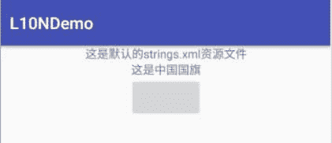
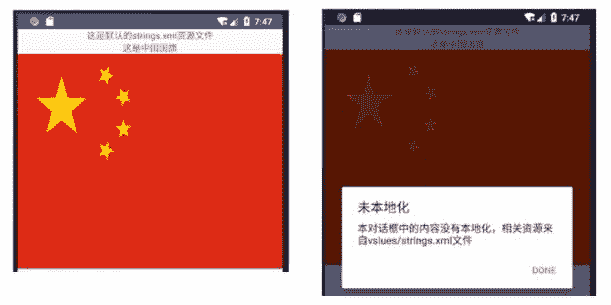

# Android 未本地化应用开发教程

> 原文：[`c.biancheng.net/view/3298.html`](http://c.biancheng.net/view/3298.html)

在本教程之前章节的实例中均未涉及本地化的问题，在此我们先看一下未本地化的应用程序在更改了手机的区域设置后运行效果会有什么不同。首先将手机区域设置为“zh_CN”。

新建一个 Eclipse Android Project，名为“L10NDemo”，全部使用默认设置，不修改任何代码。创建完成后，在 main.xml 文件中添加如下代码：

```

<?xml version= "l.0" encoding="utf-8"?>
<LinearLayout xmlns:android="http://schemas.android.com/apk/res/android"
    android:layout_width="fill_parent"
    android:layout_height="fill_parent"
    android:orientation="vertical">

    <TextView
        android:layout_width="fill_parent"
        android:layout_height="wrap_content"
        android:gravity="center_horizontal"
        android:text="@string/text_a" />

    <TextView
        android:layout_width="fill_parent"
        android:layout_height="wrap_content"
        android:gravity="center_horizontal"
        android:text="@string/text_b" />

    <Button
        android:id="@+id/flag_button"
        android:layout_width="wrap_content"
        android:layout_height="wrap_content"
        android:layout_gravity="center" />
</LinearLayout>
```

Main.xml 采用 LinearLayout 布局，分别放置了两个 TextView 和一个 Button，如图 1 所示。


图 1  默认设置的运行效果
Main.xml 所使用的资源文件 res/values/strings.xml 的代码如下：

```

<resources>
    <string name="app_name">L10NDemo</string>
    <string name="text_a">这是默认的 strings.xml 资源文件</string>
    <string name="text_b">这是中国国旗</string>
    <string name="dialog_title">未本地化</string>
    <string name="dialog_text">本对话框中的内容没有本地化，相关资源来自 vslues/strings.xml 文件</string>
</resources>
```

“L10NDemo”的主 Activity 为 L10NDemoActivity，MainActivity.java 的代码如下：

```

package introduction.android.HOnDemo;

import android.app.Activity;
import android.app.AlertDialog;
import android.content.DialogInterface;
import android.os.Bundle;
import android.view.View;
import android.widget.Button;

import introduction.android.l10ndemo.R;

public class MainActivity extends Activity {

    /**
     * Called when the activity is first created.
     */
    @Override

    public void onCreate(Bundle savedInstanceState) {
        super.onCreate(savedInstanceState);
        setContentView(R.layout.activity_main);
        Button b;
        (b = (Button) findViewById(R.id.flag_button)).setBackgroundDrawable(this.getResources().getDrawable(R.drawable.flag));
        // build dialog box to display when user clicks the flag
        AlertDialog.Builder builder = new AlertDialog.Builder(this);
        builder.setMessage(R.string.dialog_text)
                .setCancelable(false)
                .setTitle(R.string.dialog_title)
                .setPositiveButton("Done", new DialogInterface.OnClickListener() {
                    public void onClick(DialogInterface dialog, int id) {
                        dialog.dismiss();
                    }
                });
        final AlertDialog alert = builder.create();
        // set click listener on the flag to show the dialog box
        b.setOnClickListener(new View.OnClickListener() {
            public void onClick(View v) {
                alert.show();
            }
        });
    }
}
```

L10NDemoActivity 为 main.xml 中的 Button 设置了一幅图像，是 R.drawable.flag 指向的图像文件。

当用户单击 Button 时，即可弹出一个有 Done 按钮的 AlertDialog，显示 R.string.dialog_text 指向的内容，运行效果如图 2 所示。

图 2  按钮修改的运行效果
然后将手机区域设置修改为“en_US”，即美式英语。再次运行该实例，运行效果如图 3 所示。再将手机区域设置为其他区域，运行效果不变。
图 3   区域修改的运行效果
可见实例“L10NDemo”在不同的区域设置下，运行效果完全相同。这是因为 Android 系统对于未实现本地化的应用程序，均使用默认的资源文件，无论当前手机设备被设置为任何地区，应用程序的运行效果都相同。