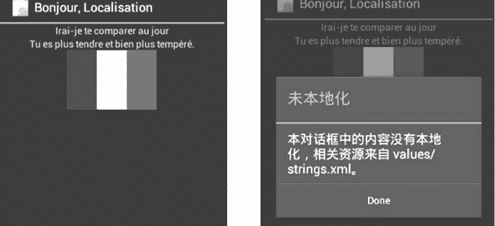

# Android 本地化应用开发教程

> 原文：[`c.biancheng.net/view/3302.html`](http://c.biancheng.net/view/3302.html)

本节我们尝试将 L10NDemo 实例本地化。为 L10NDemo 工程添加汉语、德语、日语、英语支持。

语言 _ 国家和为其所建立的资源文件夹的对应关系如表 1 所示。

**表 1 语言 _ 国家和资源文件夹的对应关系表**

| Locale Code | Language/Country | Location of strings.xml | Location of flag.png |
| --- | --- | --- | --- |
| Default | Chinese/china | res/values/ | res/drawable/ |
| zh-rCN | Chinese/china | res/values-zh-rCN | res/drawable/ |
| fr | French/France | res/values-fr/ | res/drawable-fr/ |
| ja | Japanese/Japan | res/values-ja/ | res/drawable-ja-rJP/ |
| en-rUS | English/United States | (res/values/) | res/drawable-en-rUS/ |

**1）**在 res 目录上右击，选择 New | Android XML File，如图 1 所示。在弹出的对话框中设置 Resource Type 为 Values、Project 为“DailyLog”、文件名为“strings.xml”，然后单击 Next 按钮。


图 1  New Android XML File 对话框
出现文件夹配置对话框，如图 2 所示。


图 2  New Android XML File 对话框
**2）**从左侧列表中选单击“->”按钮，为语言填写两个字符的代码 zh，从左侧列表选择单击“->”按钮，为地区填写两个字符的代码 CN，单击 Finish 按钮。Eclipse 即可在 res 目录下建立 values-zh-rCN 文件夹，该文件夹下的 strings.xml 用以存放区域设置为“zh_CN”的相关资源文件。

res/values-zh-rCN/strings.xml 文件的内容如下：

```

<resources>
    <string name="app_name">DailyLog</string>
    <string name="text_a">这是 values-zh-rCN 的 strings.xml 资源文件</string>
    <string name="text_b">这是中国国旗</string>
    <string name="dialog_title">已经本地化</string>
    <string name="dialog_text">本对话框中的内容已经本地化，所使用资源来自 values-zh-rCN/strings.xml 资源文件</string>
</resources>
```

**3）**依照同样的步骤为 res 文件添加文件夹 values-en-rUS、values-fr 和 values-ja，并创建对应的 string.xml 文件。

res/values-en-rUS/strings.xml 文件的内容如下：

```

<resources>
    <string name="app_name">DailyLog</string>
    <string name="text_a">local values from values-en-rUS/strings.xml</string>
    <string name="text_b">This is the flsg of America.</string>
    <string name="dialog_title">Localised</string>
    <string name="dialog_text">This dialog box "'"s strings are localised.For every locale,the text here will come from values-en-rUS/strings.xml</string>
</resources>
```

res/values-fr /strings.xml 文件的内容如下：

```

<?xml version="1.0" encoding="utf-8"?>
<resources>
    <string name="app_name">BonJour,Localisation</string>
    <string name="text_a">Irai-je te comparer au jour</string>
    <string name="text_b">Tu es plus tendre et bien plus tempere.</string>
</resources>
```

res/values-ja/strings.xml 文件的内容如下：

```

<?xml version= "1.0" encoding="utf-8"?>
<resources>
    <string name= "text_a"> あなた Ý なに かにた とえる としたら 夏の一日 でしよ うか? </string>
    <string name= "text_b">だが あなたは もつ と美し く、もつ と おだやかです.</string>
</resources>
```

**4）**依照同样的步骤在 DailyLog 工程的 res 目录下添加 drawable-en-rUS、drawable-fr、drawable-ja-rJP 目录，并将美国、法国和日本的国旗图标分别复制到对应文件夹下。此时，工程 DailyLog 的 res 目录结构如图 3 所示。
图 3  DailyLog 的 res 目录结构
至此，实例 DailyLog  的开发过程结束。下面更改手机的区域配置，运行应用程序，查看运行效果。

将区域配置修改为“en_US”，运行效果如图 4 所示。


图 4  设置“en_US”区域的运行效果
由运行效果可见，视图中的两个 TextView 以及对话框内的字符串都已经本地化，来自 values-en-rUS/strings.xml 文件，按钮上的美国国旗图标来自 drawable-en-rUS/flag.png 文件。

将区域修改为“zh_CN”，运行效果如图 5 所示。


图 5  设置“zh_CN”区域的运行效果
由运行效果可见，视图中的两个 TextView 以及对话框内的字符串都已经本地化。实例 DailyLog 中并没有建立 drawable-zh-rCN 文件夹，按钮上的中国国旗图标来自默认资源 drawable 文件夹。

将区域修改为 fr，运行效果如图 6 所示。


图 6  设置 fr 区域的运行效果
由运行效果可见，视图中的两个 TextView 以及应用程序的标题都已经本地化。由于 values-fr/strings.xml 文件中未包含 dialog_text 变量，因此文本框内的内容未被本地化，而是使用了 values/strings.xml 文件中的 dialog_text 变量。按钮上的法国国旗图标来自 drawable-fr/flag.png 文件。

将区域修改为 ja，运行效果如图 7 所示。


图 7  设置“ja”区域的运行效果
由运行效果可见，视图中的两个 TextView 已经本地化。由于 values-ja/strings.xml 文件中未包含 app_name 和 dialog_text 变量，因此文本框内的内容和应用程序标题都未被本地化，而是使用了 values/strings.xml 文件中的 dialog_text 变量。

虽然实例 DailyLog 中建立了 drawable-ja-rJP 文件夹，并提供了 flag.png 文件，但是由于“-ja-rJP”后缀与“-ja”后缀不一致，因此未能载入日本国旗图标，而是使用了默认的 drawable/flag.png 文件。

将区域修改为“ja-JP”，可以和 drawable-ja-rJP 目录项匹配，日本国旗图标被载入应用程序中。而字符串资源“values-ja”虽然和当前区域不在同一个地区，但也被正常载入。

这是因为“values-ja”仅指定了语言，而没有指定地区，因此该目录下的资源文件可以被所有语言为日语的区域所使用。运行效果如图 8 所示。

Android 系统根据资源文件的后缀名来实现应用程序的国际化。当手机被指定为某个特定区域后，应用程序自动读取对应后缀的文件夹下的资源文件，更新应用程序界面，达到本地化的目的。当某资源目录仅指定了语言而没有指定地区时，该资源可以被所有使用该语言的地区使用。


图 8  设置“ja-JP”区域的运行效果
在每个区域的本地化资源文件中，不需要包含所有的本地化资源，而只需定义与默认资源不同的本地化资源即可。

当在特定区域的资源文件中找不到对应的本地化资源时，Android 系统会自动使用默认的资源文件。

因此，Android 系统要求工程运行所需的所有默认的资源都必须存在。若应用程序中缺少某个默认资源，则当手机设备被设置为不支持的语言区域时，应用程序将不能运行。

例如，res/values/strings.xml 中缺少了应用程序运行所需的某一个字符串变量，当应用程序被设置为不支持的地区，尝试载入该默认资源时，会出现致命错误。

用户会看到提示应用程序错误的信息和强制关闭应用程序的按钮。这种错误不会被 Eclipse 检查出来，并且当应用程序运行于支持的地区时，该错误也不会被发现。这就要求程序开发人员在进行应用程序国际化开发时格外小心，避免这种错误。