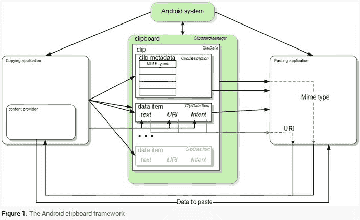

# Android 剪贴板数据转文本开发简介

> 原文：[`c.biancheng.net/view/3314.html`](http://c.biancheng.net/view/3314.html)

如果应用程序只能处理文本，可用 ClipData.Item.coerceToText() 方法进行转换，就可以从剪贴板上复制非文本数据。

这种方法将把 ClipData.Item 中的数据转换为文本，并且返回一个 CharSequence 对象。ClipData.Item.coerceToText() 的返回值依据 ClipData.Item 中的数据格式来确定。

#### 1）Text

若 ClipData.Item 是文本（getText() 不为 null），则 coerceToText() 返回文本。

#### 2）URI

若 ClipData.Item 是一个 UR（IgetUri() 不为 null），则 coerceToText() 会尝试将其视为 Content URI。

*   若 URI 是一个 Content URI 且 Provider 能返回文本流，则 coerceToText() 返回文本流。
*   若 URI 是一个 Content URI 但 Provider 无法提供文本流，则 coerceToText() 返回 URI 的字符串表示形式，该字符串表示形式与 Uri.toString() 的返回值一致。
*   若 URI 不是一个 Content URI，则 coerceToText() 返回 URI 的字符串表示形式，该字符串表示形式与 Uri.toString() 的返回值一致。

#### 3）Intent

如果 ClipData.Item 是一个 Inten（tgetIntent() 不为 null），则 coerceToText() 将其转换为 Intent URI 后返回。该字符串表示形式与 Intent.toUri(URI_INTENT_SCHEME) 的返回值一致。

剪贴板的整体框架如图 1 所示。

图 1  Android 剪贴板框架
复制数据时，应用程序将 ClipData 对象放入全局的 ClipboardManager 剪贴板中。

ClipData 内含一个或多个 ClipData.Item 对象以及一个 ClipDescription 对象。粘贴数据时，应用程序先获取 ClipData，从 ClipDescription 中读取 MIME 类型信息，再从 ClipData.Item 中或 ClipData.Item 指向的 Content Provider 中读取数据。