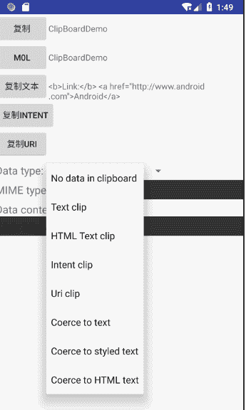

# Android 一键复制粘贴开发实例

> 原文：[`c.biancheng.net/view/3326.html`](http://c.biancheng.net/view/3326.html)

在看开发实例之前，我们先来了解一下如何设计有效的复制粘贴功能。

要为应用程序设计高效的复制与粘贴功能，需要注意以下几点：

1.  任何时候剪贴板中都只有一个 clip。系统中任何应用程序执行了新的复制操作，都会覆盖之前的 clip 。由于用户可能会跳离应用程序，并在返回前执行复制，因此不能确定剪贴板中包含前一次在该程序中复制的内容。
2.  设计 clip<span="">ClipData.Item 对象的初衷是为了支持一次复制/粘贴多个选项，而不是为了单个选项能包含多种不同的格式。通常一个 clip 中的所有 ClipData.Item 对象都应该具有相同的格式，也就是说，所有对象要么是简单文本，要么是 Content URI 或者 Intent，而不能混在一起使用。
3.  提供数据时，可以提交各种不同的 MIME 描述。把所支持的 MIME< span=""> 给 ClipDescription 对象，然后在 Content Provider 中实现这些 MIME 类型。
4.  从剪贴板读取数据时，应用程序对可用的 MIME 类型进行检查，然后决定要使用哪些类型。即使剪贴板中存在 clip，用户也请求了粘贴，应用程序不一定要执行粘贴，而是在 MIME 类型能够兼容时才执行粘贴，可以选用 coerceToText() 把剪贴板数据强制转换成文本。如果应用程序能支持多种 MIME 类型，用户先选择其中一种使用。

下面实例 ClipBoardDemo 修改自 Android SDK 中的 Demo，演示了 Android 的剪贴板对于带格式文本、无格式文本、HTML 文本、Intent 和 URI 的粘贴效果，并可以将这几种数据格式进行相互转化。该实例的运行效果如图 1 所示。


图 1  ClipBoardDemo 的运行效果
该实例的布局文件 clipboard.xml 的内容如下：

```

<?xml version="1.0" encoding="utf-8"?>

<ScrollView xmlns:android="http://schemas.android.com/apk/res/android"
    android:layout_width="match_parent"
    android:layout_height="match_parent"
    android:orientation="vertical">

    <LinearLayout
        android:layout_width="match_parent"
        android:layout_height="wrap_content"
        android:orientation="vertical">

        <LinearLayout
            android:layout_width="match_parent"
            android:layout_height="wrap_content"
            android:orientation="horizontal">

            <Button
                android:id="@+id/copy_styled_text"
                android:layout_width="wrap_content"
                android:layout_height="wrap_content"
                android:onClick="pasteStyleText"
                android:text="复制" />

            <TextView
                android:id="@+id/styled_text"
                android:layout_width="wrap_content"
                android:layout_height="wrap_content"
                android:textStyle="normal" />
        </LinearLayout>

        <LinearLayout
            android:layout_width="match_parent"
            android:layout_height="wrap_content"
            android:orientation="horizontal">

            <Button
                android:id="@+id/copy_plain_text"
                android:layout_width="wrap_content"
                android:layout_height="wrap_content"
                android:onClick="pastePlainText"
                android:text="M0l" />

            <TextView
                android:id="@+id/plain_text"
                android:layout_width="wrap_content"
                android:layout_height="wrap_content"
                android:textStyle="normal" />
        </LinearLayout>

        <LinearLayout
            android:layout_width="match_parent"
            android:layout_height="wrap_content"
            android:orientation="horizontal">

            <Button
                android:id="@+id/copy_html_text"
                android:layout_width="wrap_content"
                android:layout_height="wrap_content"
                android:onClick="pasteHtmlText"
                android:text="复制文本" />

            <TextView
                android:id="@+id/html_text"
                android:layout_width="wrap_content"
                android:layout_height="wrap_content"
                android:textStyle="normal" />
        </LinearLayout>

        <LinearLayout

            android:layout_width="match_parent"
            android:layout_height="wrap_content"
            android:orientation="horizontal">

            <Button
                android:id="@+id/copy_intent"
                android:layout_width="wrap_content"
                android:layout_height="wrap_content"
                android:onClick="pasteIntent"
                android:text="复制 intent" />
        </LinearLayout>

        <LinearLayout
            android:layout_width="match_parent"
            android:layout_height="wrap_content">

            <Button
                android:id="@+id/copy_uri"
                android:layout_width="wrap_content"
                android:layout_height="wrap_content"
                android:onClick="pasteUri"
                android:text="复制 URI" />
        </LinearLayout>

        <LinearLayout
            android:layout_width="match_parent"
            android:layout_height="wrap_content"
            android:layout_marginTop="8dp"
            android:orientation="horizontal">

            <TextView
                android:layout_width="wrap_content"
                android:layout_height="wrap_content"
                android:text="Data type: "
                android:textAppearance="?android:attr/textAppearanceMedium" />

            <Spinner
                android:id="@+id/clip_type"
                android:layout_width="wrap_content"
                android:layout_height="wrap_content"
                android:drawSelectorOnTop="true" />
        </LinearLayout>

        <LinearLayout
            android:layout_width="match_parent"
            android:layout_height="wrap_content"
            android:layout_marginTop="4dp"
            android:orientation="horizontal">

            <TextView
                android:layout_width="wrap_content"
                android:layout_height="wrap_content"
                android:text="MIME types: "
                android:textAppearance="?android:attr/textAppearanceMedium" />

            <TextView
                android:id="@+id/clip_mime_types"
                android:layout_width="0dp"
                android:layout_height="wrap_content"
                android:layout_weight="1"
                android:background="#ff303030"
                android:padding="4dp"
                android:textAppearance="?android:attr/textAppearanceMedium" />

        </LinearLayout>

        <TextView
            android:layout_width="wrap_content"
            android:layout_height="wrap_content"
            android:layout_marginTop="4dp"
            android:text="Data content:"
            android:textAppearance="?android:attr/textAppearanceMedium" />

        <TextView
            android:id="@+id/clip_text"
            android:layout_width="match_parent"
            android:layout_height="wrap_content"
            android:background="#ff303030"
            android:padding="4dp"
            android:textAppearance="?android:attr/textAppearanceMedium" />
    </LinearLayout>
</ScrollView>
```

该实例在定义 Button 的同时直接指定其响应函数，例如：

```

<Button
    android:id="@+id/copy_styled_text"
    android:layout_width="wrap_content"
    android:layout_height="wrap_content"
    android:onClick="pasteStyledText"
    android:text="复制格式文本"/>
```

其中的 android:onClick="pasteStyledText" 字段表示该按钮被点击时，直接调用 pasteStyledTest 方法进行处理，这样就省去了在 Java 文件中编写响应方法的代码。

该实例在复制过程中用到了一个名为 styled_text 的字符串，用 HTML 标识了文字的加粗、斜体等效果。因此，在工程的 values/strings.xml 文件中加入该变量名对应的字符串如下：

<string name="styled_text">Plain, <b>bold</b>, <i>italic</i>,
<b><i>bold-italic</i></b></string>

布局中的下拉列表在填充数据的过程中使用了数组进行填充，因此在工程的 values 文件夹下新建 Arrays.xml 文件，并新建数组数据如下：

```

<?xml version="1.0" encoding="utf-8"?>
<resources>
    <string-array name="clip_data_types">
        <item>No data in clipboard</item>
        <item>Text clip</item>
        <item>HTML Text clip</item>
        <item>Intent clip</item>
        <item>Uri clip</item>
        <item>Coerce to text</item>
        <item>Coerce to styled text</item>
        <item>Coerce to HTML text</item>
    </string-array>
</resources>
```

实例 ClipBoardDemo 的 MainActivity.java 文件代码如下：

```

package introduction.android.clipboarddemo;

import android.app.Activity;
import android.content.ClipboardManager;
import android.content.ClipData;
import android.content.Context;
import android.content.Intent;
import android.content.res.Resources;
import android.net.Uri;
import android.os.Bundle;
import android.text.method.LinkMovementMethod;
import android.view.View;
import android.widget.AdapterView;
import android.widget.ArrayAdapter;
import android.widget.Spinner;
import android.widget.TextView;
import android.widget.AdapterView.OnItemSelectedListener;

public class ClipBoardDemoActivity extends Activity {
    ClipboardManager mClipboard;
    Spinner mSpinner;
    TextView mMimeTypes;
    TextView mDataText;
    CharSequence mStyledText;
    String mPlainText;
    String mHtmlText;
    String mHtmlPlainText;
    ClipboardManager.OnPrimaryClipChangedListener mPrimaryChangeListener = new ClipboardManager.OnPrimaryClipChangedListener() {
        public void onPrimaryClipChanged() {
            updateClipData(true);
        }
    };

    @Override
    protected void onCreate(Bundle savedInstanceState) {
        super.onCreate(savedInstanceState);

        mClipboard = (ClipboardManager) getSystemService(CLIPBOARD_SERVICE);
        setContentView(R.layout.main);
        TextView tv;
        mStyledText = getText(R.string.app_name);
        tv = (TextView) findViewById(R.id.styled_text);
        tv.setText(mStyledText);
        mPlainText = mStyledText.toString();
        tv = (TextView) findViewById(R.id.plain_text);
        tv.setText(mPlainText);
        mHtmlText = "<b>Link:</b> <a href=\"http://www.android.com\">Android</a>";
        mHtmlPlainText = "Link: http://www.android.com";
        tv = (TextView) findViewById(R.id.html_text);
        tv.setText(mHtmlText);
        mSpinner = (Spinner) findViewById(R.id.clip_type);

        ArrayAdapter<CharSequence> adapter = ArrayAdapter.createFromResource(this,
                R.array.clip_data_types,
                android.R.layout.simple_spinner_item);
        adapter.setDropDownViewResource(android.R.layout.simple_spinner_dropdown_item);
        mSpinner.setAdapter(adapter);
        mSpinner.setOnItemSelectedListener(new OnItemSelectedListener() {
            public void onItemSelected(AdapterView<?> parent, View view, int position, long id) {
                updateClipData(false);
            }

            public void onNothingSelected(AdapterView<?> parent) {
            }
        });
        mMimeTypes = (TextView) findViewById(R.id.clip_mime_types);
        mDataText = (TextView) findViewById(R.id.clip_text);
        mClipboard.addPrimaryClipChangedListener(mPrimaryChangeListener);
        updateClipData(true);
    }

    @Override
    protected void onDestroy() {
        super.onDestroy();
        mClipboard.removePrimaryClipChangedListener(mPrimaryChangeListener);
    }

    public void pasteStyledText(View button) {
        mClipboard.setPrimaryClip(ClipData.newPlainText("Styled Text", mStyledText));
    }

    public void pastePlainText(View button) {
        mClipboard.setPrimaryClip(ClipData.newPlainText("Styled Text", mPlainText));
    }

    public void pasteHtmlText(View button) {
        mClipboard.setPrimaryClip(ClipData.newHtmlText("HTML Text", mHtmlPlainText,
                mHtmlText));
    }

    public void pastelntent(View button) {
        Intent intent = new Intent(Intent.ACTION_VIEW,
                Uri.parse("http://www.android.com/"));
        mClipboard.setPrimaryClip(ClipData.newIntent("VIEW intent", intent));
    }

    public void pasteUri(View button) {
        mClipboard.setPrimaryClip(ClipData.newRawUri("URI",
                Uri.parse("http://www.android.com/")));
    }

    void updateClipData(boolean updateType) {
        ClipData clip = mClipboard.getPrimaryClip();
        String[] mimeTypes = clip != null ? clip.getDescription().filterMimeTypes("*/*") :
                null;
        if (mimeTypes != null) {
            mMimeTypes.setText("");
            for (int i = 0; i < mimeTypes.length; i++) {
                if (i > 0) {
                    mMimeTypes.append("\n");
                    mMimeTypes.append(mimeTypes[i]);
                }
            }
        } else {
            mMimeTypes.setText("NULL");
        }
        if (updateType) {
            if (clip != null) {
                ClipData.Item item = clip.getItemAt(0);
                if (item.getHtmlText() != null) {
                    mSpinner.setSelection(2);
                } else if (item.getText() != null) {
                    mSpinner.setSelection(1);
                } else if (item.getIntent() != null) {
                    mSpinner.setSelection(3);
                } else if (item.getUri() != null) {
                    mSpinner.setSelection(4);
                } else {
                    mSpinner.setSelection(0);
                }
            } else {
                mSpinner.setSelection(0);
            }
        }
        if (clip != null) {
            ClipData.Item item = clip.getItemAt(0);
            switch (mSpinner.getSelectedItemPosition()) {
                case 0:
                    mDataText.setText("(No data)");
                    break;
                case 1:
                    mDataText.setText(item.getText());
                    break;
                case 2:
                    mDataText.setText(item.getHtmlText());
                    break;
                case 3:
                    mDataText.setText(item.getIntent().toUri(0));
                    break;
                case 4:
                    mDataText.setText(item.getUri().toString());
                    break;
                case 5:
                    mDataText.setText(item.coerceToText(this));
                    break;
                case 6:
                    mDataText.setText(item.coerceToStyledText(this));
                    break;
                case 7:
                    mDataText.setText(item.coerceToHtmlText(this));
                    break;
                default:
                    mDataText.setText("Unknown option: " + mSpinner.getSelectedItemPosition());
                    break;
            }
        } else {
            mDataText.setText("(NULL clip)");
        }
        mDataText.setMovementMethod(LinkMovementMethod.getInstance());
    }
}
```

其中代码段：

```

if (clip != null) {
    ClipData.Item item = clip.getItemAt(0);
    if (item.getHtmlText() != null) {
        mSpinner.setSelection(2);
    } else if (item.getText() != null) {
        mSpinner.setSelection(1);
    } else if (item.getIntent() != null) {
        mSpinner.setSelection(3);
    } else if (item.getUri() != null) {
        mSpinner.setSelection(4);
    } else {
        mSpinner.setSelection(0);
    }
} else {
    mSpinner.setSelection(0);
}
```

是根据粘贴内容来确定下拉列表的显示项的。

代码段：

```

ClipData.Item item = clip.getItemAt(0);
switch (mSpinner.getSelectedItemPosition()) {
    case 0:
        mDataText.setText("(No data)");
    break;
    case 1:
        mDataText.setText(item.getText());
    break;
    case 2:
        mDataText.setText(item.getHtmlText());
    break;
    case 3:
        mDataText.setText(item.getIntent().toUri(0));
    break;
    case 4:
        mDataText.setText(item.getUri().toString());
        break;
    case 5:
        mDataText.setText(item.coerceToText(this));
        break;
    case 6:
        mDataText.setText(item.coerceToStyledText(this));
        break;
    case 7:
        mDataText.setText(item.coerceToHtmlText(this));
        break;
    default:
        mDataText.setText("Unknown option: " + mSpinner.getSelectedItemPosition());
        break;
}
```

是根据用户选择的下拉列表项将粘贴内容转化为相应字符串并显示出来的。