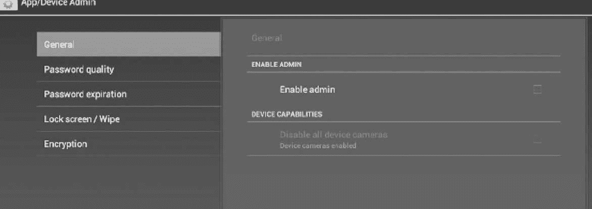
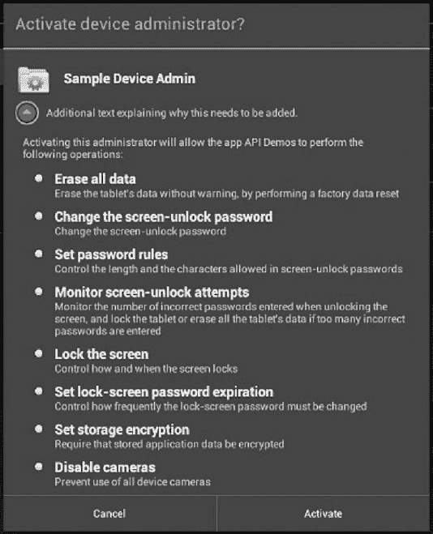

# Android 开发设备管理 API 应用教程

> 原文：[`c.biancheng.net/view/3459.html`](http://c.biancheng.net/view/3459.html)

本节通过 SDK 中的一个实例来讲解设备管理 API 的使用方法，运行效果如图 1 所示。


图 1  设备管理应用程序
该范例程序提供了一个使用设备管理 API 进行设备管理的模板，它展示了设备管理 API 的用户交互方法。其功能如下：

*   设置密码级别。
*   用户密码的特殊需求。比如，最小的密码长度，密码中必须包含数字、字符型数据的最小数量等。
*   设置密码。如果密码不符合指定的策略，系统返回一个错误。
*   设置错误密码的尝试次数，可以在设备删除之前出现（恢复到出厂设置）。
*   设置密码将要过期的时间长度。
*   设置密码历史长度（长度是关于旧密码保存的历史数量）。提供用户重新使用之前使用过的最后 n 个密码中的一个。
*   如果设备支持，指定应该被加密的存储数据。
*   设置闲置时间的最大值，即在设备自动锁定前的等待时间。
*   使设备立刻锁住。
*   擦拭设备数据（恢复出厂设置）。
*   禁用相机。

系统管理员可以使用设备管理 API 来编写一个应用，强制执行远程/本地设备安全政策。这部分给出了创建一个设备管理应用的实现步骤。

## 创建程序代码

对于使用设备管理 API 的应用程序，其 AndroidManifest.xml 代码必须包含如下信息。

#### 1）DeviceAdminReceiver 的一个子类，包括：

*   BIND_DEVICE_ADMIN 权限。
*   响应 ACTION_DEVICE_ADMIN_ENABLED 类型 Intent 的能力，在声明中作为一个 Intent Filter 表达。

#### 2）元数据中使用的安全政策的声明。

设备管理范例程序的 AndroidManifest.xml 代码如下：

```

<activity android:name=".app.DeviceAdminSample"
    android:label="@string/activity_sample_device_admin">
    <intent-filter>
        <action android:name="android.intent.action.MAIN" />
        <category android:name="android.intent.category.LAUNCHER" />
    </intent-filter>
</activity>
<receiver android:name=".app.DeviceAdminSample$DeviceAdminSampleReceiver"
    android:label="@string/sample_device_admin"
    android:description="@string/sample_device_admin_description"
    android:permission="android.permission.BIND_DEVICE_ADMIN">
    <meta-data android:name="android.app.device_admin"
        android:resource="@xml/device_admin_sample"/>
    <intent-filter>
        <action android:name="android.app.action.DEVICE_ADMIN_ENABLED"/>
    </intent-filter>
</receiver>
```

注意：

**1）**在项目的 ApiDemos/res/values/strings.xml 中设置以下属性值。

*   android:label="@string/activity_sample_device_admin"　用户可读库。
*   android:label="@string/sample_device_admin"　用户可读库的权限。
*   android:description="@string/sample_device_admin_description"　用户可读的权限描述，一个描述通常是更长和更丰富的内容。

关于更多资源的相关信息，请参看 Application Resources。

**2）**android:permission="android.permission.BIND_DEVICE_ADMIN"是 DeviceAdminReceiver 子类具备的权限，保证系统的应用权限（其他应用都不会拥有该权限），对滥用设备管理的其他应用提供防御。

**3）**android:name="android.app.action.DEVICE_ADMIN_ENABLED"是 DeviceAdminReceiver 的子类的 Action 类型，用于对设备进行管理。当用户开启设备管理应用时，它被设置为接收者。代码通常在 onEnabled() 中处理。为了得到支持，接收者也必须得到 BIND_DEVICE_ADMIN 权限以便其他应用程序无法拒绝。

**4）**当用户开启设备管理应用时，给接收者权限去执行，回应给系统特定的接收事件的广播。当出现匹配的事件时，应用就可以强加一个规范。比如，如果用户尝试设置一个新的但不符合规范的密码，应用可以提示用户选择一个不同的符合规范的密码。

**5）**android:resource="@xml/device_admin_sample" 声明使用在元数据中的安全规范。元数据为指定设备管理员提供了更多被 DeviceAdminInfo 类所解析的信息。

以下是 device_admin_sample.xml 的代码。

```

<device-admin xmlns:android="http://schemas.android.com/apk/res/android">
<uses-polocies>
    <limit-password/>
    <watch-login/>
    <reset-password/>
    <force-lock/>
    <wipe-data/>
    <expire-password/>
    <encrypted-storage/>
    <disable-camers/>
</uses-polocies>
</device-admin>
```

在设备管理应用设计中，不需要包括所有的策略，只要有和应用相关的策略就可以。

设备管理 API 包含以下几个类。

**1）DeviceAdminReceiver**

该类是完成设备管理组件的基类。这个类提供了一个解释系统发送的原始 Intent 动作的方便途径。设备管理程序必须包含一个它的子类。

**2）DevicePolicyManager**

该类负责管理在设备上执行的安全策略。大多数客户端要发布一个已经被当前用户启用的 DeviceAdminReceiver。DevicePolicyManager 为至少一个 DeviceAdminReceiver 实例管理安全策略。

**3）DeviceAdminInfo**

该类是用来为系统管理组件指定元数据的。

这些类提供一个设备管理应用实现的基础。接下来将描述如何使用 DeviceAdminReceiver 和 DevicePolicyManager API 来编写一个设备管理应用。

## DeviceAdminReceiver 的子类

要创建一个设备管理应用程序，必须实现一个 DeviceAdminReceiver 的子类。

DeviceAdminReceiver 包含一系列回调函数，这些回调函数会在具体的事件发生时被调用。

以下代码只在 DeviceAdminReceiver 子类中简单地显示了 Toast，作为对相应事件的应答。

要创建一个设备管理应用程序，必须实现一个 DeviceAdminReceiver 的子类。

DeviceAdminReceiver 包含一系列回调函数，这些回调函数会在具体的事件发生时被调用。

以下代码只在 DeviceAdminReceiver 子类中简单地显示了 Toast，作为对相应事件的应答。

```

public class DeviceAdminSample extends DeviceAdminReceiver {

    void showToast(Context context, String msg) {
        String status = context.getString(R.string.admin_receiver_status, msg);
        Toast.makeText(context, status, Toast.LENGTH_SHORT) .show ();
    }

    @Override
    public void onEnabled(Context context, Intent intent) {
        showToast(context, context.getString(R.string.admin_receiver_status_enabled));
    }

    @Override
    public CharSequence onDisableRequested(Context context, Intent intent) {
        return context.getString(R.string.admin_receiver_status_disable_warning);
    }

    @Override
    public void onDisabled(Context context, Intent intent) {
        showToast (context, context.getString (R.string.admin receiver status disabled));
    }

    @Override
    public void onPasswordChanged(Context context, Intent intent) {
        showToast(context,context.getString(R.string.admin_receiver_status_pw_changed));
    }
...
}
```

## 启用程序

用户启用程序是设备管理程序要处理的最重要的事件之一。用户必须明确启用设备管理程序才能使安全策略在设备上得以执行。如果用户选择不启用，那么安全策略就不会被执行，用户也就无法使用设备管理程序。

只要用户发出了 ACTION_ADD_DEVICE_ADMIN 的 Intent 动作，应用程序即可被启用。在以下示例中，用户点击“Enable Admin” 选择框，设备就会提示用户已经启用了设备管理程序，如图 2 所示。


图 2  启用程序
下面是当用户点击“Enable Admin”选择框时要执行的代码，结果触发了 onPreferenceChange() 回调函数。当用户改变 Preference 的值时，就会调用这个回调函数。如果用户启用程序，界面就会提示用户正在启用程序，如图 2 所示，否则就是禁止程序。

```

@Override
public boolean onPreferenceChange(Preference preference, Object newValue) {
    if (super.onPreferenceChange(preference,newValue)){
        return true;
    }
    boolean value = (Boolean) newValue;
    if (preference == mEnableCheckbox) {
        if (value != mAdminActive) {
            if (value) {
                // Launch the activity to have the user enable our admin.
                Intent intent = new Intent(DevicePolicyManager.ACTION_ADD_DEVICE_ADMIN);
                intent.putExtra(DevicePolicyManager.EXTRA_DEVICE_ADMIN,mDeviceAdminSample);
                intent.putExtra(DevicePolicyManager.EXTRA_ADD_EXPLANATION,
                mActivity.getString(R.string.add_admin_extra_app_text));
                startActivityForResult(intent, REQUEST_CODE_ENABLE_ADMIN);

                // return false - don't update checkbox until we're really active
                return false;

            } else {
                mDPM.removeActiveAdmin(mDeviceAdminSample);
                enableDeviceCapabilitiesArea(false);
                mAdminActive = false;
            }
        }
    } else if (preference == mDisableCameraCheckbox) {
        mDPM.setCameraDisabled(mDeviceAdminSample, value);
        ...
    }
    return true;
}
```

其中，intent.putExtra(DevicePolicyManager.EXTRA_DEVICE_ADMIN, mDeviceAdminSample) 说明 mDeviceAdminSample 是目标策略（DeviceAdminReceiver 是一个组件）。这些代码会调用图 2 的界面，让用户选择是否添加系统管理员。

使用 DevicePolicyManager 的 isAdminActive() 方法可以实现确定管理程序是否已经被启用。需要注意的是，该方法需要一个 DeviceAdminReceiver 类型的参数。

```

DevicePolicyManager mDPM;
...
private boolean isActiveAdmin() {
     return mDPM.isAdminActive(mDeviceAdminSample);
}
```

## 管理策略

DevicePolicyManager 是设备管理的主类。通过它可以实现屏幕锁定、屏幕亮度调节、出厂设置等功能。DevicePolicyManager 为一个或多个 DeviceAdminReceiver 类的实例管理策略。

获得 DevicePolicyManager 实例的方法可以通过以下代码实现：

DevicePolicyManager mDPM = (DevicePolicyManager)getSystemService(Context.DEVICE_POLICY_SERVICE);

本小节主要描述如何使用 DevicePolicyManager 执行设置密码策略、设备解锁策略和指定数据擦除功能等。

#### 1）设置密码策略

DevicePolicyManager 包括许多用来设置和执行设备密码策略的 API。在设备管理 API 中，密码只是用来解锁屏幕的。本小节描述了密码相关的任务。

#### 2）设置设备密码

以下代码用于显示一个用户界面提醒用户设置密码：

Intent intent = new Intent(DevicePolicyManager.ACTION_SET_NEW_PASSWORD);
startActivity(intent);

#### 3）设置密码组成策略

解锁策略可以由 DevicePolicyManager 的常量来设置。

*   PASSWORD_QUALITY_ALPHABETIC　用户输入的密码必须要有字母（或者其他字符）。
*   PASSWORD_QUALITY_ALPHANUMERIC　用户输入的密码必须要有字母和数字。
*   PASSWORD_QUALITY_NUMERIC　用户输入的密码必须要有数字。
*   PASSWORD_QUALITY_COMPLEX　用户输入的密码必须要有至少一个数字、字母和特殊字符。
*   PASSWORD_QUALITY_SOMETHING　由设计人员决定。
*   PASSWORD_QUALITY_UNSPECIFIED　对密码没有要求。

例如，按需求设置数字密码，其设置策略如下：

```

DevicePolicyManager mDPM;
ComponentName mDeviceAdminSample;
...
mDPM.setPasswordQuality(mDeviceAdminSample,DevicePolicyManager.PASSWORD_QUALITY_ALPHANUMERIC);
```

#### 4）设置对密码内容的具体要求

从 Android 3.0 开始，DevicePolicyManager 就提供了一些能很好地调节密码内容的方法。例如，可以要求密码必须有 n 个大写字母。下面这些就是提供功能的方法：

*   setPasswordMinimumLetters()
*   setPasswordMinimumLowerCase()
*   setPasswordMinimumUpperCase()
*   setPasswordMinimumNonLetter()
*   setPasswordMinimumNumeric()
*   setPasswordMinimumSymbols()

设置最少两个大写字母的密码，其代码如下：

```

DevicePolicyManager mDPM;
ComponentName mDeviceAdminSample;
int pwMinUppercase = 2;
...
mDPM.setPasswordMinimumUpperCase(mDeviceAdminSample,pwMinUppercase);
```

#### 5）设置密码最小长度

可以指定密码的最小长度，例如：

DevicePolicyManager mDPM;
ComponentName mDeviceAdminSample;
int pwLength;
...
mDPM.setPasswordMinimumLength(mDeviceAdminSample, pwLength);

#### 6）设置密码最多错误输入次数

可以设置允许密码输入错误的最大次数，超过这个次数设备就要擦除数据（恢复出厂设置），例如：

DevicePolicyManager mDPM;
ComponentName mDeviceAdminSample;
int maxFailedPw;
...
mDPM.setMaximumFailedPasswordsForWipe(mDeviceAdminSample, maxFailedPw);

#### 7）设置密码过期时间

从 Android 3.0 开始，可以使用 setPasswordExpirationTimeout() 方法设置密码何时失效，系统会以毫秒为单位倒计时，例如：

DevicePolicyManager mDPM;
ComponentName mDeviceAdminSample;
long pwExpiration;
...
mDPM.setPasswordExpirationTimeout(mDeviceAdminSample, pwExpiration);

#### 8）对密码的历史记录进行限制

从 Android 3.0 开始，可以使用 setPasswordHistoryLength() 限制用户使用的密码要多久不能重复，这个方法中包含 length 参数，该参数用来设置要记录密码的个数。当该策略被激活时，用户就不能使用所设定范围内的旧密码当作新密码使用，防止用户一直使用同一个密码。这个策略通常与 setPasswordExpirationTimeout() 一起使用，迫使用户每过一段时间就得换一个新的密码。

例如，下面的代码可以防止用户使用近期用过的 5 个密码：

DevicePolicyManager mDPM;
ComponentName mDeviceAdminSample;
int pwHistoryLength = 5;
...
mDPM.setPasswordHistoryLength(mDeviceAdminSample, pwHistoryLength);

#### 9）设置锁屏

在设定的时间内没有使用设备，就把设备锁屏，例如：

DevicePolicyManager mDPM;
ComponentName mDeviceAdminSample;
...
long timeMs = 1000L*Long.parseLong(mTimeout.getText().toString());
mDPM.setMaximumTimeToLock(mDeviceAdminSample, timeMs);

还可以使设备立即锁屏：

DevicePolicyManager mDPM;
mDPM.lockNow();

#### 10）数据擦除

可以使用 DevicePolicyManager 的 wipeData() 方法使设备恢复出厂设置。在设备被偷或者丢失的情况下非常有用。当然，恢复出厂设置要慎用。例如，在用户输入错误密码达到固定次数之后，可以使用 setMaximumFailedPasswordsForWipe() 来擦除设备数据，代码如下：

DevicePolicyManager mDPM;
mDPM.wipeData(0);

wipeData() 方法的参数是一个整数，这里暂时必须为 0。

#### 11）禁用摄像头

Android N 系统可以禁用摄像头，但不是永久禁用。摄像头可以动态地禁用/启用在不同的上下文、时间等。

使用 setCameraDisabled() 来设置摄像头是否被禁用。例如，下面的代码就根据选择框的状态来决定摄像头是否被禁用：

private CheckBoxPreference mDisableCameraCheckbox;
DevicePolicyManager mDPM;
ComponentName mDeviceAdminSample;
...
mDPM.setCameraDisabled(mDeviceAdminSample, mDisableCameraCheckbox.isChecked());

#### 12）加密存储

从 Android 3.0 开始，可以使用 setStorageEncryption() 方法来设置加密存储，前提是设备必须支持，例如：

DevicePolicyManager mDPM;
ComponentName mDeviceAdminSample;
...
mDPM.setStorageEncryption(mDeviceAdminSample, true);