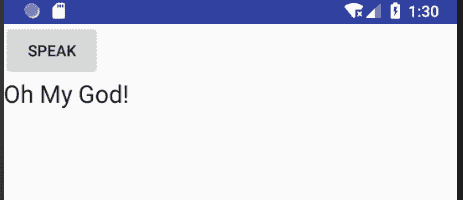

# Android 文本语音 API 开发教程

> 原文：[`c.biancheng.net/view/3471.html`](http://c.biancheng.net/view/3471.html)

Android 7.0 提供了 TextToSpeech API，可以方便地实现将文本转化为语音的功能。借助于 TextToSpeech API，企业可以很容易地开发出自己的基于文本的语音播放应用程序。

TextToSpeechDemo 是一个使用 TextToSpeech API 进行文本语音播放的实例，修改自 Android SDK 自带的 Demo 实例，其运行效果如图 1 所示。点击 speak 按钮就可以将按钮下方显示的文本内容以语音方式播放出来。


图 1  文本语音播放
其布局文件 text_to_speech.xml 的内容如下：

```

<?xml version="l.0" encoding="utf-8"?>
<LinearLayout xmlns:android="http://schemas.android.com/apk/res/android"
    android:layout_width="match_parent"
    android:layout_height="match_parent"
    android:orientation="vertical">

    <Button
        android:id="@+id/again_button"
        android:layout_width="wrap_content"
        android:layout_height="wrap_content"
        android:enabled="false"
        android:text="speak" />

    <TextView
        android:id="@+id/textView1"
        android:layout_width="wrap_content"
        android:layout_height="wrap_content"
        android:text="Large Text"
        android:textAppearance="?android:attr/textAppearanceLarge" />
</LinearLayout>
```

实例 TextToSpeechDemo 中 TextToSpeechActivity.java 的代码如下：

```

package introduction.android.texttospeechdemo;

import java.util.Locale;
import java.util.Random;

import android.app.Activity;
import android.os.Bundle;
import android.speech.tts.TextToSpeech;
import android.util.Log;
import android.view.View;
import android.widget.Button;
import android.widget.TextView;

public class TextToSpeechActivity extends Activity implements TextToSpeech.OnInitListener {
    private static final String TAG = "TextToSpeechDemo";
    private TextToSpeech mTts;
    private Button mAgainButton;
    private TextView tv;

    @Override
    public void onCreate(Bundle savedInstanceState) {
        super.onCreate(savedInstanceState);
        setContentView(R.layout.activity_text_to_speech);

        // Initialize text-to-speech. This is an asynchronous operation.
        // The OnInitListener (second argument) is called after initialization completes.
        mTts = new TextToSpeech(this, this// TextToSpeech.OnInitListener
        );
        tv = (TextView) this.findViewById(R.id.textView1);

        // The button is disabled in the layout.
        // It will be enabled upon initialization of the TTS engine.
        mAgainButton = (Button) findViewById(R.id.again_button);

        mAgainButton.setOnClickListener(new View.OnClickListener() {
            public void onClick(View v) {
                sayHello();
            }
        });
    }

    @Override
    public void onDestroy() {
        // Don't forget to shutdown!
        if (mTts != null) {
            mTts.stop();
            mTts.shutdown();
        }
        super.onDestroy();
    }

    // Implements TextToSpeech.OnInitListener.
    public void onInit(int status) {
        // status can be either TextToSpeech.SUCCESS or TextToSpeech.ERROR.
        if (status == TextToSpeech.SUCCESS) {
            // Set preferred language to US english.
            // Note that a language may not be available, and the result will indicate this,
            int result = mTts.setLanguage(Locale.US);
            // Try this someday for some interesting results.
            // int result mTts.setLanguage(Locale.FRANCE);
            if (result == TextToSpeech.LANG_MISSING_DATA || result == TextToSpeech.LANG_NOT_SUPPORTED) {
                // Lanuage data is missing or the language is not supported.
                Log.e(TAG, "Language is not available.");
            } else {
                // Check the documentation for other possible result codes.
                // For example, the language may be available for the locale,
                // but not for the specified country and variant.

                // The TTS engine has been successfully initialized.
                // Allow the user to press the button for the app to speak again.
                mAgainButton.setEnabled(true);
                // Greet the user.
                sayHello();
            }
        } else {
            // Initialization failed.
            Log.e(TAG, "Could not initialize TextToSpeech.");
        }
    }

    private static final Random RANDOM = new Random();
    private static final String[] HELLOS = {
            "Hello",
            "Congratulation",
            "Greetings",
            "How are you!",
            "What's your name?",
            "I am a good student!",
            "Oh My God!"
    };

    private void sayHello() {
        // Select a random hello.
        int helloLength = HELLOS.length;
        String hello = HELLOS[RANDOM.nextInt(helloLength)];
        mTts.speak(hello, TextToSpeech.QUEUE_FLUSH, // Drop all pending entries in the playback queue,
                null);
        tv.setText(hello);
    }
}
```

在这段内码中：

```

private static final String[] HELLOS = {
    "Hello",
    "Congratulation",
    "Greetings",
    "How are you!",
    "What's your name?",
    "I am a good student!",
    "Oh My God!"
};
```

HELLOS 数组中存放了用于播放的文本，读者如果想播放自己的文本，只需要替换该数组内的字符串即可。

mTts = new TextToSpeech(this,this);

创建了 TextToSpeech 实例 mTts，该构造方法的第一个参数表示容纳该对象的容器，第二个参数表示实现文本语音回调接口 TextToSpeech.OnInitListener 的类，该接口提供一个 public void onInit(int status) 方法，用于对文本语音 API 进行初始化。

TextToSpeech 实例通过 speak 方法即可进行语音播放。本实例是以随机顺序播放 HELLOS 中的字符串的。

目前，该功能对英文支持较好，暂不支持中文文本播放。