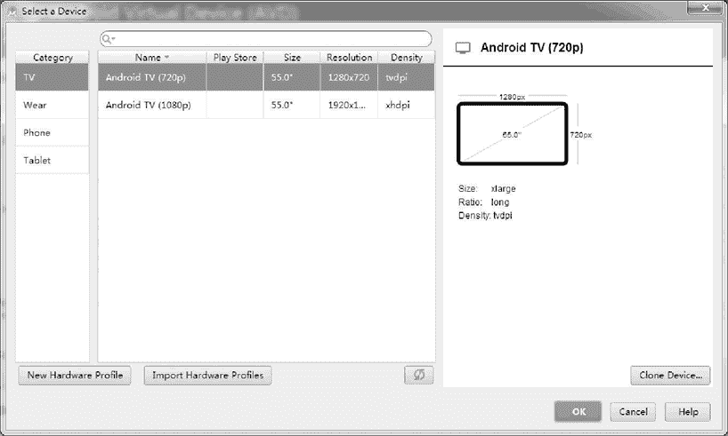
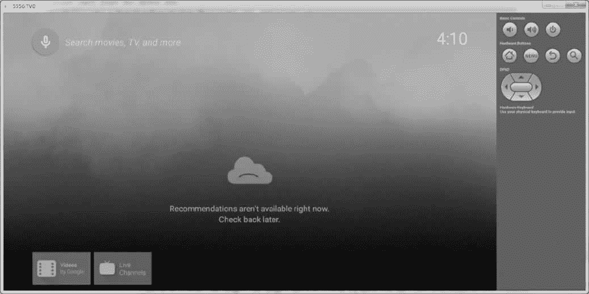

# Android TV 应用开发教程

> 原文：[`c.biancheng.net/view/3473.html`](http://c.biancheng.net/view/3473.html)

电视应用和手机、平板使用相同的结构，这意味着调整已有的应用程序就可以运行在电视设备或安卓应用上。但是需要注意的是，已有的应用程序必须满足一些要求，才能够获得在谷歌应用商店上架的权利。

本节主要描述创建电视应用的开发环境以及如何将现有的应用程序进行最小的修改，使得该应用能够在电视应用上运行。

## 创建电视应用项目

要建立电视版应用，需要满足以下几点：

*   更新 SDK 工具到 24.0.0 及以上版本。
*   更新 SDK 工具包，启动、创建并测试可穿戴应用。
*   更新安卓 SDK 到安卓 7.0（API 24）及以上版本。
*   更新平台版本，为电视应用提供新的 API。
*   拥有创建或者更新的应用项目。

创建一个能够在电视设备上运行的应用，还需要使用以下元素：

#### 1）应用于电视的活动（Activity for TV）

该元素是必须使用的，需要在应用程序清单上声明一个能够在电视设备上运行的活动。

#### 2）电视支持库（TV Support Libraries）

该元素是可选的，支持库为电视设备建立用户接口的小部件提供支持。

为了能够使用新的电视设备的 API，必须针对 Android N（API 等级 24）及以上版本创建一个新的项目或者修改一个已有的项目。

#### 1）声明一个 TV Activity

运行在电视设备上的应用必须在 Manifest 中为 Activity 匹配 android.intent.category.LEANBACK_LAUNCHER 意图过滤器（Intent Filter）。

添加过滤器的目的主要是为了 Google Play 的识别，没有添加相应过滤器的应用，Google Play 是不允许上架的。

以下代码段用于实现如何使用这个过滤器：

```

<application
    android:allowBackup="true"
    android:icon="@mipmap/ic_launcher"
    android:label="@string/app_name"
    android:roundIcon="@mipmap/ic_launcher_round"
    android:supportsRtl="true"
    android:theme="@style/AppTheme">

    <activity android:name="com.example.android.MainActivity"
     android:label="@string/app_name">

        <intent-filter>
            <action android:name="android.intent.action.MAIN" />
            <category android:name="android.intent.category.LAUNCHER" />
        </intent-filter>
    </activity>

    <activity android:name="com.example.android.TVActivity"
     android:label="@string/app_name"
     android:theme="@style/Theme.Leanback">

        <intent-filter>
            <action android:name="android.intent.action.MAIN" />
            <category android:name="android.intent.category.LAUNCHER" />
        </intent-filter>
    </activity>
</application>
```

本例中第二个 <activity> 活动应用清单入口声明能够打开一个电视设备的活动。

需要注意的是，如果应用的过滤器中不包括 CATEGORY_LEANBACK_LAUNCHER，那么用户在电视设备上运行谷歌应用商店时是看不到该应用的，同时使用开发者工具加载一个电视设备时，如果该应用没有这个过滤器，这个应用也不会出现在电视用户接口中。

如果修改一个已有的应用在电视应用中使用，电视应用上的布局不同于手机或平板电脑。电视应用的用户接口（或者是已存在的电视应用的一部分）应当提供一个简单的接口，这个接口可以非常简单地使用遥控器进行遥控。

关于设计一个电视应用的指导，请查看 TV Design。关于电视布局最低运行要求的相关信息，请查看 Building TV Layouts。

#### 2）声明 Leanback 技术支持

安卓电视要求应用声明 Leanback 接口。如果开发的应用打算应用在各个移动设备（如手机、可穿戴设备、平板电脑等）上，那么要将 Leanback 的 required 的属性值设置为 false。如果将 required 的属性值设置为 true，应用将只能运行在使用 Leanback 的设备上。其代码如下：

```

<manifest>
<uses-feature
    android:name="android.software.leanback"
    android:required="false"/>
    ...
</manifest>
```

#### 3）声明触摸屏的值为 false

电视设备上的应用不依赖于触摸屏进行输入。为了让大家更加清楚这一点，在电视应用的应用程序清单上，android.hardware.touchscreen 的值设为 false。

false 说明应用能够运行在电视设备上，在谷歌的应用商店才会被视为一个电视应用。以下代码给出了 android.hardware.touchscreen 的用法。

```

<manifest>
<uses-feature
    android:name="android.hardware.touchscreen"
    android:required="false"/>
    ...
</manifest>
```

注意：在应用程序清单中必须像上面的代码中那样，声明应用不需要使用触摸屏，否则应用将不会出现在谷歌应用商店里。

#### 4）提供一个主屏幕 banner

应用必须为每个包含 Leanback 桌面过滤器的本地化提供一个主屏幕 banner。

banner 指出应用运行时将会出现的应用主屏幕和游戏行。在 Manifest 中，banner 的代码如下：

```

<application>
    ...
    android:banner="@drawable/banner"/>
    ...
</application>
```

<application> 标签中的 android:banner 属性设置了所有应用活动的默认 banner，也可以在 <activity> 标签中应用一个特定活动的 banner。

更多 banners 信息可以在 UI Patterns for TV design guide 中查找。

## 添加 TV 支持库

为了在电视上使用，安卓 SDK 包括 TV Support Libraries，这些 Support Libraries 提供 API 和用户接口组件，它们被放在 <sdk>/extras/android/support/ 文件夹下。以下是主要的库及其功能。

**1）v17 leanback library**

该库为电视版应用提供接口组件，尤其为那些媒体回放的应用。

**2）v7 recyclerview library**

该库提供管理内存中存放的长列表的高效方式的类。在 v17 leanback 库中的类依赖于该库中的类。

**3）v7 cardview library**

该库为展示信息卡提供用户接口的小部件，比如媒体缩略图和描述等。

注意：电视应用中不是必须使用这些支持库，只是建议大家使用，特别是为提供媒体素材库浏览接口的应用使用。

使用 v17 leanback 库时，需要注意的是，它依赖于 v4 支持库。这意味着使用 leanback 支持库的应用应该包含以下所有的支持库：

*   v4 support library
*   v7 recyclerview support library
*   v17 leanback support library

v17 leanback 包含应用项目中需要特定步骤的资源。

## 建立 TV 应用

完成前两步之后，就可以开始为大屏幕建立应用了。电视应用分为以下几种：

#### 1）建立电视回放应用

电视是用来娱乐的，所以安卓提供了一系列用户接口工具和小部件，使建立的电视版应用能够欣赏影片和音乐，使用户能够浏览到想要的内容。

#### 2）帮助用户查找内容

因为所有的内容都在用户的手指间，所以帮助他们选择喜欢的内容和提供给他们内容一样重要。这里就是讨论如何在电视设备上找到喜欢的内容。

#### 3）电视游戏

电视设备是非常好的游戏平台。基于 Android TV 的电视游戏具有广阔的发展空间。

## 运行 TV 应用

运行应用在开发过程中是一个非常重要的过程。

Android SDK 中的 AVD 管理器提供了设备定义，它允许创建虚拟电视设备、运行和测试应用程序。

创建虚拟电视设备需要以下 4 个步骤：

*   打开安卓虚拟设备管理器。
*   在安卓虚拟设备管理器对话框中，点击“设备定义（Device Definitions）”标签。
*   选择一个安卓电视类型，点击“创建安卓虚拟设备（CreateAVD）”。
*   选择模拟器选项，点击 OK 按钮创建安卓虚拟机。

创建电视 AVD 的界面如图 1 所示。注意：为了使电视模拟器设备达到最好的效果，最好能够使用主机的 GPU 选项，这样可以为虚拟设备加速。创建的 TV AVD 如图 2 所示。


图 1  创建 TV AVD
 
图 2  TV AVD
要测试虚拟设备上的应用，需要两个步骤：

1.  在开发环境中编译电视应用。
2.  在开发环境中运行应用，选择电视虚拟设备作为目标设备。