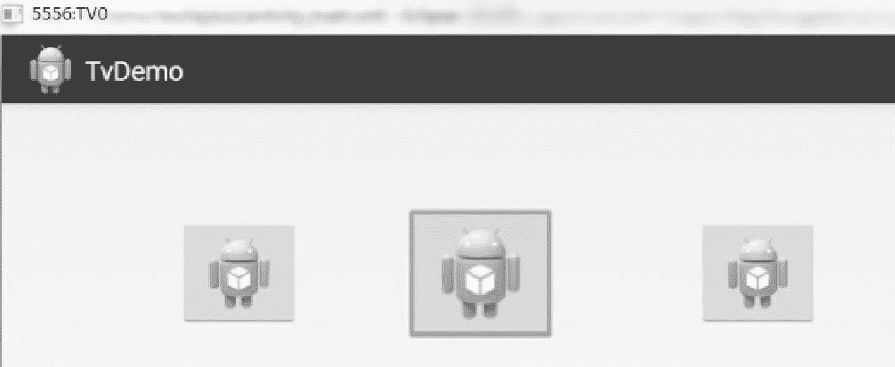
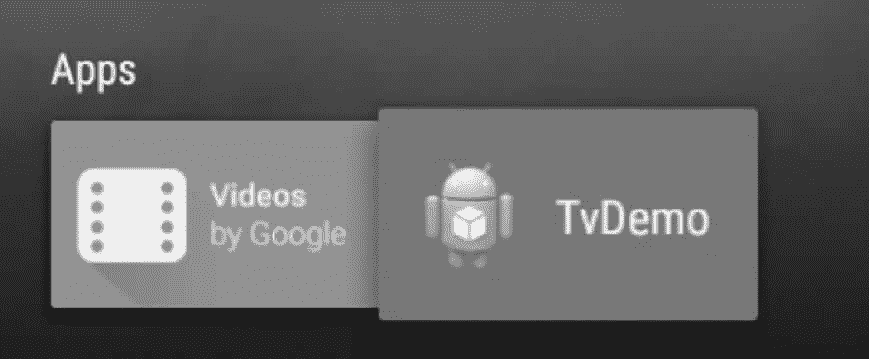

# Android TV 应用开发实例

> 原文：[`c.biancheng.net/view/3474.html`](http://c.biancheng.net/view/3474.html)

实例 TvDemo 演示了开发电视应用的基本过程。该实例完成了在电视上对三个 ImageButton 的导航效果，当图像按键获得焦点时会变大，其运行效果如图 1 所示。


图 1  TvDemo 的运行效果
为符合 Google Play Store 的商品规范，需要首先为 TvDemo 应用程序取消触摸屏支持。在该工程的 AndroidManifest.xml 文件中加入：

<uses-feature android:required="false" android:name="android.hardware.touchscreen"/>

为了能够将该应用显示到电视的 App 列表中，需要在该工程的启动 Activity 的过滤器中添加如下代码：

<category android:name="android.intent.category.LEANBACK_LAUNCHER" />

添加后，TvDemo 就会出现在电视的 App 列表中，如图 2 所示。


图 2  电视的 App 列表
该工程的 Manifest 文件内容如下：

```

<?xml version="1.0" encoding="utf-8"?>
<manifest xmlns:android="http://schemas.android.com/apk/res/android"
    package="introduction.android.tvdemo"
    android:versionCode="1"
    android:versionName="1.0">

    <uses-sdk
        android:minSdkVersion="22"
        android:targetSdkVersion="22" />
    <uses-feature
        android:name="android.hardware.touchscree"
        android:required="false" />
    <application
        android:allowBackup="true"
        android:icon="@mipmap/ic_launcher"
        android:label="@string/app_name"
        android:roundIcon="@mipmap/ic_launcher_round"
        android:supportsRtl="true"
        android:theme="@style/AppTheme">
        <activity android:name=".MainActivity">
            <intent-filter>
                <action android:name="android.intent.action.MAIN" />
                <category android:name="android.intent.category.LAUNCHER" />
            </intent-filter>
        </activity>
    </application>

</manifest>
```

其布局文件 activity_main.xml 的代码如下：

```

<?xml version="l.0" encoding="utf-8"?>
<RelativeLayout xmlns:android="http://schemas.android.com/apk/res/android"
    xmlns:tools="http://schemas.android.com/tools"
    android:layout_width="match_parent"
    android:layout_height="match_parent"
    android:paddingBottom="@dimen/activity_vertical_margin"
    android:paddingLeft="@dimen/activity_horizontal_margin"
    android:paddingRight="@dimen/activity_horizontal_margin"
    android:paddingTop="@dimen/activity_vertical_margin"
    tools:context="introduction.android.tvdemo.MainActivity">

    <imageButton
        android:id="@+id/imageButton3"
        android:layout_width="wrap_content"
        android:layout_height="wrap_content"
        android:layout_alignTop="@+id/imageButton2"
        android:layout_marginLeft="90dp"
        android:layout_toRight0f="@+id/imageButton2"
        android:nextFocusDown="@+id/imageButton1"
        android:src="@drawable/ic_launcher" />

    <imageButton

        android:id="@+id/imageButton1"
        android:layout_width="wrap_content"
        android:layout_height="wrap_content"
        android:layout_alignParentLeft="true"
        android:layout_alignParentTop="true"
        android:layout_marginLeft="39dp"
        android:layout_marginTop="5ldp"
        android:nextFocusDown="@+id/imageButton2"
        android:src="@drawable/ic_launcher" />

    <imageButton

        android:id="@+id/imageButton2"
        android:layout_width="wrap_content"
        android:layout_height="wrap_content"
        android:layout_alignTop="@+id/imageButton1"
        android:layout_marginLeft="69dp"
        android:layout_toRightOf="@+id/imageButton1"
        android:nextFocusDown="@+id/imageButton3"
        android:src="@drawable/ic_launcher" />
</RelativeLayout>
```

布局中的三个 ImageButton 默认情况下可以通过电视的方向键进行焦点的转换。

本实例中通过“android:nextFocusDown”属性为三个图像按键添加按下按键焦点循环改变的功能。读者可以通过相关属性直接改变应用程序中的导航效果。

其主 Activity 的 Java 类代码如下：

```

import android.app.Activity;
import android.os.Bundle;
import android.view.Menu;
import android.view.MenuItem;
import android.view.View;
import android.widget.ImageButton;
import android.widget.ImageView.ScaleType;

public class MainActivity extends Activity {
    ImageButton ivl, iv2, iv3;
    private String tag = "TV";

    @Override
    protected void onCreate(Bundle savedInstanceState) {
        super.onCreate(savedInstanceState);
        setContentView(R.layout.activity_main);
        ivl = (ImageButton) this.findViewById(R.id.imageButtonl);
        iv2 = (ImageButton) this.findViewById(R.id.imageButton2);
        iv3 = (ImageButton) this.findViewById(R.id.imageButton3);
        ivl.setOnFocusChangeListener(new View.OnFocusChangeListener() {
            @Override
            public void onFocusChange(View v, boolean hasFocus) {
                // TODO Auto-generated method stub
                ivl.setScaleType(ScaleType.CENTER);
                if (hasFocus) {
                    ivl.setScaleX(1.3f);
                    ivl.setScaleY(1.3f);
                } else {
                    ivl.setScaleX(1.0f);
                    ivl.setScaleY(1.0f);
                }
            }
        });
        iv2.setOnFocusChangeListener(new View.OnFocusChangeListener() {
            @Override
            public void onFocusChange(View v, boolean hasFocus) {
                // TODO Auto-generated method stub
                iv2.setScaleType(ScaleType.CENTER);
                if (hasFocus) {
                    iv2.setScaleX(1.3f);
                    iv2.setScaleY(1.3f);
                } else {
                    iv2.setScaleX(1.0f);
                    iv2.setScaleY(1.0f);
                }
            }
        });
        iv3.setOnFocusChangeListener(new View.OnFocusChangeListener() {
            @Override
            public void onFocusChange(View v, boolean hasFocus) {
                // TODO Auto-generated method stub
                iv2.setScaleType(ScaleType.CENTER);
                if (hasFocus) {
                    iv3.setScaleX(1.3f);
                    iv3.setScaleY(1.3f);
                } else {
                    iv3.setScaleX(1.0f);
                    iv3.setScaleY(1.0f);
                }
            }
        });
    }

    @Override
    public boolean onCreateOptionsMenu(Menu menu) {
        // Inflate the menu; this adds items to the action bar if it is present.
        getMenuInflater().inflate(R.menu.main, menu);
        return true;
    }

    @Override
    public boolean onOptionsItemSelected(MenuItem item) {
        // Handle action bar item clicks here. The action bar will
        // automatically handle clicks on the Home/Up button, so long
        // as you specify a parent activity in AndroidManifest.xml.
        int id = item.getItemId();
        if (id == R.id.action_settings) {
            return true;
            return super.onOptionsItemSelected(item);
        }
    }
}
```

其中的代码段：

```

ivl.setOnFocusChangeListener(new View.OnFocusChangeListener() {
    @Override
    public void onFocusChange(View v, boolean hasFocus) {
        // TODO Auto-generated method stub
        ivl.setScaleType(ScaleType.CENTER);
        if (hasFocus) {
            ivl.setScaleX(1.3f);
            ivl.setScaleY(1.3f);
        } else {
            ivl.setScaleX(1.0f);
            ivl.setScaleY(1.0f);
        }
    }
});
```

表示图像按键 1 获得焦点后即调用 onFocusChange 方法进行处理。具体的处理方法为改变按键的显示范围为原来的 1.3 倍，即增大显示。