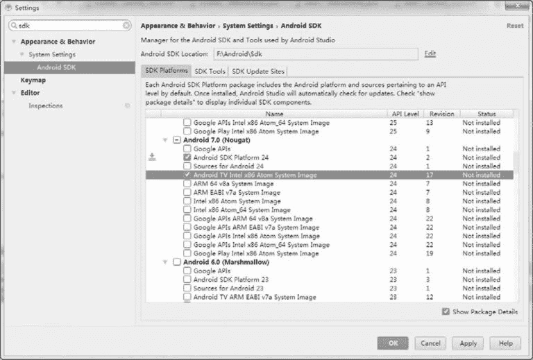
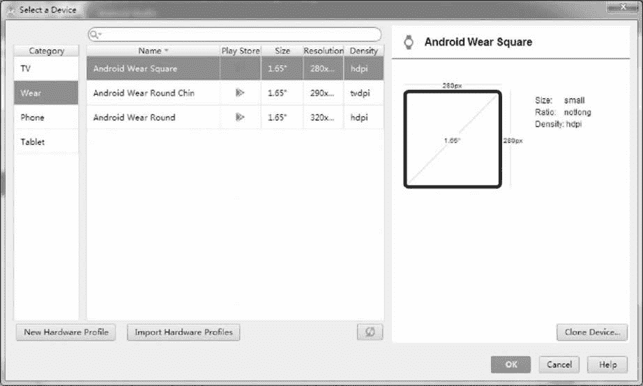
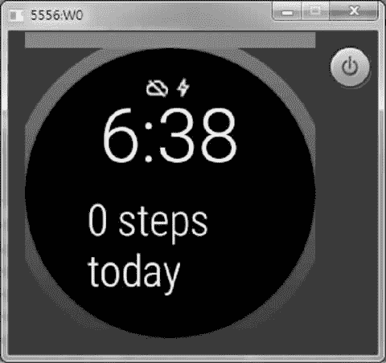
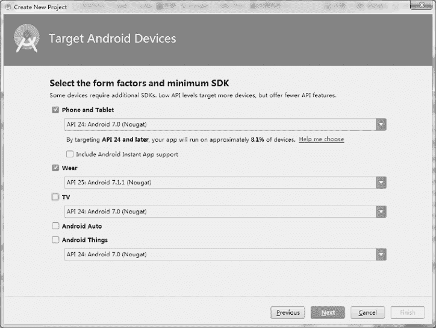

# Android 可穿戴设备应用开发教程

> 原文：[`c.biancheng.net/view/3475.html`](http://c.biancheng.net/view/3475.html)

穿戴式智能设备是应用穿戴式技术对日常穿戴进行智能化设计、开发可穿戴设备的总称，如眼镜、手套、手表、服饰及鞋等。

广义的穿戴式智能设备不仅包括功能全、尺寸大、可不依赖智能手机实现完整或者部分功能的设备，如智能手表或智能眼镜等。也包括只专注于某一类应用功能，需要和其他设备（如智能手机）配合使用的设备，如各类进行体征监测的智能手环、智能首饰等。

随着技术的进步以及用户需求的变迁，可穿戴式智能设备的形态与应用热点也在不断变化。

穿戴式技术在国际计算机学术界和工业界一直备受关注，只不过由于造价成本高和技术复杂，很多相关设备仅仅停留在概念领域。

随着移动互联网的发展、技术进步和高性能低功耗处理芯片的推出等，部分穿戴式设备已经从概念化走向商用化，新式穿戴式设备不断传出，谷歌、苹果、微软、索尼、奥林巴斯、摩托罗拉等诸多科技公司也都开始在这个全新的领域深入探索。

谷歌的 Android 系统在全球的智能手机市场已经占据统治地位。然而，谷歌并不满足于此，其将新的发展目标锁定在可穿戴式设备。

Android studio 0.8.12 和 Gradle 0.12+ 的可穿戴应用程序可以在可穿戴设备上直接运行，可以直接对传感器等低级别硬件、Activity、网络服务器进行访问。

可穿戴应用必须有一个智能手机或者手持设备配合应用，才可以提交到 Google Play 市场上。

用户下载手机应用，自动把可穿戴应用推送到可穿戴设备上，同时手机应用伴侣能承担更重的计算任务、网络操作等，并发送结果给可穿戴应用。

## Android Wear 项目搭建

Android Wear 是连接安卓手机和可穿戴产品的一个平台。自发布以来，Android Wear 获得了大量关注，既有来自消费者的关注，也有来自开发商的关注。Android Wear 旨在为用户在对的时间提供数量合适的信息。据此，谷歌已经发布了设计原则以帮助开发商集中思考 Android Wear 应用程序。

使用 Android Wear 需要完成以下三步：

1.  搭建 Android 开发环境，更新 SDK。
2.  安装来自谷歌应用程序市场的 Android Wear 应用。
3.  匹配安卓手机设备与 Android Wear 设备。

下面简单介绍如何建立一个设备或模拟器创建一个项目。

#### 1．搭建 Android 开发环境，更新 SDK

由于 Android Wear 要求 Android SDK 的版本至少是 4.3，因此在开始创建可穿戴应用之前，必须完成以下几项：

**1）更新 SDK 工具到 23.0.0 或者更高版本。**

① 更新 SDK 工具包，启动、创建并测试可穿戴应用。

② 更新安卓 SDK 到 7.0 （API 24）或者更高版本。

**2）更新平台版本，为可穿戴应用提供新的 API。**

如图 1 所示。其中，“Android Wear ARM EABI v7a System Image”和“Android Wear Intel x86 Atom System Image”必须下载，否则无法完成对虚拟设备的仿真。

图 1  更新 SDK

#### 2．创建 Android Wear 模拟器

建议用户使用真实设备，这样可以更好地实现用户体验测试。但模拟器可以测试多种设备，使用方便，在开发调试中也是必不可少的。

创建 Android Wear 模拟器，如图 2 所示，步骤如下：
图 2  创建 AVD

#### 1）单击“Tools | Android | AVD Manager”。

#### 2）单击“Create Virtual Device....”，选择参数。

① 在目录列表中单击“Wear”。

② 由选定的设备类型确定“Android Wear Square”或者“Android Wear Round”。

③ 单击“Next”按钮。

④ 选择发布名（如 Kitkat Wear）。

⑤ 单击“Next”按钮。

⑥ 根据需要修改虚拟设备（可选项）。

⑦ 单击“Finish”按钮完成。

#### 3）开启模拟器。

①　选择刚刚创建的虚拟设备。

②　单击“Play”按钮。

③　等待，直到模拟器初始化并显示 Android Wear 桌面，如图 3 所示。
图 3  虚拟智能手表设备

#### 4）匹配手持设备和连接模拟器。

① 手持从谷歌 Play 上安装 Android Wear 应用。

② 通过 USB 连接手持设备和机器。

③ 转发 AVD 的通信端口到连接的手机（或手持设备），在命令行中输入如下命令：
adb -d forward tcp:5601 tcp:5601

④ 在手持设备上启动 Android Wear 应用后连接到模拟器。

⑤ 点击 Android Wear 应用右上角的菜单，选择演示卡（Demo Cards）。

⑥ 选择的卡片将在模拟器的桌面以通知的形式显现。

#### 3．设置 Android Wear 设备

**1）在手机上安装 Android Wear 应用。**
**2）遵循该应用的指南为可穿戴设备配对手持设备，测试设备通知同步。**
**3）保持手机上的 Android Wear 应用处于打开状态。**
**4）在安卓可穿戴设备上开启 ADB 调试。**

① “settings”中选择“about”。

② 单击“Build Number”7 下。

③ 返回上一界面。

④ 屏幕底部找到“Developer Options”开发者选项。

⑤ 选择“ADB Debugging”，开启 ADB。

**5）通过 USB 连接可穿戴设备到机器，开发时可直接把应用安装到设备中，在可穿戴设备和安装穿戴应用上会出现一条信息，指示允许调试。**

注意：如果无法通过 USB 连接可穿戴设备到机器，请参看 Debugging over Bluetooth。

**6）在 Android Wear 应用上选择“Always allow from this computer”后点击“OK”按钮。**

Android Studio 上的安卓工具窗口显示可穿戴设备上的系统日志。当运行“adb devices ”命令时，可穿戴设备会被列出。

#### 4．在 Android Studio 上创建 Android Wear 项目

在开发前，首先创建一个包含可穿戴和手持应用模块的项目。在 Android Studio 中，点击“File | New Project”，然后遵照 Project Wizard 的指导，进行以下操作：

**1）在“Configure your Project ”窗口输入应用名和软件包名称。**

**2）在“Form Factors”窗口进行操作，如图 4 所示。**
图 4  Form Factors① 选中“Phone and Tablet”并选择“API 24: Android 7.0 (Nougat )”。

② 选中“Wear”，并选择“API 25: Android 7.1.1 (Nougat )”。

**3）在第一个“Add an Activity”窗口，为 Mobile 添加一个空白活动界面应用（blank activity）。**

**4）在第二个“Add an Activity”窗口，也为 Wear 添加一个空白活动界面应用。**

当向导程序结束时，Android Studio 创建了一个新项目，包含 Mobile 和 Wear 两个模块。这样就已经有了一个同时支持可穿戴设备和手持设备的项目，接下来可以创建活动（activities）、服务（services）、自定义布局（custom layouts）等。

在手机端已经完成了大部分工作，比如网络通信、高强度计算以及那些需要复杂交互的功能，但完成这些工作的时候，通常需要同步通知可穿戴设备处理结果。

注意：Wear 模块还包含一个“Hello World”活动，根据屏幕圆形还是方形来构建布局，这时可以使用 WatchViewStub（可穿戴支持库的一个界面组件）实现。

#### 5．安装 Android Wear 应用

在开发时，可以使用 ADB Install 或者 Android Studio 上的“Play”按钮，像一般移动应用一样，直接把应用安装到可穿戴设备中。

发布时，需要把可穿戴应用嵌入一个手机应用中。当用户从 Google Play 安装手机应用时，一个连接好的可穿戴设备将自动接收这个可穿戴应用。但需要注意的是，自动安装只工作于 App 使用了发布密钥（Release Key）进行签名，而不是调试密钥（Debug Key）。

从“Run/Debug Configuration”下拉菜单中选择“Wear”，并单击“Play”按钮，程序运行并打印出“Hello World!”字样。

#### 6．包含正确的库

项目向导会将正确的依赖关系导入相应模块的 build.gradle 文件中。然而，这些导入的依赖关系并不都是必需的。

**1）通知（Notifications）**

用户可以在手机应用上创建通知，自动同步到可穿戴应用。只构建一次通知就可以呈现于多种设备（不只是可穿戴设备，还包括汽车和电视），而不用为不同的设备参数分别进行设计。

对于那些只出现在可穿戴设备上的通知（由可穿戴应用所发出的通知），我们只需要使用标准框架 APIs（API Level 20）即可移除 Mobile 模块的依赖库。

**2）可穿戴数据层（Wearable Data Layer）**

要通过可穿戴式数据层 APIs 来同步发送设备和手持设备之间的数据，需要最新版本的 Google Play 服务，如果不使用这些 API，这些依赖关系就从模块中被移除。

**3）可穿戴界面支持库（Wearable UI Support Library）**

这是一个非官方的库，包括一些专门为可穿戴设备设计的界面组件，这些组件具有很好的实践效果，建议在应用中使用。

这些库只对可穿戴设备 App 可用，尽管以后可能会升级更新，但不会影响应用的使用，因为这些库是被静态编译进应用程序的。使用最新的静态库并重新编译链接就可以使用最新的特性。