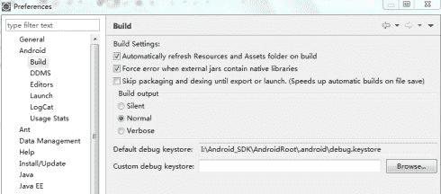

# Android 为什么要为应用程序签名?

> 原文：[`c.biancheng.net/view/3479.html`](http://c.biancheng.net/view/3479.html)

Android 系统要求签名机制，所有安装在 Android 系统上的软件都必须经过签名。与 Symbian 系统要求对安装软件进行签名的目的不同，Android 系统要求对软件进行签名不是为了获得软件在 Android 系统上安装的权限，而是为了用签名辨别软件的开发者。

Android 系统不会安装没有经过签名的应用程序，所有的 Android 应用程序都要求开发者使用一个证书来进行签名。该证书的私钥由应用程序的开发者所拥有，Android 系统通过该证书来识别应用程序的开发者。

只有使用同一个证书签名的应用程序，才能被 Android 系统允许进行升级、覆盖安装等操作。使用不同签名的两个应用程序，即使其包名和类名完全相同，Android 系统也不会允许其安装在同一个目录下。

之前的章节中提到过，之前开发的应用程序，没有经过签名，却可以在模拟器上安装并且运行，是因为在开发模式下编译应用程序的 ADT 工具会自动使用默认的证书来对应用程序进行签名，以便其可以在模拟器上运行。

单击 Eclipse 菜单中的 Window | Preferences | Android | Build，显示的是系统默认的调试用的签名数字证书（为 debug.keystore），如图 1 所示。

图 1  系统默认的数字签名
需要注意的是，使用 debug.keystore 进行签名的应用程序只能在模拟器上运行，而不能在真机上运行。在真机上运行的应用程序必须使用正式的证书进行签名。

用于给应用程序签名的证书不需要是权威机构发布的证书，开发者可以生成自己的签名证书。

Android 建议的签名证书的有效期一般要长于 25 年。

Android 系统只有在应用程序安装时才会检查证书的过期时间。若安装时证书已经过期，则应用程序不能安装。若在应用程序安装后证书过期，则不会影响应用程序的正常运行，但是会导致该应用程序再也不能升级。

为应用程序进行数字签名的过程如下：

*   导出未签名的应用程序。
*   获取签名文件。
*   为应用程序签名。

下面具体讲解数字签名的实现过程。

## Android 的签名策略

通常情况下，Android 为所有的应用程序开发者推荐的签名策略是，所有的应用程序都应该使用同一个证书进行签名，并且证书的有效期应该长于应用程序的生命周期。这样做的原因有以下三点：

#### 1）应用程序升级。

若开发者希望某应用程序可以无缝升级到新版本，则新旧版本应用程序必须使用同一个证书进行签名，否则不能升级。

如果使用的不是同一个证书签名，则新的应用程序会被安装到一个完全不同的目录下，相当于安装了一个新的应用程序，而旧的应用程序不能升级。

#### 2）应用程序模块化。

Android 系统允许多个以同一个证书签名的应用程序运行在同一个进程中，并将其看作一个应用程序。每个应用程序可以以模块化部署，在升级时可以独立地升级其中的某一个模块。

#### 3）允许代码或者数据共享。

Android 提供了以签名为基础的权限机制，应用程序可以为以相同证书签名的其他应用程序公开自己的功能，这样就可以在相同签名的应用程序之间共享代码和数据。

另一个决定签名策略的重要因素是如何设置签名密钥的有效期。

*   如果开发者计划升级应用程序，那么应该确保签名密钥的有效期超过应用程序的生命周期。Android 建议密钥的有效期长于 25 年。一旦密钥过期，其签名的应用程序将再也无法升级。
*   如果使用同一个密钥为多个应用程序签名，那么密钥的有效期应该长于其中任何一个应用程序的生命周期。
*   如果开发者计划将应用程序发布到 Android Market 上，那么密钥的有效期应该超过 2033 年 10 月 22 日，以便保证应用程序可以无缝升级。