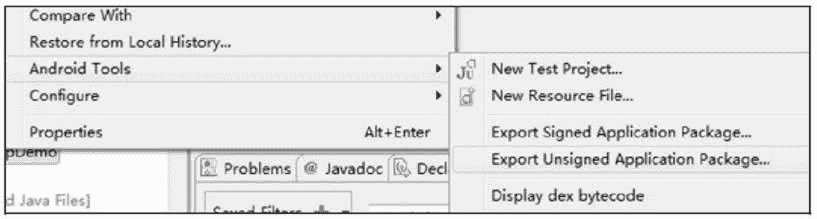
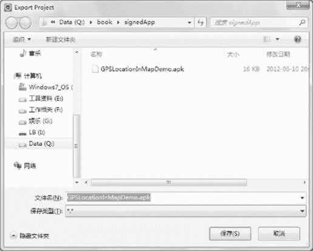
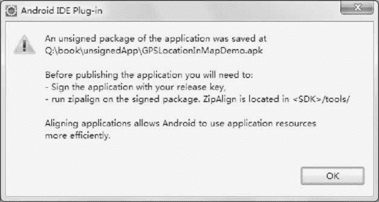

# Android 导出未签名应用程序开发步骤

> 原文：[`c.biancheng.net/view/3483.html`](http://c.biancheng.net/view/3483.html)

使用 Eclipse+ADT 的方式开发应用程序，会使得整个签名过程变得简单。借助于 ADT，导出未签名的应用程序仅需单击一下即可。

以实例 GPSLocationInMap 为例，在工程上右击，选择 Android Tools |Export Unsigned Application Package 选项，如图 1 所示。

图 1  Android Tools 子菜单
在弹出的对话框中选择路径，单击“保存”按钮，即可将未经过 debug.keystore 文件签名的 GPSLocationInMap.apk 保存起来，如图 2 所示。

图 2  保存数字签名
文件保存后，会弹出一个提示对话框，如图 3 所示。

图 3  提示对话框