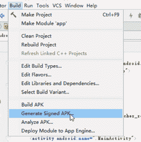
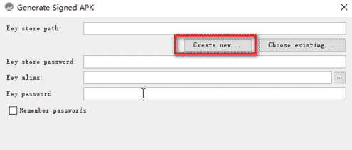
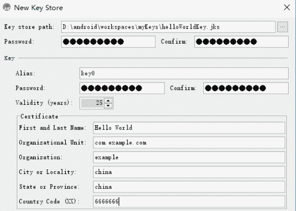
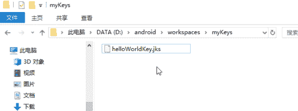
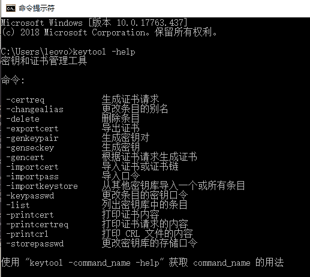
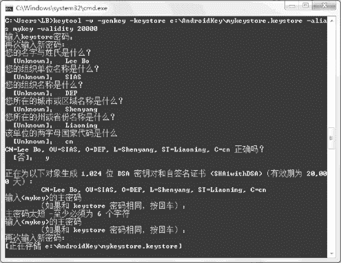

# Android 生成签名文件开发教程

> 原文：[`c.biancheng.net/view/3486.html`](http://c.biancheng.net/view/3486.html)

生成 Android 签名证书的方式有两种：一种是使用 ADT 工具来生成签名证书；另一种是使用命令行方式生成签名证书。

## 使用 Android Studio

1）在 Android Studio 工程界面，选择 Build | Generated Signed APK 菜单选项，如图 1 所示。

图 1  选择导出项目
2）在 Generate Signed APK 对话框中，单击 Create new… 按钮，如图 2 所示。

图 2  生成秘钥文件对话框
3）在 New Key Store 对话框中确定要保存的 key store 文件的位置和名字，并确定对应的 key store 文件的密码。

此处将 key store 文件保存为“D:\Android\workspaces\myKeys\helloWorldKey.jks”，密码为“888888888”，如图 3 所示。其中，Alias 为密钥的别名；Validity 为密钥的有效期，建议大于 25 年。所有内容填写完毕后，单击 OK 按钮，Android Studio 会在指定的 Key store path 路径下生成秘钥文件 helloWorldKey.jks，如图 4 所示。

图 3  创建密钥对话框
 
图 4  生成的签名文件

## 使用 keytool 命令

使用命令方式生成签名文件的过程稍微复杂一点。使用的是 keytool 命令，该命令位于 <JDK 安装目录>/bin 文件夹下。

运行 cmd 命令，输入“keytool –help”命令后按回车键，会显示 keytool 命令的一系列参数的用法，如图 5 所示。

图 5  keytool 命令
keytool.exe 命令用于生成密钥，并且把密钥信息存放到 keystore 文件中。

运行命令行“keytool -v -genkey -keystore e:\AndroidKey\mykeystore.keystore –alias mykey -validity 20000”。

其中，参数的意义如下：

*   -v 为显示详细输出信息。
*   -genkey 为产生密钥。
*   -keystore<keystorefilename>.keystore 指定生成 keystore 文件的文件名。
*   -alias<keyfilename> 指定密钥的别名。
*   -validity<days> 指定该密钥的有效期限，单位是天。

该命令运行后出现密钥生成向导，开发者根据要求填写相应信息，即可生成密钥，如图 6 所示。具体步骤说明如下：

输出 keystore 密码（输入密码“123456”，未回显）
再次输入新密码：（输入密码“123456”，未回显）
您的名字与姓氏是什么？
[Unknown]:Lee Bo
您的组织单位名称是什么？
[Unknown]:SIAS
您的组织名称是什么？
[Unknown]:DEP
您所在的城市或区域名称是什么？
[Unknown]:Shenyang
您所在的洲或者省份名称是什么？
[Unknown]:Liaoning
该单位的两字母国家代码是什么？
[Unknown]:cn
CN=Lee Bo,OU=SIAS,O=DEP,L=Shenyang,ST=Liaoning,C=cn
输入<mykey>的著代码（如果和 keystroe 密码相同，按回车键）：
再次输入新密码：（输入密码，未回显）
[正在存储 e:\AndroidKey\mykeystore.keystore]

图 6  密钥生成向导
至此，已生成开发者签名证书，存储在 E:\AndroidKey\mykeystore.keystore 文件中。开发者可以使用该密钥对应用程序进行签名。