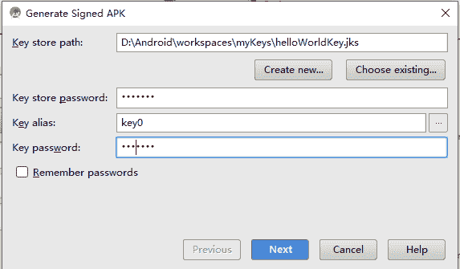
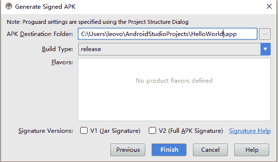
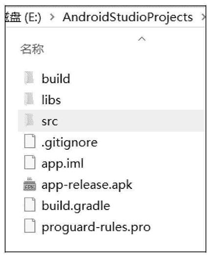
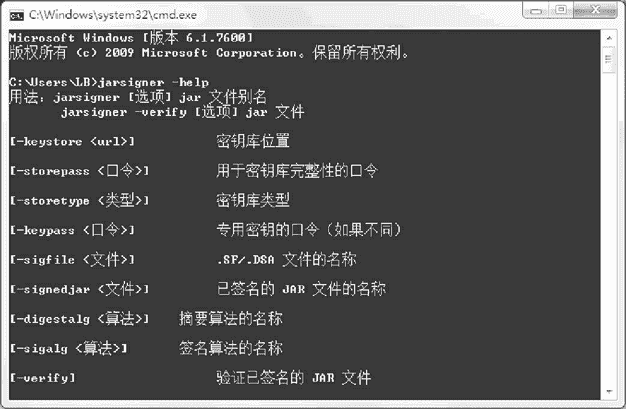
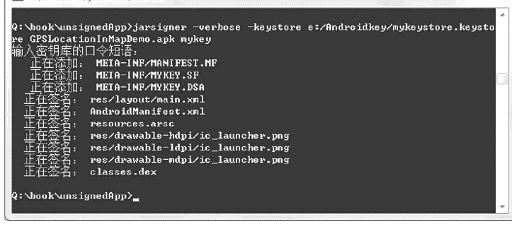

# Android 应用程序签名开发教程

> 原文：[`c.biancheng.net/view/3487.html`](http://c.biancheng.net/view/3487.html)

有了签名文件后，就可以为应用程序签名了。签名的方式也分为 ADT 方式和命令方式两种。

## 使用 Android Studio

通过 Android Studio 方式对应用程序进行签名的过程非常简单。

在 Android Studio 工程中，选择 Build | Generated Signed APK 菜单选项，在弹出的对话框中选择签名要使用的秘钥文件，然后单击 Next 按钮。

此处在弹出的 key store 文件选择对话框中单击 Choose existing … 按钮，使用《Android 生成签名文件》教程中生成的 mykeystore.jks 文件，如图 1 所示，并输入密码“8888888”。

图 1  key store 文件选择对话框
在出现的对话框中选择要存放签名 APK 的目标文件夹，并设置生成 APK 的方式是 debug 还是 release。此处选择 release 模式，并单击 Finish 按钮，如图 2 所示。

图 2  设置生成 APK 的方式
Gradle 会依据之前设置的内容在目标文件夹下生成签名的 APK 文件，如图 3 所示，签名过程完成。

## 使用 jarsigner 命令

使用命令方式进行签名，使用的是 jarsigner 命令，该命令和 keytool 命令一样，被放置在 <JDK 的安装目录>\bin 文件夹下。

在 cmd 窗口中运行“jarsigner –help”命令，显示该命令的各个参数的具体用法，如图 3 所示（在此不一一介绍）。

图 3  生成的 APK 文件
 
图 4  jarsigner 命令
未签名的 APK 文件使用《Android 导出未签名应用程序》教程中导出的 GPSLocationInMap.apk 文件。运行 cmd 命令，将命令路径设置到未签名 APK 文件所在的目录，此处为“Q:\book\unsignedApp”。签名的证书文件使用《Android 生成签名文件》教程中使用生成的签名文件，保存路径为“E:/Androidkey/mykeystore.keystore”。

使用 jarsigner 为 GPSLocationInMap.apk 文件签名的命令为“jarsigner -verbose -keystore e:/Androidkey/mykeystore.keystore GPSLocationInMapDemo.apk mykey”，其中：

*   -verbose 表示开启详细输出。
*   -keystore<keystorefilename>.keystore 指定用于签名的 key store 文件的文件名。
*   mykey 表示用于签名的密钥的别名。

运行结果如图 5 所示。

图 5  使用 jarsigner 为 GPSLocationInMap.apk 文件签名的运行结果
至此，完成了对 GPSLocationInMap.apk 的签名工作。