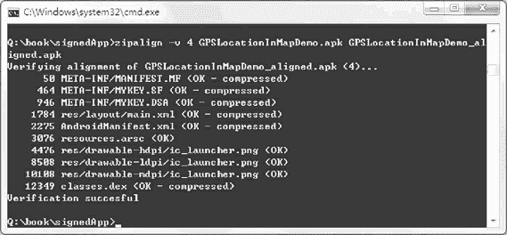

# zipalign 工具优化应用程序开发简介

> 原文：[`c.biancheng.net/view/3490.html`](http://c.biancheng.net/view/3490.html)

Android SDK 包含一个名为 zipalign 的工具，存放在 tools 文件夹下。该工具能够对打包的 APK 应用程序进行优化，将资源文件对齐到 4 字节边界，以加快资源的读取速度。

使用 zipalign 工具优化过的应用程序，在运行时可以使 Android 与应用程序间的交互更加有效率，让应用程序和整个系统运行得更快。因此，签名的应用程序在发布之前应该使用 zipalign 工具得到优化后的版本。

使用 ADT 插件签名的应用程序，Eclipse 会自动使用 zipalign 工具进行优化，因此不需要我们人工干预。

使用命令方式签名的应用程序，需要使用 zipalign 工具优化。优化方法如下：

运行 cmd，切换到签名的 APK 应用程序所在目录，以《Android 应用程序签名》教程中的 Q:\book\ unsignedApp\GPSLocationInMapDemo.apk 文件为例，对其优化需运行如下命令：

zipalign -v 4 GPSLocationInMapDemo.apk GPSLocationInMapDemo_aligned.apk

其中，-v 表示开启详细输出，4 表示对齐字节的个数，必须为 4 才能起到优化效果。该命令运行结果如图 1：

图 1  zipalign 优化
需要注意的是，该优化必须在签名之后进行。若先进行优化再对 APK 文件进行签名，会失去优化效果。