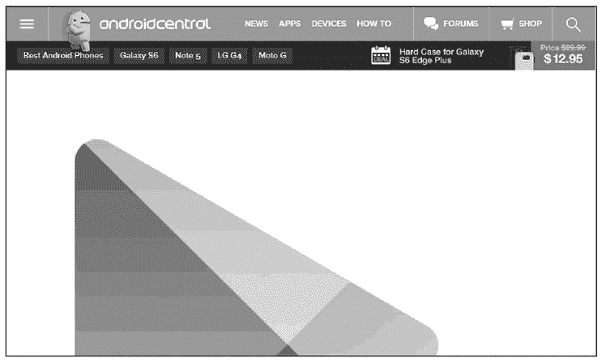

# Google Play Store（ Android Market）发布简介

> 原文：[`c.biancheng.net/view/3491.html`](http://c.biancheng.net/view/3491.html)

完成对 APK 文件的签名后，就可以将应用程序发布到 Google 公司提供的网络发布平台 Google Play Store 中了，如图 1 所示。

图 1  发布到 Google Play Store
Google Play Store 的网址为 [`www.androidcentral.com/google-play-store`](http://www.androidcentral.com/google-play-store)。

Google Play Store 原名 Android Market（Android 市场）。

Android Market 是 Google 为 Android 设备开发的在线应用程序商店。Android 手机在出厂时已经预装了 Android Market，Android 用户可以通过 Android Market 浏览和下载第三方开发者发布的 Android 应用程序，同时也可以将自己开发的应用程序发布到 Android Market 上供其他用户下载和使用。

Google 通过 Android Market 将全球的 Android 用户联系在了一起，同时也为 Android 用户提供了创业的平台。

随着 Android 系统本身地位不断攀升，占领全球大部分智能手机市场的同时，Android Market 却在被快速边缘化，于是 Google 在 Android Market 中加入了电影、电子书和音乐（部分服务仅限于美国地区作用）等服务，丰富其功能，想让其成为一个超级市场。

北京时间 2012 年 3 月 7 日凌晨，Google 公司将 Android Market 正式更名为 Google Play Store。此举旨在让消费者更加清楚地认识到 Google 提供的一系列广泛内容，而不只是提供用于 Android 智能手机和平板电脑的应用，以便提升自身在电子内容销售市场上的形象以及更好地与苹果和亚马逊竞争。

对于 Android 开发者来说，在 Google Play Store 中注册后，只要一次性支付 25 美元，便可成为 Google Play Store 的会员，进而可以在该平台上发布自己的软件，并可以通过 Google Play Store 提供的信息统计平台查看到该软件被下载、安装、评级等相关信息。