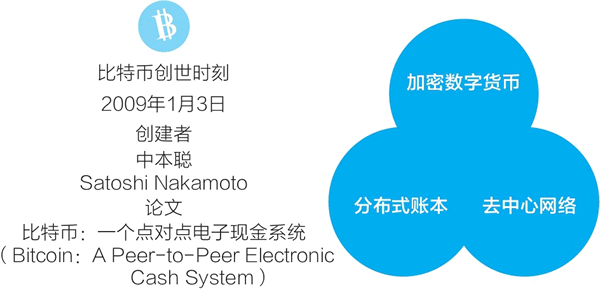
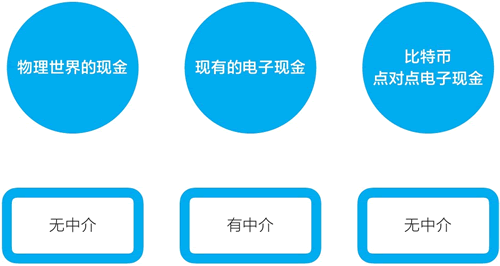
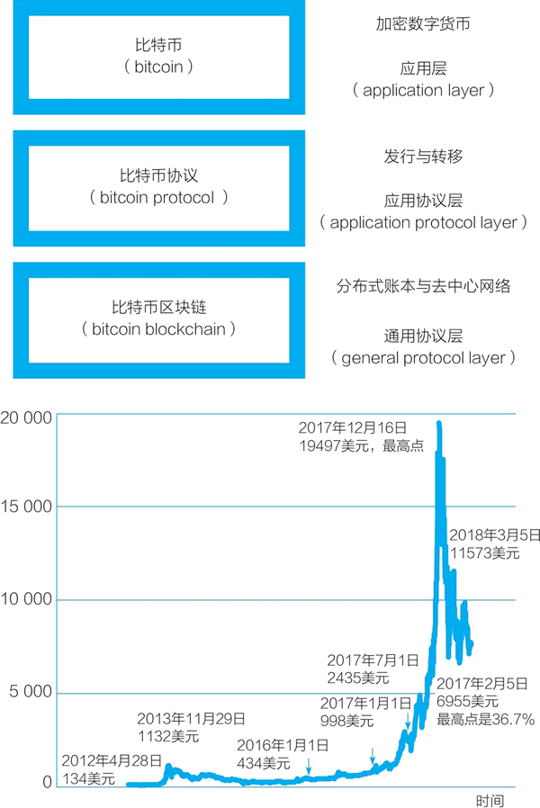
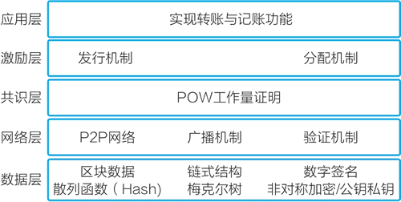
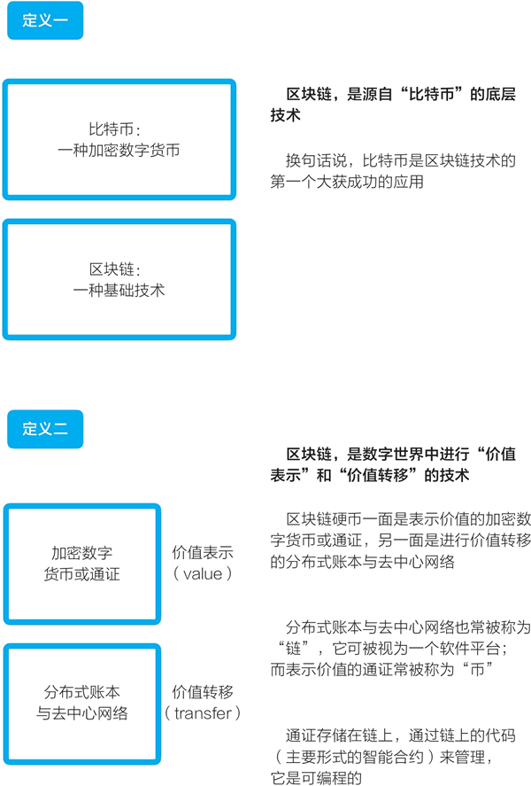
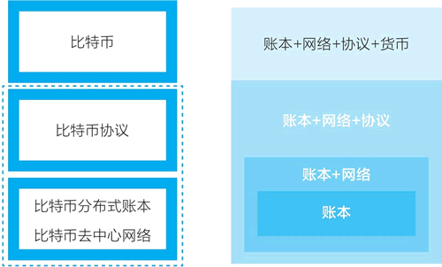

# 区块链是什么？超级详细，看了无师自通！

> 区块链技术是由比特币创造的，本文也将从比特币开始进行引导，一步一步告诉大家什么是区块链。如果你想立马知道区块链是什么，也可以直接转到文章末尾的区块链定义。

区块链，可能是当下最有前景又充满分歧的技术与经济趋势。它给数字世界带来了“价值表示”和“价值转移”两项全新的基础功能。其潜力正在显现出来，但当下它又处于朦胧与野蛮生长的阶段。

对比互联网的发展史，现在的区块链可能相当于 1994 年的互联网，即互联网刚刚进入大众视野的时期，那也是第一波互联网革命萌芽的时期。谷歌、亚马逊、Facebook、腾讯、阿里巴巴、优步、滴滴，甚至现在市值超万亿的苹果都得益于那一时刻。

现在区块链技术可能带来互联网的二次革命，把互联网从“信息互联网”带向“价值互联网”。在区块链的对照之下，人们发现，最初被形象地称为“信息高速公路”的互联网处理的是“信息”，而区块链能处理的是“价值”。

变革即将发生，未来已来。我们又一次处于革命的起点——价值互联网的变革，而要理解价值互联网的未来，我们先要搞明白区块链技术是什么。

让我们回到 10 年前，从中本聪（Satoshi Nakamoto）发明比特币的那一刻说起。

## 比特币的诞生

2009 年 1 月 3 日，在位于芬兰赫尔辛基的服务器上，至今匿名的神秘技术极客中本聪生成了第一个比特币区块，即所谓的比特币创世区块（genesis block）。

在创世区块的备注中，中本聪写入了当天英国《泰晤士报》的头版头条标题：

“The Times 03/Jan/2009 Chancellor on brink of second bailout for banks”
“《泰晤士报》，2009 年 1 月 3 日，财政大臣站在第二次救助银行的边缘”

这样做，他记录了比特币系统启动和创世区块生成的时刻，又借这句话表达了对当时全球金融体系的暗讽。2009 年年初，全球金融体系刚经历了 2008 年金融危机的冲击，看起来摇摇欲坠。

在生成创世区块时，按自己设定的规则，中本聪获得了 50 个比特币奖励，这是最早的 50 个比特币。从创始区块开始，在比特币的账本上每 10 分钟就有新的数据区块被增加上去，新的比特币被凭空发行出来。比特币的去中心网络开始运转，扩展到现在的由数万个节点组成的全球网络。

在比特币的创世时刻，它的三个组成部分都出现了，即加密数字货币（cryptocurrency）、分布式账本（distributed ledger）、去中心网络（decentralized network），如下图所示。

图 1：比特币的三个组成部分
2008 年 10 月 31 日，中本聪向一个密码学邮件列表的所有成员发送了一个电子邮件，标题为“比特币：点对点电子现金论文”。

> *   中本聪邮件见：[`www.mail-archive.com/cryptography@metzdowd.com/msg09959.html`](https://www.mail-archive.com/cryptography@metzdowd.com/msg09959.html)。
> *   比特币白皮书见：[www.bitcoin.org/bitcoin.pdf](http://www.bitcoin.org/bitcoin.pdf)。

他写道：“我一直在研究一个新的电子现金系统，它完全是点对点的，无须任何的可信第三方。”比特币的起源应远早于这个日期，中本聪曾说，他从 2007 年 5 月就开始为比特币项目编程。2008 年 8 月，他注册了 [bitcoin.org](http://bitcoin.org) 域名，这是现在比特币项目的官方网址。

在邮件中，他附上了比特币白皮书的链接，论文题为“比特币：一个点对点电子现金系统”（Bitcoin:A Peer-to-Peer Electronic Cash System）。中本聪在 2008 年发表的这篇论文可能是互联网发展史上最重要的论文之一，其他重要论文有利克里德写的开启互联网前身阿帕网的“计算机作为一种通信设备”（1968 年）、蒂姆·伯纳斯-李写的万维网协议（WWW）建议书“信息管理：一个建议”（1989 年）、谷歌联合创始人谢尔盖·布林与拉里·佩奇写的搜索引擎论文（1998 年）等。

可以合理地推测，中本聪不是一个学院派的研究型学者，他可能是一个做实际软件工程开发的工程师，因为他不只设计了比特币系统，还把它开发出来，让它在互联网上运行起来。他可能是先开发了软件，才写了上面提到的重量级论文，来解释自己的设计。

2008 年 11 月 16 日，中本聪公布了比特币系统的源代码。在发布白皮书、将软件代码开源后，在 2009 年 1 月 3 日这一区块链的创世时刻，最终他在互联网上上线了比特币网络。之后，中本聪和几个开发者在网上一起讨论想法，继续开发迭代。随着比特币网络的成熟，他的活动开始减少，比特币系统逐渐进入自治运转的状态。最终，在发明比特币系统 3 年后，自 2011 年 11 月后，中本聪永远不再出现。他成了一个永远匿名的传奇，没人知道他是谁，他只留下了自己的创造。

## 中本聪为什么创造比特币

在创造比特币的过程中，中本聪发明了区块链技术，区块链是源自比特币的底层技术。那么，他为什么要创造比特币？他想解决什么难题？

现在，比特币常被称为一种“加密数字货币”，人们常很关注其中的“货币”二字。其实，比特币并不具备现在各国法定货币的特征，它只是一种数字形式的特殊商品。比特币现在的市场价格和暴涨暴跌也影响着人们对它的看法，人们把它类比为黄金、郁金香等各种投资、投机标的。

但如果回到中本聪创造它的时刻，我们会看到，比特币的出现是源于技术极客想解决的一个技术难题：“在数字世界中，如何创造一种具有现金特性的事物？”“比特币：一个点对点电子现金系统”这个标题体现出了中本聪想解决的难题：他想创造在数字世界中可用的电子现金，它可以点对点也就是个人对个人交易，交易中不需要任何中介参与。

来对比看看。在物理世界中，一个人可以把现金纸币给另一个人，不需要经过诸如银行、支付机构、见证人等中介机构。

但由于数字文件是可复制的，复制出来的电子文件是一模一样的，因而在数字世界中，我们不能简单地用一个数字文件作为代表价值的事物。同时，我们在支付机构中有多少钱，并没有像一张张钞票一样的数字文件可以代表，钱仅是中心化数据库中的记录。

在数字世界中，当一个人要把现金转给另一个人时，必须要有中介机构的参与。比如，我们通过支付宝转账的过程是：支付宝在一个人的账户记录里减掉一定金额，在另一个人的账户记录中增加一定金额。

在数字世界中，如何创建一个无须中介或者说去中心化的数字现金，一直是一个难题。由于数字文件可以完美复制，如果没有一个中心化数据库做记录，那如何避免一个人把一笔钱花两次？

这就是所谓的双重支付或双花问题（double spending）。在比特币出现之前，我们熟悉的主要电子现金系统（如 PayPal、支付宝等）都是依靠中心化数据库来避免双花问题，这些可信第三方中介不可或缺，见图 2。

图 2：比特币是点对点的现金，无须任何中介
但在另一条道路即去中介或去中心化的电子现金这条路径上，有很多技术极客一直在做着各种尝试，只是一直未能获得最终的成功。

到了 2008 年，中本聪借鉴和综合前人的成果，特别是现在常被统称为密码朋克（cypherpunk）的群体的成果，改进之前各类中心化和去中心化的电子现金，加上自己的独特创新，创造了比特币这个点对点电子现金系统，在无须中介的情况下解决了双花问题。

特别地，比特币这个电子现金系统是同时去中介化和去中心化的：

*   个人与个人之间的电子现金无须可信第三方中介的介入，这是去中介化。
*   这个电子现金的货币发行也不需要一个中心化机构，而是由代码与社区共识完成，这是去中心化。

要注意的是，这个“电子现金”中的现金指的并非货币，它只是在解决难题的过程中被借用来在数字世界中代表价值的说法。这样说是为了便于理解，在现实中，最常见的代表价值的事物是现金。

最初，比特币这个用以表示价值的电子现金并没有价格。比特币系统只是在逻辑上可行的系统，是解决了一个难题的技术玩具。2010 年 5 月 22 日，在一个网络论坛上，有一个程序员用 1 万枚比特币换了两张棒约翰比萨的代金券，比特币第一次有了一个公允价格：1 万枚比特币价格为 25 美元。为了纪念这一天，每年的 5 月 22 日变成了区块链世界的一个节日——比特币比萨节。

此后，比特币虽然从来都不是货币，但逐渐地有了价值与价格。比特币的价格在自由市场交易中被确定，又持续、反复地大幅波动。但是，不管是从早期的 1132 美元跌掉一半，还是在 2017 年年底快速上涨到接近 2 万美元，又在几个月内跌到只有三分之一，比特币系统和它底层的区块链技术都保持稳定。

中本聪设计和编码实现的比特币电子现金系统至今已运转近十年。比特币系统已经从一个技术玩具变成一个运转得近乎完美的系统，并且看起来还将长期稳定地运转下去。

## 从比特币系统中发现区块链

在物理世界中，现金是一张张纸币，但其背后有着一整套与货币相关的金融体系：中央银行、银行、印钞厂、信用卡组织，以及后来出现的第三方网络支付机构等。

在数字世界中，想要创造一种去中介化、去中心化的“电子现金”，同样要设计一套完整的系统。这一系统要能解决以下一系列问题：

*   这种“现金”如何公平、公正地发行出来，不被任何中心化的机构或个人控制？
*   如何实现像在物理世界中一样，一个人可以直接把现金递给另一个人，无须任何中介的协助？
*   这种电子现金如何“防伪”？在数字世界中，这个问题可转换为，一笔电子现金如何不被花费两次？

中本聪设计和开发了比特币系统，完美地解决了这些问题。说起比特币，人们常指的是比特币这种做价值表示的电子现金。其实，作为电子现金的比特币只是比特币系统的表层，比特币系统包括三层，见图 3：

*   最上一层是比特币这种电子现金。这是整个系统的应用层。
*   中间一层的功能是发行比特币与处理用户间的比特币转移。这一层也叫比特币协议（bitcoin protocol），是整个系统的应用协议层。
*   最底层是比特币的分布式账本和去中心网络。这一层也被称为比特币**区块链（bitcoin blockchain）**，是整个系统的通用协议层。

比特币系统的三层命名（应用层、应用协议层、通用协议层）源自知名区块链研究者梅兰妮·斯万，她也提出了被广泛引述的一种阶段划分：区块链 1.0 是货币、区块链 2.0 是合约、区块链 3.0 是应用。

> 梅兰妮·斯万（Melanie Swan）著有《区块链：新经济蓝图及导读》（Blockchain:Blueprint for a new economy）。应用层、应用协议层、通用协议层的分类参见她的演讲。

图 3：一张图看清比特币与区块链
比特币系统实现的去中心化的点对点电子现金，其发行与转账靠的是中间的比特币协议层。类比现实货币系统，这一层的角色相当于中央银行（发行货币）与银行（处理转账）等金融机构。

来深入看看名为“比特币协议”的这一层。比特币系统架构图又常被进一步细分为五层（见图 4），它对应的是比特币协议和比特币区块链两个部分。在这个五层架构中，比特币协议层被细分为：应用层、激励层和共识层。

图 4：比特币系统架构图
在设计比特币系统时，中本聪创造性地把计算机算力竞争和经济激励相结合，形成了工作量证明（proof-of-work，POW）共识机制，让挖矿计算机节点在计算竞争中完成了货币发行和记账功能，也完成了区块链账本和去中心网络的运维。这就形成了一个完整的循环：矿机挖矿（算力竞争），完成去中心化记账（运转系统），获得比特币形式的经济激励（经济奖励）。

比特币的工作量证明共识机制是承上启下的一层，连接了上层应用与下层技术：在其上的层次为电子现金的发行、转账、防伪；在其下的层次，去中心网络的节点达成一致，更新分布式账本。

之后在讨论区块链的现在与未来时，我们会不断地回到比特币系统的设计上来，它是一个简单又精妙的系统，融合技术和经济因素，是区块链所有创新的源头。

## 区块链的定义

至此，相信读者已经大概能明白了区块链是什么了，最后，再让我们从不同的角度给区块链下一个定义吧。

#### 第一种区块链的定义（比较通俗）

比特币：一种加密数字货币；区块链：一种基础技术。

区块链是一种源自于“比特币”的底层技术。换句话说，比特币是区块链技术的第一个大获成功的应用。

#### 第二种区块链的定义

区块链是数字世界中进行“价值表示”和“价值转移”的技术。区块链硬币一面是表示价值的加密数字货币或通证，另一面是进行价值转移的分布式账本与去中心网络。

分布式账本与去中心网络也常被称为“链”，它可被视为一个软件平台；而表示价值的通证常被称为“币”。

通证存储在链上，通过链上的代码（主要形式的智能合约）来管理，它是可编程的。

图 5：区块链的两种定义

## 【讨论】当我们说区块链时，我们在说什么

比特币系统包括三层：比特币、比特币协议、比特币区块链，即比特币的分布式账本与去中心网络。那么，从比特币系统来对照看，说区块链时，我们说的可能是什么？

图 6：从比特币系统看区块链是什么
区块链这个说法包括四种可能性，所覆盖的范围逐步变大，见上图：

*   可能性之一，区块链指的是比特币的数据结构，即由数据块（block）连接形成的链（chain），这也被称为“分布式账本”。在比特币白皮书中，中本聪分别提及了区块和链，但后来它们才被组合成了区块链（blockchain）这个新词。
*   可能性之二，区块链指的是比特币的分布式账本和去中心网络的组合。对应于比特币系统，它指的是整个第三层比特币区块链。
*   可能性之三，区块链指的是比特币系统的第二层（比特币协议）和第三层（比特币区块链）的组合。它包括分布式账本、去中心网络和比特币协议。
*   可能性之四，区块链指的是整个比特币系统，包括所有三层，既包括价值表示的比特币，也包括了背后支撑的整个系统。从这个范围看，是把区块链看成一个既包括技术部分，又包括经济部分的完整系统。

大众在提及区块链时，常指的是第四种最大的范围，即“账本+网络+协议+货币”。在产业中，人们在提到区块链时，通常指的是第三种范围，即“账本+网络+协议”。而很多软件开发者在说起区块链时通常指的是第二种范围“账本+网络”，即分布式账本加去中心网络。

现在，包括我在内的很多人都有一种看法是，将基于区块链的价值表示物都称为通证，并把比特币等代币（coin）视为通证的一个特定种类。通常而言，提及加密数字货币、通证、代币时，我们指的都是基于区块链的、在数字世界中进行价值表示的事物。如果采用“通证”说法，区块链的最大范围包括的则是“账本+网络+协议+通证”。

相关文章推荐：

*   [区块链到底是什么意思，看完这段话就懂了](http://baijiahao.baidu.com/s?id=1599786695197552100)
*   [区块链是什么？一张图让你秒懂！](https://baijiahao.baidu.com/s?id=1592894131130991736)
*   [几张图看懂区块链是什么？](https://www.cnblogs.com/behindman/p/8873191.html)
*   [什么是区块链?这是我见过的最通俗易懂的解释](http://www.sohu.com/a/213184031_734987)
*   [什么是区块链的“智能合约”](http://www.woshipm.com/blockchain/1442574.html)
*   [什么是区块链——百度知道](https://zhidao.baidu.com/question/2120881497847370027.html)
*   [区块链是什么，如何简单易懂地介绍区块链？](https://www.zhihu.com/question/37290469)