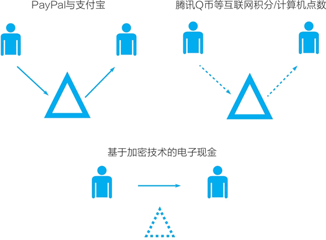
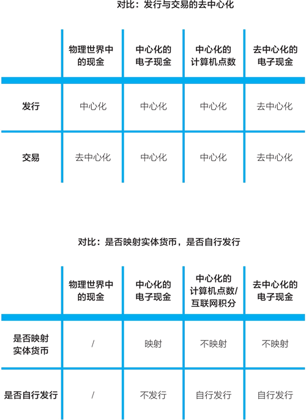
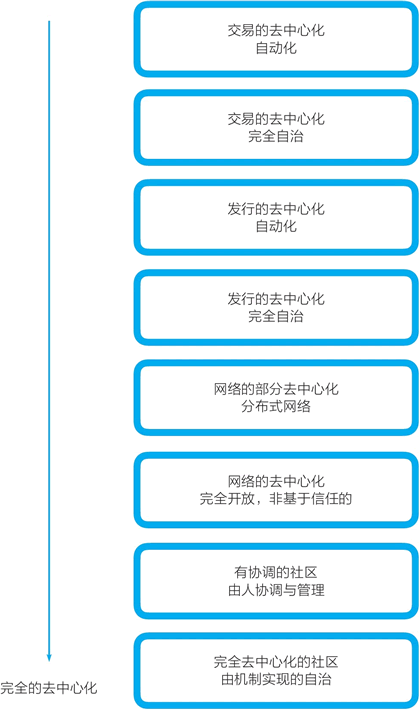
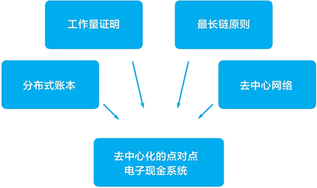

# 什么是去中心化？比特币是如何实现去中心化的？（非常详细）

【导读】本节通过对比三种数字货币的形式引出“什么是去中心化”，并展示了比特币在去中心化方面的表现如何，最后，向大家阐述了比特币去中心化的原理。

中本聪解决了自己定义的难题“点对点的电子现金”，在这个过程中，他“发明”了区块链技术。比特币系统融合密码学、博弈论和软件工程等三个领域的技术与理论，区块链技术是已有技术巧妙地组合形成的创新。中本聪不是凭空解决“点对点电子现金”这个难题的，他沿着前人的足迹前进，只是他完成了最后一跃。

接下来，我们来具体地看中本聪是如何解决他定义的难题，创造一个在数字世界中做价值表示的事物的。在讨论中我们会特别关注，他是如何实现“去中心化”的？

## 什么是去中心化？

在说“货币”时，我们讨论的是数字世界中的价值表示。在互联网上的数字世界中，人们曾设计出各种各样的电子现金或数字现金方案，在为《区块链：技术驱动金融》一书撰写前言时，杰里米·克拉克收集了约 100 种支付系统。他写道：“在通往比特币的道路上，布满了无数失败的尝试。”在所列的各种系统中，他认为大众所知道的只有 PayPal。当然，在移动支付超前发展的中国，我们都很熟悉支付宝与微信支付。

一直以来，数字世界中的“货币”有三种形式（见下图）：

*   中心化的在线支付；
*   中心化的计算机点数或互联网积分；
*   去中心化的电子现金。

图 1：数字世界中“货币”的三种形式

#### 第一种形式：中心化的在线支付

我们常用的 PayPal、支付宝、微信支付都是中心化的在线支付，在这些支付系统中流转的是映射到数字世界的各国的法定货币（也称法币）。

> 法币（fiat money）是“法定货币”或“法偿币”的简称，它依靠政府的法令成为合法流通的货币。法币是各国政府发行的纸币，发行者没有将货币兑现为实物（如黄金）的义务。
> 
> 法定货币的价值来自拥有者相信货币将来能维持其购买力，本身并无内在价值。历史上，在政府强制规定纸钞为法定货币之前，大多数流通的货币具有一定的内在价值，例如金币、银两，它们又被称为商品货币（commodity money）。
> 
> 在布雷顿森林体系中，35 美元能兑换 1 盎司（1 盎司＝28.35 克）黄金，因而当时的美元不是法币。之后，当美元与黄金脱钩后，美元就变成了法币。

#### 第二种形式：中心化的计算机点数或互联网积分

中心化的互联网积分/计算机点数是指 Q 币、游戏币、航空里程等，它们还曾有一个更为大众所熟知的名字——虚拟货币。通常，它们不与物理世界的法币对应，而是由商业公司中心化发行，仅可以在一家公司的体系中使用。

#### 第三种形式：去中心化的电子现金

去中心化的电子现金已经被计算机密码学家探索了多年，沿着前人的探索路径，中本聪最终将这条路径变成了现实。中本聪设计和开发了比特币系统，并催生了众多加密数字货币和区块链技术项目。

下面来分别看看这三种形式。三种形式与物理世界中的现金的对比如图 2 所示。

图 2：一组对比：是否去中心化与是否自行发行

#### 第一种形式：PayPal、支付宝、微信支付

现在，被互联网用户广泛使用的主流支付系统是 PayPal、支付宝，以及后来出现的移动支付 Square、微信支付等。这些第三方在线支付系统依赖于物理世界中的货币系统与金融体系，它们在数字世界中为用户提供支付、转账等服务。在使用它们时，我们所用的钱是物理世界中的法币，如美元、人民币、欧元、日元等，钱从银行账户中被映射到网络支付账户中。

过去，信用卡、储蓄卡等塑料卡片实现了纸币现金的数字化，把纸币现金变成了卡片账户中的数字现金。现在，在线支付系统将信用卡和储蓄卡的功能转移到互联网数字世界中来了。

在这些系统中流转的都是与法币一一对应的电子现金，变化的仅仅是“账户”，而非“货币”。这些系统所起的作用是，在账户和货币上连接物理世界与数字世界。

这些系统都是中心化的。它们背后所依赖的传统金融系统是中心化的，法币是由各国央行发行的。它们自身是完全中心化的，由单一机构运转网络支付系统。它们在交易中担任中心化的中介角色，进行账户的记账，是用户间数字现金流通的中心。当两个用户进行转账时，在线支付系统在中间担任可信第三方的中介角色。这就是为什么称之为“中心化的电子现金”。

#### 第二种形式：Q 币、游戏币等互联网积分或计算机点数

在互联网上，除了在线支付系统之外，还有一种过去常被称为“虚拟货币”的货币现象。

比如，用户可以用人民币购买腾讯公司的 Q 币，腾讯自称它是“统计代码”。Q 币可以在腾讯的产品如 QQ 即时通信工具、网络游戏、音乐文学等中使用，兑换各种在线服务。

> 关于“什么是 Q 币，它有什么用处”的问题，腾讯网站上的解释是，Q 币是用于计算机用户使用腾讯网站的各种增值服务的种类、数量或时间等的一种统计代码，并非任何代币、票券，不能用于除腾讯网站增值服务以外的任何商品或服务。

又比如，在游戏中，用户可以付钱购买道具，也可以通过战斗赢取游戏币。这些道具和游戏币的形态与价值各不相同，在一个游戏中都很难确定价格、进行兑换，在多个游戏之间几乎不可互换。当然，游戏玩家还是可以找到办法进行交换，在一定条件下甚至还可以将它们变现换回法币，例如，曾流行的“游戏打金”就是指有些玩家专门在游戏中获得金币，然后卖出获得现金收入。

正如腾讯用“统计代码”的说法所表明的，Q 币等是中心化机构（通常是一家公司）发行与管理的互联网积分或计算机点数。它们是中心化的，其发行和交易都是中心化的。

一般来说，在不需要用户付费购买时，它们常被称为“积分”，在需要用户付费购买时，它们常被称为“点数”。

但近年来出现了很有意思的混合产物。在打车软件中，用户可以存入现金，如存 100 元得 150 元；也可以介绍其他人成为打车软件的用户从而获得奖励，如介绍一个新用户双方各获得 50 元余额。在这种情况下，在打车软件钱包中的余额就变成了一定程度上的点数与积分的混合物。在打车软件钱包中的余额一般是不能提现的，也不能在用户之间直接转账，至多只能帮其他用户代付车费。

我们还可以进一步对比在线支付系统和计算机点数。

*   一个视角是，它们是否映射物理世界中的货币。在线支付系统是映射物理世界中的货币的，电子现金价值就是货币的价值。而对于游戏迷来说，游戏币、游戏道具通常是不映射物理世界中的货币的。对游戏迷而言，游戏道具既有价值也有价格；对其他人而言，游戏道具可能毫无价值。在线支付系统与法币无缝连接，而这些互联网积分/计算机点数系统只与现实世界中的货币系统有很少的连接点，并且由于法律、商业等方面的原因，一般没有畅通的渠道将它们兑换回法币。
*   另一个是视角是“电子现金”或“点数/积分”是如何发行的？与在线支付系统不同，点数/积分是由一家公司自行发行的，用户付费获得点数，可被认为是向这家公司购买一种数字商品，用户稍后可用这些点数兑换成该公司体系内的虚拟商品或服务。

直到最近，与现实世界相连的在线支付系统和不与现实世界相连的互联网积分/计算机点数都是互联网中的主流。变化始于比特币的出现。

#### 第三种形式：去中心化的电子现金

在这两个主流之外，一直还有着另外一种探索：能不能创造一种完全去中心化的点对点电子现金？其中最终极的设想是，在数字世界中，货币的发行和交易都不需要中心化机构介入，是由计算机自动执行的：在发行时，无须类似各国央行的中心化机构；两个人在相互转移电子现金时，也无须中心化机构的参与。

按前面的对比表格，这种理想化的去中心化的电子现金几乎在每个方面都试图进行突破：不映射线下的货币，而在数字世界中自行发行；发行去中心化，不需要一个类似中央银行的角色；像物理世界中的现金交易一样，交易无须中介介入。

这个问题很难，因为它的要求与数字世界中的技术基础设施的能力相悖。其中重要的一点是，在物理世界中，表示价值的现金纸币是不能复制的。但在数字世界中，数字化文档是可以复制的，每一个复制出来的文档都一模一样。因而过去在数字世界中，要用数字文件表示价值（比如表示一笔电子现金），我们需要一个中心化机构来确保数字文件是唯一的。假设这笔电子现金现在属于我，当我把它转给你时，我们需要一个中介来协助记录所有权的变更，我不能直接把数字文件复制给你。

计算机密码学家们探索的是，在无须中心化介入的情况下，如何通过密码学的方法，用可复制的数字文件来代表价值。

这是一个漫长的探索过程，其开端甚至比互联网商业化都还早，最早可追溯到 20 世纪 80 年代。总的来说，由于这种探索是基于加密技术的，因此各种去中心化数字现金也被称为加密数字货币（crypto-currency），其中 crypto 是密码学（cryptography）的词根。

最终在 2008 年，匿名的中本聪在密码朋克的邮件列表中发布了比特币的设计。他发明的比特币系统几乎集合了第三类探索的所有智慧结晶，他又加入了新的创新，最终在电子现金的发行和交易上都实现了去中心化。

正如我们所知，中本聪不只是设计和实现了这个最理想化的去中心化电子现金，他还“发明”了区块链技术。区块链的价值表示和价值转移功能让它可能成为新一代互联网的技术基础。

## 比特币实现了极致的“去中心化”

对照前文图表，与现有中心化的电子现金系统（在线支付系统）相比，比特币是与之完全相反的：

*   在线支付系统的货币发行是中心化的，比特币的发行是去中心化的；
*   在线支付系统的货币流动是中心化的，比特币的交易是去中心化的；
*   在线支付系统映射物理世界中的货币，比特币不映射任何现有的货币；
*   在线支付系统自己不进行货币的发行，比特币是在数字世界中凭空发行出来的。

在去中心化的程度上，比特币系统达到了极致。去中心化的初级阶段是自动化（automatic），即根据人设定的规则自动运行，而去中心化的高级阶段是自治（autonomous），也就是完全自治、自发。而比特币系统作为一个电子现金系统，达到了极致的去中心化状态（见图 3）：

*   作为一个货币应用，它不只交易是自治的，它的发行也是自治的。
*   作为一个计算机网络，它是完全去中心化的，而不仅仅是分布式网络。
*   作为一个组织，它是完全的社群自治，不需要有一个领导者居中协调。

去中心化处于区块链的思维模式的最内核，而比特币实现了极致的去中心化。

图 3：比特币去中心化的层次
不过，之后在发展区块链技术和将之应用的过程中，我们又不得不从最极致的理想状态往实用方向调整，比如：

*   现在多数区块链项目都是由基金会管理的。以太坊是由创始人维塔利克·布特林（人称“V 神”）和以太坊基金会居中协调的，而不像比特币社区那样是完全自治的。
*   常在金融系统中使用的联盟链，以及部分节点数量不多的基础公链，如小蚁（NEO）、EOS，更应被视为分布式网络，没有实现完全的去中心网络。
*   通过以太坊发行基于 ERC20 标准的通证，通证的发行规则是由项目方确定的，在运行过程中会酌情更改规则。它们的发行不是自动的或自治的。
*   常被视为区块链 3.0 代表的 EOS 在智能合约部分引入了李嘉图合约和社区仲裁机制，也即交易部分不再是完全交给机器自动执行，在需要时人可以参与和干涉。

我们反复讨论比特币系统的设计，是因为它早已经把最极致的情况展现在所有人面前。而在将区块链技术落地应用的过程中，从最极致的去中心化往实用主义方向调整并不是倒退，而是事物发展的必然过程。

## 比特币是如何实现去中心化的？

那么，比特币系统具体是如何实现极致的去中心化的呢？

在比特币白皮书《比特币：一个点对点电子现金系统》中，中本聪详细地解释了他是如何设计这个系统的。在其中，他确立了此后所有区块链系统的主要设计原则。

*   一个真正的点对点电子现金应该允许从发起方直接在线支付给对方，而不需要通过第三方的金融机构。
*   现有的数字签名技术虽然提供了部分解决方案，但如果还需要经过一个可信的第三方机构来防止（电子现金的）“双重支付”，那就丧失了（电子现金带来的）主要好处。
*   针对电子现金会出现的“双重支付”问题，我们用点对点的网络技术提供了一个解决方案。
*   该网络给交易记录打上时间戳（timestamp），对交易记录进行哈希散列处理后，将之并入一个不断增长的链条中，这个链条由哈希散列过的工作量证明（hash-based proof-of-work）组成，如果不重做工作量证明，以此形成的记录无法被改变。
*   最长的链条不仅仅是作为被观察到的事件序列的证明，并且证明它是由最大的 CPU 处理能力池产生的。只要掌控多数 CPU 处理能力的计算机节点不（与攻击者）联合起来攻击网络本身，它们将生成最长的链条，把攻击者甩在后面。
*   这个网络本身仅需要最简单的结构。信息尽最大努力在全网广播即可。节点可以随时离开和重新加入网络，只需（在重新加入时）将最长的工作量证明链条作为在该节点离线期间发生的交易的证明即可。

威廉·穆贾雅在《商业区块链》一书中对比特币白皮书摘要进行了分析，他总结了四个要点：

1.  点对点电子交易；
2.  不需要金融机构；
3.  加密证据而不是中心化的信用；
4.  信用存在于网络，而不是某个中心机构。

而从这个摘要中，我们提炼出了比特币系统设计的五个要点（见图 4）：比特币的区块链系统是由分布式账本（即狭义的区块链）和去中心网络（点对点网络）组成的，形成链条的方式是工作量证明共识机制。最长链是由网络中的算力共同决定的，因而它是可信的，节点离开和加入依据的是最长链是可信的这一原则。这些组合起来形成了比特币系统。

图 4：比特币系统设计的五个要点

#### 1) 去中心化的点对点电子现金系统

比特币要做的是一个“点对点的电子现金系统”，发送方和接收方直接交易，它们之间不需要中介机构的介入。

要去掉可信第三方等中介机构，就需要解决“双花问题”。在摘要中，中本聪给出了点对点网络的解决方案，并介绍了这个方案的核心——区块链。他并没有提到区块链（blockchain）这个词，但在论文中分别提到了区块（block）和链（chain）这两个概念。

#### 2) 分布式账本

比特币的区块链是基于工作量证明形成的带时间戳、存储数据的数据块和由哈希指针连接成的链条。

这个链条或者说账本以分布式的方式存储在比特币网络的各个节点上，因而也被称为分布式账本。

#### 3) 工作量证明

比特币网络中的节点按照规则进行加密哈希计算，以竞争获得生成新区块的权利。节点在竞争获胜后就获得记账权，它生成区块成为最新区块后，就获得与新区块对应的挖矿奖励。

工作量证明也是区块链账本的安全机制。如果不重做“工作量证明”所需的大量计算则此链条不可修改，这一共识机制保证了区块链上的数据的可靠性。

#### 4) 最长链原则

在任何时刻，最长的链条是所有人都接受的最终记录。

由于最长链是由网络中的主要算力完成的，因而只要它们不都与攻击者合作，那么它们生成的最长链就是可信的。这个原则被称为“最长链原则”。

#### 5) 去中心网络

比特币的去中心网络的架构非常简洁，本身需要的基础设施很少。它可以在互联网网络上运行。计算机节点可以随时离开或加入这个去中心网络，在加入时它们只需遵守最长链原则即可。

相关文章推荐：

*   [去中心化是什么？它的真正的含义是什么？](http://baijiahao.baidu.com/s?id=1604622125779413966)
*   [关于“去中心化”，你知道的可能都是错的](https://36kr.com/p/5121934.html)
*   [常常被讨论的“去中心化”到底是什么？](http://www.woshipm.com/it/253264.html)
*   [什么是去中心化——搜狐](https://www.sohu.com/a/252713112_404443)
*   [什么是去中心化？——爱奇艺视频](https://www.iqiyi.com/w_19rwfkjgh9.html)
*   [如何理解互联网的去中心化?](https://www.zhihu.com/question/24641651)
*   [浅谈去中心化应用](https://blog.csdn.net/sinat_33150417/article/details/79556583)