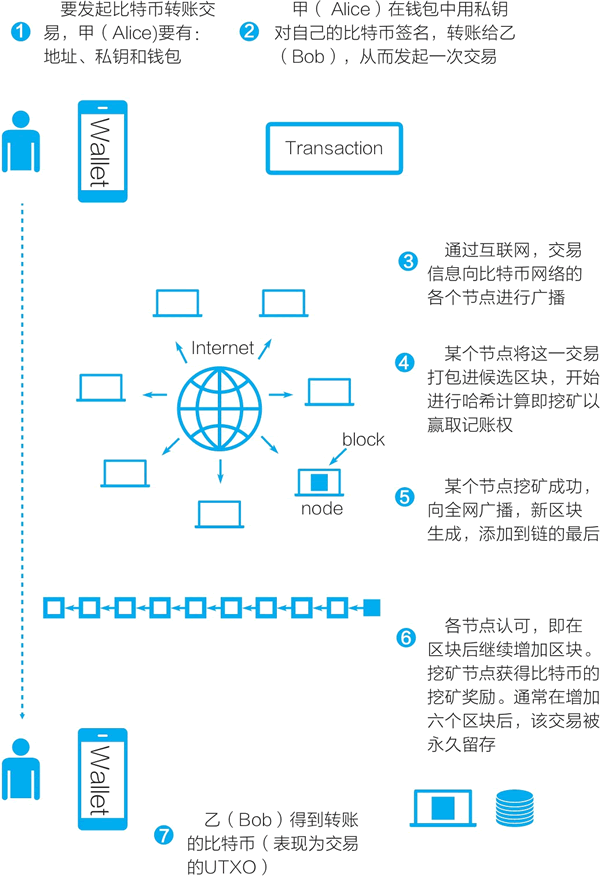

# 比特币是如何转账的——比特币区块链的五个技术性细节

“互联网上的商务交易，几乎都需要借助金融机构作为可信赖的第三方来处理电子支付。”比特币白皮书的第一句话这样写道。中本聪是如何把可信第三方从比特币的交易中去掉的呢？

通过两个人之间的转账交易，我们来看看比特币系统是如何实现交易的去中心化的？

假设我是甲，要把自己的钱包地址中的 8 个比特币转给你（乙），即转到你的钱包中去。详细讨论这一转账交易过程，我们可以看到比特币区块链是如何工作的五个技术性细节（见图 1）：

*   分布式账本和去中心网络
*   未使用的交易输出（unspent transaction output，UTXO）
*   [比特币区块链的数据结构](http://比特币区块链的数据结构)
*   工作量证明共识机制
*   比特币挖矿机制与代币生成机制

由于篇幅限制，我们将分五节讲解以上五个技术细节，大家可以点击链接进入对应的章节。

在沿着比特币系统所开创的路线开发各类基础公链时，开发者们从各个角度调整与改进以上五个技术性细节，形成新的区块链系统。

图 1：一笔比特币转账交易的过程