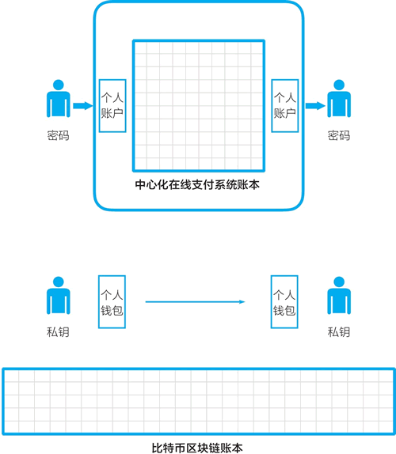
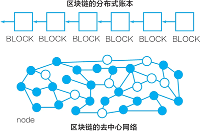

# 分布式账本和去中心网络

所有的区块链系统都包括“分布式账本和去中心网络”这一对必备要素。

比特币网络没有一个中心服务器，它是由众多全节点和轻节点组成的，这些节点形成一个**去中心网络**。其中：

*   全节点包含所有比特币区块链的区块数据；
*   轻节点仅包括与自己相关的数据。

比特币网络是完全开放的，任何服务器都可以接入、下载全部区块数据成为全节点。

所有用户持有的比特币信息都存放在一个**分布式账本**之中。这个账本是一个不断增长的由数据块组成的链条，这个数据块组成的链条是狭义的“区块链”。比特币账本可被认为同时存储在所有的全节点之中。

基于分布式账本与去中心网络，比特币系统实现了去中心化的价值表示和价值转移，它与中心化在线支付系统有很大的不同。用两个人之间的转账来对比看一下。

#### 中心化在线支付系统的交易流程

中心化在线支付系统的转账过程是：假设你我二人要通过支付宝进行转账。我们都在支付宝开设有账户（account），账户上有多少钱是支付宝账本上记录的数字。当我转账 100 元给你，支付宝在我的账户记录上减掉 100 元，在你的账户记录上增加 100 元，形成新的账本。到此，转账交易结束。

如图 1 所示，中心化在线支付系统维护一个中心化的账本。用户在账本上开设账户，通过密码来与之交互。

图 1：中心化在线支付系统 vs 比特币系统

#### 比特币系统的交易流程

对比而言，比特币系统使用的是一个分布式账本，用户在其中开设“账户”，严格地说是地址（address）。每个人都可以在比特币区块链上建立“账户”，获得一对公钥与私钥，地址是公钥的哈希值，我们通过私钥与地址进行交互。

我们每人有一个钱包，钱包中存储的是私钥。两个人在相互转账比特币时，可以通过各自的钱包软件直接进行。

在这里，比特币的去中心化体现在：不再有一个中心化机构来集中管理账本。账本存放在由众多节点组成的去中心网络中；不再有一个中心化机构来帮我们管理账户、处理交易，每个人管理自己的钱包，交易由分布式账本来记录。

有人会往下追问，我们地址中的比特币是记录在账本中的，看起来还是有一个“中心”存储我们的资产。其实，这个账本是分布式地存储在去中心网络中的，因而从这个层面看，它可以看成是去中心化的。

对比而言，对于中心化在线支付系统，它通常是由中心化的服务器来管理集中式账本。对于比特币系统，它背后的系统是一个去中心网络，网络节点共同维护一个分布式账本（见图 2）。

图 2：分布式账本与去中心网络