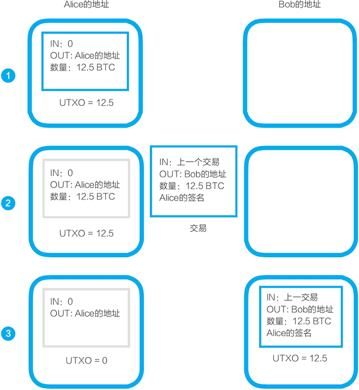

# UTXO：未使用的交易输出，比特币核心概念之一

在比特币系统上其实并不存在“账户”，而只有“地址”。只要你愿意，你就可以在比特币区块链上开设无限多个钱包地址，你拥有的比特币数量是你所有的钱包地址中比特币的总和。比特币系统并不会帮你把这些地址汇总起来形成你的账户。

从我（甲）到你（乙）的一笔比特币转账，是从我的一个钱包地址转到你的一个钱包地址上去。

接下来的讨论就涉及比特币系统的一个关键技术性细节：UTXO（未使用的交易输出）。通证经济专家孟岩曾撰写一篇文章，标题是“其实没有什么比特币，只有 UTXO”，这个标题指出了，对于计算机来说比特币是什么——比特币是区块链账本上的交易输出。

我们来看一个两个人进行转账交易的过程，以深入理解 UTXO：

假设我有 8 个比特币，这其实意味着，之前有一个交易把这些比特币转入我的地址，这个交易的输出（即 8 个比特币）未被使用，我拥有了这 8 个比特币。

现在，我要发起一个转账交易，这个交易中的输入是让我拥有这些比特币的上一个交易。

我要转账给你，我做的是，对让我拥有这些 8 个比特币的上一个交易进行签名，把这一新转账交易的输出地址设为你的钱包地址。

这样，我就发起了一个转账支付交易。等矿工将这一交易打包进新的区块，转账交易完成，这 8 个比特币就属于你了。你拥有的是你我这个交易的未使用的交易输出。

对于一个交易签名所涉及的比特币的公钥和私钥的非对称加密机制，之后再讨论。为便于理解可类比看，钱包地址相当于房间号和锁，私钥则相当于钥匙，钥匙可以打开对应的锁。

以上两个人的转账交易过程是：我用私钥（从一个输出是我的地址的交易中）取出比特币，并用私钥对从我的地址转到你的地址的新交易进行签名。一旦交易完成，这些比特币就转到你的钱包地址中去。你的钱包中新交易的未使用交易输出，只有你的私钥才可以打开。

从以上讨论中我们可以看到，的确不存在比特币，只有未使用的交易输出（UTXO）。每一笔比特币都源自上一个交易，可以一直向上追溯上去。而一直向上追溯，在每一笔比特币的源头，都有一种特殊的交易，即比特币矿工因挖矿获得奖励的创币交易，每一个比特币都是通过挖矿被创造出来的。假设我作为比特币矿工挖矿成功赢得了 25 个比特币，那么这个特殊交易是，它的输入是 0，而输出是 25 个比特币进到矿工的钱包地址中。

未使用的交易输出（UTXO）和我们熟悉的银行账户有着很大的不同。为什么要采用这样的设计？对比银行账户和比特币的 UTXO，我们可以看到 UTXO 的优点。

#### 1) UTXO 设计易于确认比特币的所有权

如果采用传统的账户设计，当我要转账 8 个比特币出去时，为了完全避免造假，我们就需要逐一向上追溯，确认之前的每一笔交易，从而证明我的确拥有 8 个比特币。

采用现在的 UTXO 设计，要确认我拥有 8 个比特币，只要确认上一个交易我的确获得了它们即可。通常只要上一个交易是真实的，我就的确拥有这些比特币。而我们都知道，一个区块经过 6 次确认，其中的交易可被认为是真实无误的。

#### 2) UTXO 设计与区块链账本是完全融为一体的

区块链账本存储的是状态。以太坊是对比特币区块链的改进，在白皮书中，以太坊创始人维塔利克分析了比特币，他认为，“比特币账本可以被认为是一个状态转换系统（state transition system）”。以太坊也是采用这种状态转换系统的设计，但对之进行了改进。

> 微观地看，每一个区块链中的交易都是一个状态转换函数，以太坊白皮书就用“以太坊状态转换函数”（Ethereum state transition function）来讨论在区块链上一个交易的进行过程。

几乎所有的区块链都是采用这一设计，每一个新区块和它之前的所有区块一起形成了一个新的状态，如此重复、持续下去。在确认之后，之前的状态就不可篡改，即不可随意更改。UTXO（未使用的交易输出）是与这种状态的设计相对应的。

## 加深对 UTXO 的理解

UTXO 是 unspent transaction outputs（未使用的交易输出）的缩写，每一个比特币其实都是 UTXO，它是比特币的最核心概念之一。

> 参考资料：《区块链：技术驱动金融》中相应的讨论，及文章“比特币和以太坊的记账方式——UTXO 和账户余额”（黄世亮/文）。

#### 你的比特币就是 UXTO

比特币的挖矿节点获得新区块的挖矿奖励，比如 12.5 个比特币，这时，它的钱包地址得到的就是一个 UTXO，即这个新区块的币基交易（也称创币交易）的输出。币基交易是一个特殊的交易，它没有输入，只有输出。

当甲要把一笔比特币转给乙时，这个过程是把甲的钱包地址中之前的一个 UTXO，用私钥进行签名，发送到乙的地址。这个过程是一个新的交易，而乙得到的是一个新的 UTXO。

这就是为什么有人说在这个世界上根本没有比特币，只有 UTXO，你的地址中的比特币是指没花掉的交易输出。

#### 详看从甲转账给乙的过程

假设甲（Alice）向乙（Bob）转账，则转账过程可以分成三个阶段（见图 1）：

1) 假设 Alice 之前通过挖矿获得了 12.5 个比特币，在她的地址中，这些比特币是某个币基交易的 UTXO。

2) Alice 发起一个交易，输入是自己的上一个交易，输出是 Bob 的地址，数量是 12.5 个比特币，Alice 用自己的私钥对交易进行签名。

> 这里简化了交易过程，只讨论了将上一个交易的输出全部转帐的情况。如果试图转出上一个交易的输出的一部分比特币，则要进行略复杂的处理。
> 
> 按照比特币系统的设计，比特币交易还要遵循一个原则：每一次交易的输入值都必须全部花掉，不能只花掉部分。比如，我要转出比特币给你的钱包地址中只有 8 个比特币，那么很简单，我发起一个交易，把这 8 个比特币转到你的钱包地址中，我签名确认这个交易。但假如我的钱包地址中有 25 个比特币，那我发起的交易就不是转给你 8 个比特币，然后自己的钱包地址中还剩下 17 个比特币。这时，我发起的交易是：从我的钱包地址中转 8 个比特币给你，同时转 17 个比特币给我的同一地址。

3) 当交易被区块链确认后，Alice 的 UTXO 就变成了 0。而在 Bob 的地址中就多了一个 UTXO，数量是 12.5。

图 1：比特币转账的三个阶段
存在 Bob 的钱包地址中的这些比特币只有用 Bob 的私钥才可以签名转账给其他人。

如果 Bob 要将这些比特币转账给其他人，则重复上述过程。

简单地说，从一个地址向另一个地址转账比特币的过程，是用这个地址对应的私钥打开，再加密到另一个地址的过程。这个私钥的打开和加密就是签名的过程。在这个过程中，接收比特币的一方并不需要动用自己的私钥。

#### 我的比特币是什么样的？它们存在哪儿

初次接触比特币的人会问：我的比特币是什么样的？它们存在哪儿？

如果你头脑中参照的是在物理世界中购买金币，那么这里很不一样，你的比特币并不是存在家中或金库中，并不存在一个数字文件表示“你的比特币”。

如果你头脑中参照的是银行的存款，那么你可以假设，你的比特币就“存在”于一个账本上，我们已经知道了，在数字世界中，价值是账本中的“记录”。

不同的是，对比特币来说，这个账本不是一家银行的中心化数据库，比特币的账本是一个分布式账本，存在于一个去中心化的网络上。任何人都可以接入这个网络，把这个账本下载下来。但是，只有用你的私钥才能动用你的地址中的比特币。

我们还可以再换一个角度看，你的比特币在哪儿？按前面说的，比特币就是 UTXO，那么比特币可以被看成是上面的物理世界金币和银行存款两种概念的混合：

*   一方面，你的比特币是有一个“物理存在”的——对应着一个数据文件。比特币以一个交易的 UTXO 的形式存在着，每个交易都可被看成是一个数据文件。
*   另一方面，所有这些交易被打包进区块链的区块中，后一个区块连着前一个区块，形成一条链，也就是独特的账本。这么看，你的比特币是这个账本上的记录。

#### 为什么采用 UTXO 的形式

UTXO 与我们熟悉的账户概念的差别很大。我们日常接触最多的是账户，比如，我在银行开设一个账户，账户里的余额就是我的钱。

但在比特币网络中没有账户的概念，你可以有多个钱包地址，每个钱包地址中都有着多个 UTXO，你的钱是所有这些地址中的 UTXO 加起来的总和。

中本聪发明比特币的目标是创建一个点对点的电子现金，UTXO 的设计正可以看成是借鉴了现金的思路：我们可能在这个口袋里装点现金，在那个柜子角落里放点现金，在这种情况下不存在一个账户，你放在各处的现金加起来就是你所有的钱。

采用 UTXO 设计还有一个技术上的理由，这种特别的数据结构可以让双重花费更容易验证。对比一下：

*   如果采用账户和账户余额设计，Alice 要转账给 Bob，为了确保 Alice 的确有钱，我们需要核查她之前所有的交易。随着时间的推移，比特币的交易越来越多，这个验证的难度会持续上升。
*   采用 UTXO 设计，我们只要沿着每个交易的输入逐级向上核查，直到查到这笔比特币的创币交易即可。随着时间的推移，这个核查也会变难，但变难的速度要远低于采用账户和账户余额设计。

这种设计使得比特币系统作为一种电子现金系统有着非常大的可扩展性。当然，我们很快会看到，通常被认为是区块链 2.0 的以太坊没有继续采用 UTXO 设计，而是考虑到其他因素，采用了账户余额的设计，其代价正是中本聪可能已经考虑到的复杂性。