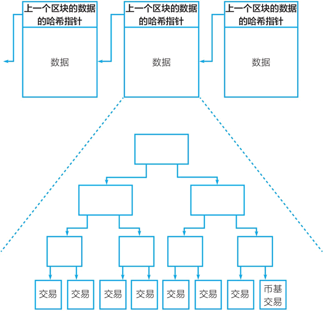

# 比特币区块链的数据结构

我们回到两个人转账交易的过程中，去理解比特币区块链的数据结构。

我发起一笔交易，即我向整个区块链网络广播，我和你两个人想进行这笔交易：我向你的地址中转入一笔比特币，无须你的许可。

但只有当这笔交易被打包进最新的比特币区块中时，这笔交易才真正完成。通常来说，当在一笔交易所在的区块之后又增加 5 个区块，即包括它自己在内一共经过 6 次确认时，这笔交易可认为被完全确认。按比特币每个区块的确认时间 10 分钟估算，即一笔交易最终确认要经过约 1 小时。

这里包括了两步：一是交易被打包进候选区块，每个节点可以按规则生成不同的候选区块；二是节点挖矿成功，候选区块被成功地加到区块链的尾部，成为最新的正式区块。

那么，把一笔交易打包进区块是什么意思呢？这涉及区块链最基础的数据结构，这也是它不可篡改的基础。

以下讨论可能略显枯燥，但却是认识比特币与区块链的最基础的知识，我尽量以通俗的语言来解释。

区块链之所以被称为 blockchain，是因为它的数据块以链状的形式存储着。从第一个区块即所谓的创世区块开始，新增的区块不断地被连到上一个区块的后面，形成一条链条。

每个区块由两个部分组成——区块头部和区块数据。其中，区块头部中有一个哈希指针指向上一个区块，这个哈希指针包含前一个数据块的哈希值。哈希值可以被看成是数据块的指纹，即在后一个区块的头部中均存储有上一个区块数据的指纹。如果上一个区块中的数据被篡改了，那么数据和指纹就对不上号，篡改行为就被发现了。要改变一个区块中的数据，对其后的每个区块都必须相应地进行修改。

> 比特币区块链设计有一种机制让这种修改难以发生，我们稍后在谈到“工作量证明”和“比特币挖矿”时再详细讨论。

一个区块中的数据是被打包进这个区块的一系列交易。这些交易按照既定的规则被打包形成特定的二叉树数据结构——梅克尔树（Merkle trees）。按目前的比特币区块的大小，一个区块中能容纳的交易数量在 2000 个左右，比如在第 526957 个区块中容纳了 1804 个交易。

> 可通过如下网站查看比特币区块链的数据信息：[`blockchain.info/`](https://blockchain.info/)。

比特币区块链的数据结构中包括两种哈希指针，它们均是不可篡改特性的数据结构基础。一个是形成“区块+链”（block+chain）的链状数据结构，另一个是哈希指针形成的梅克尔树（见图 1）。链状数据结构使得对某一区块内的数据的修改很容易被发现；梅克尔树的结构起类似作用，使得对其中的任何交易数据的修改很容易被发现。

图 1：比特币区块链的“区块链”与梅克尔树