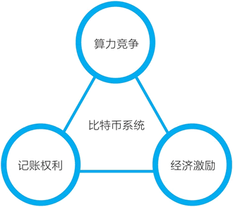
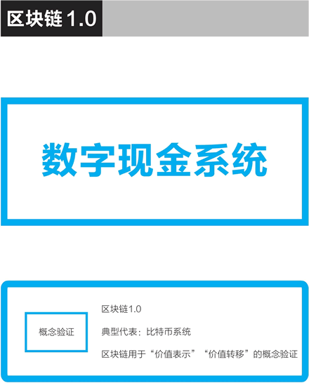

# 挖矿是什么意思？矿工都做了什么？

这篇文章从本质上讲解了矿工挖矿是什么意思，需要读者具备以下基础知识：

*   比特币是如何转账的？
*   比特币的分布式账本和去中心网络
*   UTXO（未使用的交易输出）
*   比特币区块链的数据结构
*   工作量证明共识机制

挖矿节点计算机在挖矿时要做两个任务：

*   第一个任务是把比特币网络中未确认的交易按梅克尔树组装成候选区块，未被纳入的交易则往下顺延。
*   在创建候选区块时，除了普通的交易之外，矿工在其中增加一个特殊的交易：币基交易（coinbase transaction）。如果挖矿成功，则币基交易会凭空转出新区块的奖励比特币到矿工的钱包地址中，从而发行这些比特币出来。这个特殊交易也被叫作“创币交易”，新的比特币是在这一交易中被创造出来的。

挖矿节点计算机的第二个任务是真正的挖矿，即进行加密哈希计算，解决一个计算难题，进行算力竞争。在众多争夺记账权的节点中，谁最先完成这个计算，它打包的区块就被加到了区块链的最后，成为最新的区块。率先完成计算的矿工会赢得新区块的挖矿奖励。最初，成功挖出一个区块，矿工可以获得 50 个比特币的奖励，按规则，这个挖矿奖励每四年减半一次，分别为 25 个、12.5 个，以此类推。

我们再讨论两个问题，以深入了解比特币的工作量证明共识机制与它的挖矿机制。

#### 第一，先向内看，比特币矿工挖矿是在做什么？

在候选区块的头部有一个 32 位的随机数区域，矿工需要反复调整随机数并计算，目标是让整个区块的哈希值小于一个“目标值”。如果试过所有的 32 位随机数可能性后，计算仍未能成功，那么就要改变币基（coinbase）的一个随机数，接着进行反复计算。

这个计算是加密哈希计算（对比特币来说是 SHA-256），除了反复计算别无他法。这个计算量非常大，比如在 2015 年年底，在大约 2 的 68 次方个随机数中，只有一个可以成功，这个数字比全球总人口的平方还要大。

有意思的是，这种挖矿计算是非对称的，你挖矿需要经过 2 的 68 次方个哈希计算，而我要验证你的确找到有效的随机数，只需要一次就可以。

第一个完成这个计算难题的节点所打包的区块就成为有效区块，它向全网广播告知自己已经完成，由其他节点确认后（即有别的挖矿节点在这个区块的基础上进行下一个区块的挖矿，生成新的区块）。在等待 6 个区块后，该挖矿节点就可以获得这次比特币奖励。

比特币的去中心网络能够长期运行下来，现在有 1 万多个全节点，正是因为有这样的挖矿奖励机制。出于对自己的利益考虑的矿工运维着这个不属于任何人、完全去中心化的网络。

#### 第二，再向外看，比特币的挖矿机制在加入挖矿的计算机的算力不断增加的情况下，这个挖矿机制是如何保持稳定的？

比特币挖矿的芯片已经经过几轮演变，其计算能力越来越强：从 CPU 演变到 GPU（显卡），再到现场可编程门阵列（FPGA），再到现在的专用集成电路技术（ASIC），即只能进行比特币挖矿所需的哈希计算的专用芯片中。并且随着矿机的升级迭代和数量增多，接入比特币区块链网络、参与挖矿竞争的计算算力越来越大。

相应地，比特币系统有这样一个对应的机制设计：随着算力的增长，调整目标值的难度使得挖出一个区块的时间始终是 10 分钟左右。

这形成了一种动态的平衡，维持区块链网络经济激励的有效与稳定。这个决定难度的公式非常简单明了，每挖出 2016 个区块，也就是经过约两个星期，挖矿难度会进行一次调整，该公式是：

下一个难度 = 上一个难度 × 2016 × 10 分钟 / 产生 2016 个区块所需的时间

如果算力突然大幅度上升，产生上一组 2016 个区块所需的时间变短，那么难度就会上升。在某些特殊情况下，如果产生上一组 2016 个区块所需的时间变长，那么难度也会下降，但这样的情况并不多见。

因此，比特币矿工节点的挖矿是它在运行分布式账本与去中心网络。同样重要的是，它也是比特币的发行机制和整个社区的激励机制。

比特币的挖矿是比特币的唯一发行机制，从中本聪挖出第一个区块获得 50 枚比特币开始，比特币这个加密数字货币就以这样的去中心化方式不断地发行了出来。

比特币区块链网络是由众多节点组成的去中心网络，而这些计算机节点加入这个网络，维护分布式账本，是因为中本聪在设计系统时巧妙地加入了经济激励：众多比特币矿工（即挖矿节点）在竞争获得记账的权利，矿工每增加一个新的区块能获得对应的记账奖励。

比特币的经济系统是以“竞争-记账-奖励”循环为核心的（见图 1），其中“竞争”非常重要，即挖矿节点进行的算力竞争。在比特币系统这样一个去中心网络中，节点参与是出于获得经济奖励的自利动机，而记账权利和对应的奖励需要通过竞争来获得。

> 在区块链的相关探讨中，有把“挖矿”一词的含义扩大的倾向，在这里我们认为，只有生成区块的计算行为，即运维分布式账本与去中心网络的行为，才是真正意义上的挖矿。简单地说，只有生产区块，才是挖矿。即便放宽要求，不再强求只有计算机节点生产区块才是挖矿，我们也仍想强调，竞争获得对应的权利和奖励，仍是必须的。没有竞争的奖励，是很难真实有效的。

图 1：比特币的“竞争-记账-奖励”循环
通过讨论比特币区块链的五个技术性细节，我们再一次看到，比特币系统在发行和交易层面都实现了完全的去中心化：

*   一个交易的确认，被写入分布式账本记录下来，是由去中心网络中互不信任的节点为了自己的利益相互以算力进行竞争而确认的。
*   在竞争挖矿的过程中，比特币的发行是“凭空发行货币”，它的货币发行也是靠这个去中心网络的算力竞争来完成的，是去中心化的。

比特币作为区块链 1.0 的典型，完成了价值表示和价值转移的概念验证（见图 2）。

比特币区块链是非常精妙的设计，它无须任何人的居中协调与领导就能持续发展。比特币可能是迄今为止最成功的加密数字货币，比特币区块链在加密数字货币的应用上堪称完美。

比特币区块链即“区块链 1.0”是专为去中心化的电子现金设计的，而要在各个领域中广泛应用，我们需要有更通用、性能更好的区块链系统。

图 2：比特币作为区块链 1.0 的典型，完成了价值表示和价值转移的概念验证
在比特币系统之后出现了常被认为是“区块链 2.0”代表的以太坊。现在，更多项目在竞争成为“区块链 3.0”，我们在后续章节中会分别讨论它们。