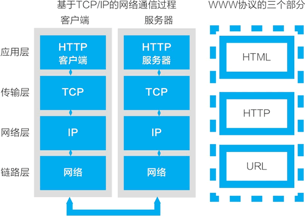
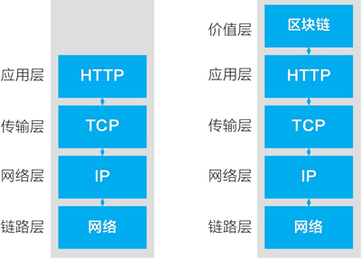

# 区块链将成为互联网基础协议，类似于 TCP/IP、HTTP

网络中的协议在技术上指的是，网络硬件、操作系统在进行通信时要遵守一些规则，这些规则被称为协议（protocol）。

互联网通信用的协议是所谓 TCP/IP 协议族。通常认为 TCP/IP 协议族包括四层：应用层、传输层、网络层、链路层。链路层将一些数据放在电线上；网络层对数据进行路由；传输层将数据持久化；应用层以应用的形式提供数据抽象，见图 1。

图 1：网络通信协议的四层与 WWW 协议
TCP/IP 协议族包括一组协议：TCP 和 IP 两种基础协议，邮件传输的 SMTP 协议，超文本传输协议 HTTP、HTTPS，域名系统 DNS 等。

1989 年，蒂姆·伯纳斯-李提出了让学术界进行信息与知识共享的 WWW（万维网）协议。通常认为，WWW 协议包括三个部分：

*   文本标记语言 HTML。
*   文档传输协议 HTTP。
*   指定文档网络地址的统一资源定位符 URL。

在之前的讨论中，为简化起见，我们把信息在应用方面的相关协议称为 WWW 协议。如图 1 所示，在讨论信息传输时，我们常说的是 HTTP 协议，它位于通信协议的应用层。要注意，这里的应用层与讨论互联网应用时的“应用”是有区别的，指的并不是网站、App 等。

把互联网看成硬件网络、万维网协议、网站与 App 应用三个层次，而区块链技术带来的变化是，在现有硬件网络之上、WWW 协议旁边，构建一组用于价值表示和价值转移的新协议：区块链信用层协议。区块链仍然很新，相关的协议都在发展过程中，但现在，我们已经可以认为，它所发挥的角色类似于 WWW 协议。

如果从网络通信的应用层、传输层、网络层、链路层的分层逻辑上看，我们还可以有另一种看法：区块链可能从原应用层分离出来，形成一个价值层（见图 2）。当然，对网络通信协议的分层，在短期内还难以形成一致的修订意见。这里为了便于理解，我们试图绘制如图 1-29 所示的图示，在应用层、传输层、网络层、链路层四层上抽象出一个“价值层”。

图 2：网络通信的第五层“价值层”：价值表示与价值转移
在信息传输时，原来的四个层次组合在一起良好地工作。但要在数字世界中表示价值、转移价值，互联网在基础协议层次并没有提供支持，我们需要在网站、App 中做很多工作。并且特别地，我们通常需要一个中心化机构来担任可信第三方的角色，帮我们管理记录价值的账本，协助我们进行价值转移。

现在，正如比特币系统和其他区块链系统所展示的，区块链同时提供了关于价值的两个重要功能：价值表示和价值转移。

现在，我们不再需要可信第三方来协助进行价值表示和价值转移，用户可以通过区块链来进行点对点的价值交易。因此，我们可以认为，区块链对数字世界中与价值相关的应用功能进行了抽象，从原应用层独立抽离出来，形成了网络通信的第五个层次——价值层。

也有人认为，区块链给互联网带来的是与信用相关的功能，它担任的角色是过去的可信第三方的角色，这个从应用层分离出来的层次也可称为“可信层”。

之前我们尝试性地提出了“区块链信用层协议”的说法，以说明区块链给互联网带来了类似 WWW 协议的重大变化。这里我们又从网络通信层次的角度，尝试性地提出“价值层”的说法，因为这是互联网第一次可能在通信协议层次直接处理价值表示和价值转移。以上都是尝试性的提议，提出来供进一步探讨。