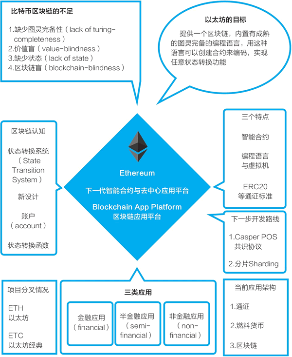

# 以太坊是什么？为什么说它是区块链 2.0 的代表

通过深入了解比特币系统我们已经知道，区块链是源自比特币的底层技术，它让我们可以无须借助任何第三方中介直接进行价值表示和价值转移，它还给数字世界带来了价值表示物——通证。区块链将使互联网从“信息互联网”阶段跨越到“价值互联网”阶段。

但区块链技术要应用起来，还需要持续迭代升级。比特币系统和它的区块链都是专为创建一个去中心化的点对点电子现金而设计的。如果把比特币系统看成区块链 1.0，则以太坊是当之无愧的升级迭代版，是区块链 2.0 的典范。

在过去这些年中出现了很多对比特币系统的改进，如替代币（altcoin）、替代链（alt chain）、侧链与跨链等。曾被认为是替代链的以太坊，可能是对比特币系统的众多改进中被广泛接受的一个。

过去几年，基于以太坊区块链、以太坊的智能合约和通证标准，大量的通证涌现，这使以太坊变成仅次于比特币系统的热门生态。在软件层面，以太坊新加入的是智能合约，但在实际应用中，它真正带来巨变的是通证。

现在，有不少新项目在认可以太坊是区块链 2.0 的前提下，试图竞争成为所谓的区块链 3.0，试图成为应用开发的新一代平台，竞争才刚刚开始。

> 当下，对于区块链的发展阶段划分，一个被普遍接受的分类来自区块链研究者梅兰妮·斯万，在《区块链：新经济蓝图》一书中，她将区块链分为：区块链 1.0，货币；区块链 2.0，合约；区块链 3.0，应用。从货币到合约、再到应用是一种阶段分类，以太坊白皮书的题目即宣称，它试图成为智能合约和去中心化应用的平台。

以太坊也在持续发展，随着它的自身技术与功能的优化，它被开发者选用于更广泛的应用开发，它或许可能往前进一步演化，成为用于应用的区块链 3.0 中的一员，毕竟以太坊最初的设计目标就是成为智能合约和去中心化应用的平台。

接下来，我们就来深入了解以太坊，并将之与比特币系统对比，以了解它的特点。以太坊的创始人叫维塔利克·布特林，常被昵称为“V 神”。

## 详解以太坊之一：智能合约与去中心化应用的平台

维塔利克是如何逐步把以太坊发展起来的？从以太坊白皮书开始，我们来看看他的最初设想和之后一步步的历程。

在以太坊白皮书中，维塔利克在分析了比特币区块链之后认为，在比特币系统的基础上开发高级应用有三种可行路径：

*   建立一个新的区块链。
*   在比特币区块链上使用脚本。
*   在比特币区块链上建立元协议（meta-protocol）。

维塔利克认为，比特币系统的主要设计 UTXO（未使用的交易输出）和其对应的脚本语言有缺陷，他总结认为它有以下四点不足（见图 1）：

*   缺少图灵完备性（lack of turing-completeness）。尽管比特币的脚本语言可以支持多种计算，但是它不能支持所有的计算。
*   价值盲（value-blindness）。UTXO 脚本不能为账户的取款额度提供精细的控制。
*   缺少状态（lack of state）。UTXO 只能是已花费或者未花费状态，这意味着 UTXO 只能用于建立简单的、一次性的合约。
*   区块链盲（blockchain-blindness）。UTXO 看不到区块链的数据，比如区块头部的随机数、时间戳和上一个区块数据的哈希值。

维塔利克得出了自己的结论，他认为应当开发一个“下一代智能合约和去中心化应用平台”。他把自己将要开发的系统命名为“**以太坊**”。

图 1：一张图看清以太坊
在白皮书摘要部分，他这样描述以太坊的目标：

以太坊的目标是，提供一个区块链，内置有成熟的图灵完备的编程语言，用这种语言可以创建合约来编码，实现任意状态转换功能。

“状态转换”反映了维塔利克对比特币系统和区块链的认识。在白皮书中他认为，比特币是一个状态转换系统，而他为以太坊设计了一个更灵活的状态转换系统。

以太坊的目标描述可以细分成以下三个部分：

1.  维塔利克要创建一个新的区块链。
2.  这个区块链的特色是，有一个能实现所有计算，即所谓的图灵完备的脚本编程语言。
3.  这个脚本语言可以用来创建复杂的“智能合约”，用以控制区块链的状态转换，也即进行链上数字资产的转移。

> 关于智能合约，在以太坊白皮书中，维塔利克用的词汇是“实现预先设定规则的一段代码”（implementing arbitrary rules）。在区块链上，这些代码的用途是控制链上的数字资产的转移。关于智能合约的更多介绍见相关冷知识专栏讨论。

在以太坊白皮书中，维塔利克认为，在以太坊上可以开发三大类应用（见图 1）：

*   金融应用（financial）：为用户提供更强大的的方法，用他们的钱去管理和参与合约。这些应用包括子货币、金融衍生品、对冲合约、储蓄钱包、遗嘱，甚至雇用合约。
*   半金融应用（semi-financial）：这里有钱的存在，但非金钱的方面所占的比例也很重。一个好例子是为了解决计算问题而设的自动执行的悬赏。
*   非金融应用（non-financial）：如在线投票和去中心化治理等。

以太坊的最初设计目标是建立一个智能合约和去中心化应用平台，它和比特币区块链的最大不同是，它包括了一个图灵完备的编程语言（Solidity）。利用 Solidity，我们可以在以太坊上更方便地编写“智能合约”，以太坊也提供了一个代码运行环境——以太坊虚拟机（EVM）。有了这些，在以太坊区块链上，逻辑上我们就可以开发去中心化应用（decentralized application）了。去中心化应用常被简写为 DAPP，现在它通常指利用了区块链技术的网站或移动 App 应用（见图 2）。

图 2：从比特币区块链到以太坊区块链

## 详解以太坊之二：用智能合约管理数字资产与 ERC20 通证标准

我们现在看到，以太坊并没有像最初设想的那样，从比特币区块链的加密数字货币功能跨出两大步，成为应用的平台。按梅兰妮·斯万的区分，区块链 1.0 是货币，区块链 2.0 是合约，区块链 3.0 是应用，而以太坊的初始目标是建立智能合约和去中心化应用平台。在实践中，它跨出了一步或者说半步：以太坊区块链上最常用的功能并非去中心化应用，而是编写智能合约，更符合实际情况的说法是，编写智能合约以管理用通证表示的数字资产。

这可能是区块链这个新兴技术在发展和应用过程中的必然阶段，一个新技术总会首先被用于当前条件下最适用的领域。

为了理解通证与数字资产，我们再来对比一下比特币和以太坊。

在比特币的二次开发或应用中，最广为人知的是众多的替代币。人们简单修改比特币开源代码的参数，然后就可以用这个代码运行一个新的区块链，创建新的替代币。

在以太坊的二次开发或应用中，最为广泛的是基于它的智能合约创建符合 ERC20 标准的通证。以太坊的智能合约将创建通证的门槛降到了很低（见图 3）。

图 3：从比特币到以太坊：智能合约与通证
以太坊还将进行代币众筹的门槛降到了很低。在以太坊区块链上，代币众筹的流程是，一个区块链应用项目的团队在以太坊上创建一种通证，然后投资者可以用自己的以太币按照规则兑换项目的通证。代币众筹与后来的名字（首次代币发行（ICO））在 2017 年大为盛行后又陷入巨大争议，这个机制被滥用了。

> 2017 年 9 月 4 日，中国人民银行等七部委发布公告叫停首次代币发行（ICO），本书这里提及 ICO 仅为对以太坊区块链的技术进行探讨。
> 
> 公告指出，“近期，国内通过发行代币形式包括首次代币发行（ICO）进行融资的活动大量涌现，投机炒作盛行，涉嫌从事非法金融活动，严重扰乱了经济金融秩序”。
> 
> 公告认为，“代币发行融资是指融资主体通过代币的违规发售、流通，向投资者筹集比特币、以太币等所谓‘虚拟货币’，本质上是一种未经批准非法公开融资的行为，涉嫌非法发售代币票券、非法发行证券以及非法集资、金融诈骗、传销等违法犯罪活动”。
> 
> 公告要求，“本公告发布之日起，各类代币发行融资活动应当立即停止。已完成代币发行融资的组织和个人应当做出清退等安排，合理保护投资者权益，妥善处置风险”。“本公告发布之日起，任何所谓的代币融资交易平台不得从事法定货币与代币、‘虚拟货币’相互之间的兑换业务，不得买卖或作为中央对手方买卖代币或‘虚拟货币’，不得为代币或‘虚拟货币’提供定价、信息中介等服务”。

要真正了解代币众筹，我们可以回到以太坊的开始时刻。匿名的中本聪几乎靠自己一个人设计和开发了比特币系统，规划它的经济激励模型，然后让它在互联网上自由生长。在比特币项目中，他花费了多少开发资金，资金来源于何处，现在我们都再也无从了解，但合理的猜测是，总投入并不大。

但是，当维塔利克和团队开发与运营以太坊时，它已经不太可能是一个宿舍里的作品，以太坊团队需要资金来运转。

在发布白皮书后，维塔利克吸引合伙人加入，建立了一个项目所需的商业和法律架构（一个瑞士公司以及后续的一个瑞士的非营利性基金会）。他和团队一起进行项目的设计与开发。在 2014 年 4 月，以太坊发布了由联合创始人加文·伍德（Gavin Wood）撰写的技术白皮书。

> 以太坊技术白皮书见：[`ethereum.github.io/yellowpaper/paper.pdf`](https://ethereum.github.io/yellowpaper/paper.pdf)。

为了获得所需的资金，在 2014 年 7 月到 8 月，以太坊进行了为期 42 天的在线众筹：参与者可以用比特币换取以太坊的通证——以太币（当时叫 ether）。

这个代币众筹可以看成是，面向比特币持有者进行了一次以太币的预售。在 2008 年前后，KickStarter、Indigogo 等产品众筹网站开始逐渐建立，后来还出现了股权众筹等各种形式。以太坊的众筹可以说是这种产品众筹方式的延续，不同的是：

*   它所筹集的不是法币（法定货币），而是比特币。
*   人们获得的不是明确的商品或股权，而是换得了以太币。

这个以太币有什么用，代表什么权益，当时参与者均没有对此进行多少探讨。毕竟，这次代币众筹是在当时非常小的比特币社区中进行的，带有强烈的理想主义，很像是比特币社区的成员们用自己手上的比特币赞助了一个新区块链的开发。

通过这次代币众筹，以太坊获得了 31531 个比特币，按当时的比特币价格换算，它获得了 1843 万美元，这是当时排名第二的众筹项目。

2015 年 6 月 30 日，以太坊的首个版本正式上线，预挖的 7200 万枚以太币被分配给众筹参与者与项目团队（见图 4）。在之前的众筹中，以太坊共售出了 6010 万枚以太币。到此，以太坊的代币众筹过程就完成了。

图 4：以太币的供给：从 7200 万枚到 1 亿枚

> 资料来源：[`www.etherchain.org/charts/totalEtherSupply`](https://www.etherchain.org/charts/totalEtherSupply)。

由于之后比特币的价格大幅波动，众筹获得大量比特币的以太坊项目还经历了几个插曲。比如，由于比特币价格暴跌，而以太坊基金会没有在高点把手中的比特币换成法币，它用以支付各项费用的法币资金短缺，不得不大幅度削减预算。

2015 年 9 月，中国万向集团旗下的基金用 50 万美元向以太坊基金会“购买”了 41.6 万枚以太币。按 2018 年 5 月以太币处于较低点的价格计算，这批以太币的价值仍超过 2 亿美元。这常被认为是一次“赞助”，是对当时资金困难的以太坊基金会的支持。

在发展的一开始，以太坊有了这样一个成功的代币众筹，这一思路很自然地被发扬光大。

在 2015 年 11 月 19 日，以太坊的主要开发者费边·沃格尔斯特勒（Fabian Vogelsteller）向社区提议了 ERC20 标准。

> ERC 是 Ethereum Request for Comment 的缩写，除了 ERC20 这个可互换通证标准之外，主要采用的标准还有 ERC721 不可互换通证标准（non-fungible tokens），它也被称为契约（deeds）。在 2018 年年底大为流行的加密猫（CryptoKitty）是基于 ERC721 通证标准发行的。
> 
> ERC20 最初的建议见：[`github.com/ethereum/eips/issues/20`](https://github.com/ethereum/eips/issues/20)，最终标准文件见：[`github.com/ethereum/EIPs/blob/master/EIPS/eip-20.md`](https://github.com/ethereum/EIPs/blob/master/EIPS/eip-20.md)。ERC721 标准地址见：[`github.com/ethereum/EIPs/blob/master/EIPS/eip-721.md`](https://github.com/ethereum/EIPs/blob/master/EIPS/eip-721.md)。

这是一个用以太坊区块链智能合约发行可互换通证（fungible token）的方案。所谓可互换通证，指的是每一个通证都是一模一样的，比如任何两张 100 美元的价值是完全相同的，又比如你持有的一家上市公司的 1 万股普通股股票和我持有的 1 万股普通股是可互换的。

另一种方案是在 2018 年 6 月正式获得以太坊社区认可的 ERC721 通证标准，它是不可互换通证（non-fungible token）。不可互换通证的参照物是棒球卡、邮票等收藏品等，比如我的一本专门题名给我的签名书和你的同一本书是不同的，二者不可互换。

有了 ERC20 通证标准，我们可以在以太坊上很简单地编写一个智能合约，创建表示价值的通证。虽然这些通证所表示的价值是什么仍不明确，但大量的通证已经被创建出来。截至 2018 年 5 月，在以太坊上有 8 万多种创建 ERC20 标准通证的智能合约。

在 2017 年，这些符合 ERC20 标准的通证的重要用途是被用于首次代币发行的筹资，人们可以用以太币按照项目方设定的兑换率来换取这些通证，而项目方获得以太币形式的资金。

以太坊区块链及其智能合约、ERC20 通证标准提供了简单地创建代表价值的通证的技术方案，最终在 2017 年造成了通证的大爆发。这些通证在各个国家或地区的合规是一个引起激烈争论的议题。但不管怎样，从技术上讲，以太坊的实际功能是数字资产系统，因而从区块链 1.0 到区块链 2.0，是从“数字现金”到“数字资产”（见图 5）。

图 5：以太坊及其通证让区块链从数字现金系统演变为数字资产系统