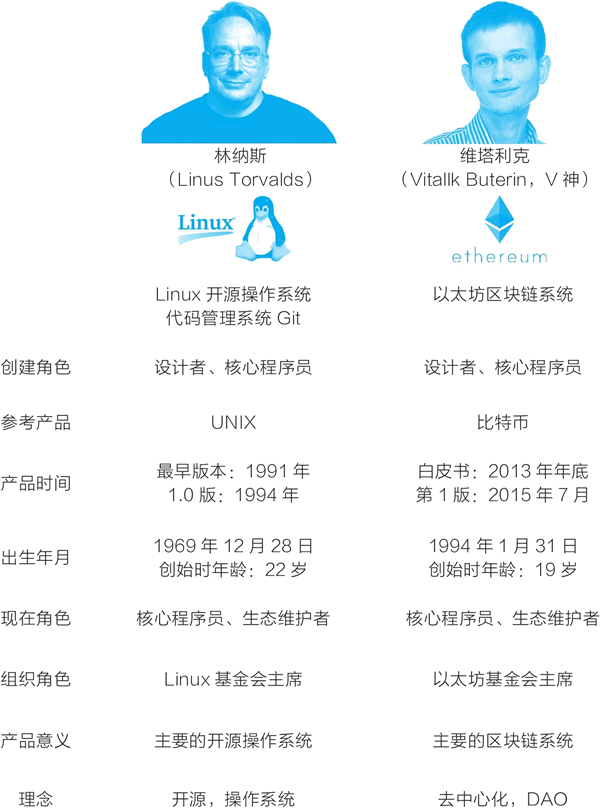

# V 神是谁？他是以太坊创始人，是区块链界的真正大佬

“V 神”的真名叫维塔利克·布特林，他以太坊的创始人，是区块链界真正的大佬。

1994 年 1 月 31 日，V 神出生于俄罗斯，6 岁时，他跟随父母移民到加拿大。他的父亲是一个计算机科学家，因而他从小就接触计算机，在小学时，他被选入杰出儿童班，认识到自己对数学、编程和经济学充满了兴趣。2012 年，他赢得了国际信息学奥林匹克比赛的铜牌。以最传统的眼光看，V 神就是天才少年。

在区块链世界中，V 神的第一个角色是作者，他写文章探讨比特币和区块链。

17 岁时，V 神从他父亲那里了解到比特币。在论坛上认识一些人之后，他被邀请为一个比特币博客写文章，当时，他写一篇文章可以得到 5 个比特币（价值 3.5 美元）。可惜的是，由于当时只有很少的人关注比特币，这个博客网站很快关停了。

2011 年 9 月，V 神和网上认识的朋友一起创办了名为比特币杂志（Bitcoin Magazine）的网站，他是联合创始人和主要作者。在 2012 年年底，这个媒体还开始出版印刷版杂志，成为最早报道加密数字货币的杂志。比特币杂志后来被媒体机构 BTC Media 收购，直到 2014 年年中，V 神都还在为它写文章。

在区块链世界中，V 神很快有了第二个角色，一个做区块链规划与开发的程序员。

2013 年，V 神周游全球，他曾有一段时间待在中国，他的中文也很好，常和中国网友在论坛上用中文交流。在这段时间内，他在全球与网上认识的朋友们见面交流比特币系统和区块链编程。

大约在这个过程中，他形成了要做名为“以太坊”（Ethereum）的项目的念头。他认为应该为比特币开发一个脚本编程语言，从而在比特币区块链上可以开发应用。但是，他的想法无法得到比特币社区的认可。因而他开始考虑，也许自己应该开发一个带有脚本编程语言的新平台。

2013 年年底，他在回到加拿大多伦多后，发布了一份白皮书形式的论文“以太坊：下一代智能合约和去中心化应用平台”。他在详细地分析了比特币系统的设计、优点和不足后，提出要建立一条新的区块链，使之成为去中心化应用的平台。

> 以太坊白皮书的标题为：A Next-Generation Smart Contract and Decentralized Application Platform；网址为：[`github.com/ethereum/wiki/wiki/White-Paper`](https://github.com/ethereum/wiki/wiki/White-Paper)。

去中心化的想法很早就扎根在他的心中。在 13 岁的时候，V 神沉迷于“魔兽世界”游戏不可自拔，但后来发生了一件事让他非常愤怒。开发魔兽游戏的暴雪公司取消了术士的“生命虹吸”技能，他写邮件和在论坛里与暴雪的工程师沟通，尝试要求恢复这个技能，但得到的回复都是，我们是出于游戏平衡才这么做的，不能恢复。V 神认识到，玩家是很弱势的，像暴雪这样的游戏开发商是中心，它说了算。

后来，在为《商业区块链》一书写的序言中，V 神把自己和以太坊所处的技术浪潮统称为“去中心化科技”（decentralized technologies）。他写道：“与其寄希望于我们打交道的对方能够诚实，不如建立一个能够内生包括我们想要的东西的技术系统。这样，即使里面的参与者是腐败的，系统本身也能保持正常运作，得到我们想要的效果。”

V 神曾经在多伦多大学上了 8 个月学，但在拿到 Facebook 早期投资人彼得·蒂尔鼓励辍学创业的 10 万元蒂尔奖学金后，他从 2014 年开始全职开发以太坊项目，从此开创了一段传奇。

从 2013 年的白皮书开始，以太坊项目经过了 4 年多的发展，并最终在 2017 年大爆发：基于它的通证数量暴涨，以太坊自己的燃料货币“以太币”的价格在一年的时间里最高涨了 170 多倍，从 2017 年年初的 8 美元涨到年底的接近 1400 美元。

V 神自此拥有了在区块链世界中的第三个角色——一个技术领袖。

V 神引领着以太坊系统的开发，也带动着整个区块链技术的开发和应用。在中文网络论坛中，网友对他的称呼从“V 生”变成了“V 神”。在神秘的比特币发明者中本聪完全消失于网络后，V 神成为区块链领域最重要的人物。

V 神很早就表现出一个技术领袖的能力与魅力。在 2016 年出版的《区块链革命》一书中，数字经济专家唐·塔普斯科特写道，若要找一下历史上的例子做类比的话，下面这个类比是很明显的：V 神之于以太坊，就如同林纳斯之于 Linux 系统一样。林纳斯与 V 神的对比如图 1 所示。

图 1：林纳斯与 V 神：两个技术领袖