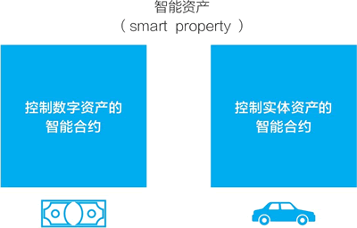

# 智能合约是什么？

尼克·萨博最早于 1994 年提出了智能合约。他定义道：“一个智能合约是，一个计算机化的交易协议，它执行一个合约的条款。”

> 交易协议中的“协议”二字指的是计算机协议。尼克·萨博的智能合约论文见：[`www.fon.hum.uva.nl/rob/Courses/InformationInSpeech/CDROM/Literature/LOTwinterschool2006/szabo.best.vwh.net/smart.contracts.html`](http://www.fon.hum.uva.nl/rob/Courses/InformationInSpeech/CDROM/Literature/LOTwinterschool2006/szabo.best.vwh.net/smart.contracts.html)。

尼克·萨博是知名的计算机科学家、法学学者和密码学者，他的研究重点是智能合约和数字现金。1998 年，他还曾创建中心化的数字现金比特黄金。

## 为什么需要智能合约

尼克·萨博说：“智能合约的设计目标是，执行一般的合同条件，最大限度地减少恶意和意外的状况，最大限度地减少使用信任中介。”

他认为，我们需要一个这样的计算机协议：它能够完全保证，如果付款了，商品会被发送，或者商品寄出去了，就会收到钱。

在现实生活中，我们有很多办法来实现这一点。而计算机科学家的目标是，用事先确定的代码自动执行合约条款，无须人工干预和第三方中介。

智能合约中的“智能”可以理解为，按条件自动执行，无须人的干预，是自动的或自治的。

## “合同”是智能合约的好类比吗

按其名字，智能合约的好类比是不是我们在商业活动中所签订的“合同”？其实不是。

智能合约贴切的形象类比，是我们在说起计算机术语“有限状态机”或“状态机”时常用的自动可乐售卖机：

*   我们向可乐售卖机投入硬币，按一下出可乐的按钮。
*   售卖机将一听可乐从出货口放出来。
*   售货机恢复到最初的状态。

萨博在 1997 年的文章中也说，智能合约的原始祖先是不起眼的自动售货机。

在以太坊白皮书中，维塔利克还特别指出，这里的“合约”不应被理解为需要执行或遵守的东西，而应看成是存在于以太坊执行环境中的“自治代理”（autonomous agents），它拥有自己的以太坊账户，它们收到交易信息后就相当于被捅了一下，然后自动执行一段代码。

> 维塔利克是以太坊的创始人，就是大名鼎鼎的“V 神”。

我们还可以这么看：

*   区块链存储的是“状态”，智能合约是它用于状态转换的方式。
*   智能合约像一个特别的“时钟”，把世界从“同步”转向“异步”。

## 智能财产：用智能合约来控制实体资产

在智能合约论文中，萨博还讨论了如何把智能合约用于实体资产，形成所谓的智能财产（smart property）。

所谓智能财产，是智能合约程序按照设定的规则控制的财产。萨博举例说明如下：

*   例如，为了防止一部车被偷窃，除非确定拥有者完成正确的“挑战响应协议”，否则车是不会启动激活的。
*   例如，如果车是贷款买的，当拥有者无法偿还贷款时，智能合约将会自动启动扣押令，并将车钥匙的控制权交给银行。一旦拥有者还清贷款，智能合约就移除扣押令。

智能资产的概念后来被扩大了，在对比特币的相关介绍中有这样说法：由比特币区块链上的智能合约控制的资产，不管是实体的还是数字的，都叫智能资产（见图 1）。

图 1：智能资产：由区块链上的智能合约控制的线上或线下资产
尼克·萨博的关键论文：

*   1994，Smart Contracts。
*   1996，Smart Contracts:Building Blocks for Digital Markets。
*   1997，The Idea of Smart Contracts。