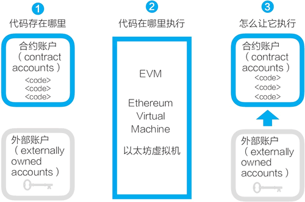
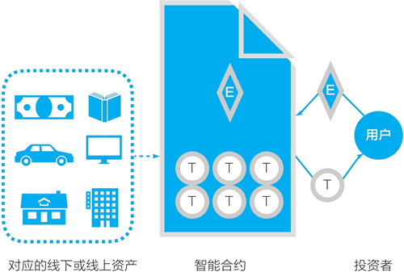

# 以太坊智能合约是什么？

以太坊是最早提出做智能合约的平台。由于以太坊区块链被普遍接受，因此多数区块链的智能合约采取与以太坊相似的设计。本文将详细介绍以太坊的智能合约：它是什么？它有什么用？

## 以太坊的智能合约是什么

以太坊的智能合约并非现实中常见的合同，而是存在区块链上，可以被触发执行的一段程序代码，这些代码实现了某种预定的规则，是存在于以太坊执行环境中的“自治代理”。以太坊的账户与合约如图 1 所示。

图 1：以太坊的账户与合约
以太坊的智能合约设计很简明。

*   任何人都可以在以太坊区块链上开发智能合约，这些智能合约的代码是存在于以太坊的账户中的，这类存有代码的账户叫合约账户。对应地，由密钥控制的账户可称为外部账户。
*   以太坊的智能合约程序，是在以太坊虚拟机（Ethereum Virtual Machine,EVM）上运行的。
*   合约账户不能自己启动运行自己的智能合约。要运行一个智能合约，需要由外部账户对合约账户发起交易，从而启动其中的代码的执行。

以太坊和比特币的一个重大不同是，前者提供了图灵完备的编程语言（Solidity）和相应的运行环境（EVM）。所谓图灵完备，指的是这个脚本编程语言可以运行所有可能的计算，而比特币的 UTXO 模型和脚本只能运行部分计算。

## 以太坊的智能合约有什么用

以太坊的智能合约被广泛应用的一个用途是创建通证，通证对应的多是以太坊区块链之外的资产。

图 2 是一个简明的图示，这是从 Komhar 咨询公司的一个图示重绘而来的。图示是一个典型的 ERC20 通证发行过程：一个项目通过智能合约创建通证，这个通证是实体资产或线上资产的价值表示物。投资者（用户）发起交易，向智能合约转入以太币（ETH），智能合约自动运转，在满足一定规则后，它向投资者账户转入相应数量的通证。

图 2：以太坊的通证合约逻辑示意图