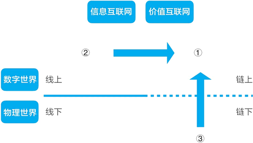
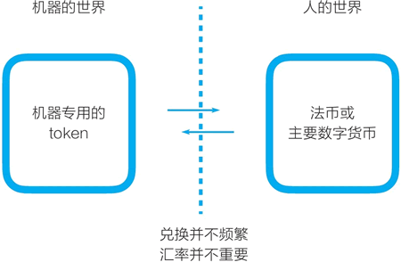

# 机器比人更需要通证

在讨论数字世界中表示价值的通证时，我们常会拿它和法定货币做比较，这会带来一个疑问：在很多情况下，延续数千年的人类货币已经工作得很好，在数字世界中，在线支付系统也工作得很好。至于它们是中心化还是去中心化的，对用户来说并不那么重要。那么，为什么我们还需要通证？

我们可以从很多个角度来探讨这个话题，其中一个可能很重要的观点是，机器比人更需要通证。

## 通证有什么用

如图 1 所示，我们可以用两个维度把自己所处的世界分成几个部分，一个维度是区分数字世界和物理世界；另一个维度是区分信息互联网和价值互联网。我们在这里把所有线下资产都视为一类，为第三类 ③。

图 1：从四个象限看通证的用途
我们可借用这张图示来思考“通证有什么用”这个问题。

通证的作用是，在数字世界中，在区块链上表示价值。比特币、以太币等是凭空在区块链上发行出来的。

要把其他象限的价值映射到链上、用通证来表示，主要有两个路径：

*   路径之一是，把原本在互联网上通过中心化机构的数据库表示的价值和价值转移，切换到去中心化的区块链上来。比如常见的有网络零售的支付、社交网络的积分、游戏里的道具等，反映在图中就是从象限 ② 到象限 ③。
*   路径之二是，把实体中的资产映射到链上，通过区块链进行流通。比如常见的有：把线下的民宿、供应链金融、资产证券化（ABS）中的资产用通证进行表示，反映在图中就是从象限 ③ 到象限 ①。

这两个都是值得探索的方向，但在这两个方向上探索时，我们逐渐地感到困惑：通证除了可以更大范围地进行交易，似乎并没有带来多少独特优势。对于路径一，互联网上的各类点卡、积分、道具一直运作良好；对于路径二，用通证进行表示依然没有能解决线下资产如何数字化的问题，也没有解决它们的流通性问题。

问题可能出在，把线上、线下资产变成链上资产，用通证进行表示，通过自由市场交易来发现其价格，这只是表面的变化。当我们意识到自己还在把它们折算为法币值多少钱时，我们发现，传统的法币在代表这类价值时已经做得足够好。

在如上这些领域中，用法币来表示这些价值以及相关的金融工具都非常成熟。把线下、线上资产用通证进行表示，可以带来一些优势，比如，过去在互联网上一个点赞 0.0001 美元的行为也许就被忽略了，而现在可能被通证记录下来了。但是，这带来的变化还是不那么大。出现这样的困惑是因为，我们始终站在人的视角来看通证的可能性，而通证能发挥作用的地方应当是法币不那么有效的地方。

## 当我们不再站在人的视角

当站到机器的视角去看通证时，我们会发现通证的独特价值，它的角色是法币无法替代的。

token 这个词在网络通信中的原始含义是令牌，只有有令牌的节点才能参与通信，令牌代表权利。当数字世界的范围扩大，在看机器相互交互的场景时，我们会看到，它们比人类更需要通证。

来看一种场景，在讨论中我们暂用 token 而不是通证。

假设，为了防止网络中的机器发出垃圾邮件，我们设定如下规则：个人电脑或手机在发出邮件时，需要消耗一个 token；发件邮件服务器也要消耗一个 token。如果这个邮件不被垃圾邮件规则拦截，或不被个人举报为垃圾邮件，那么在一定时间内，所消耗的 token 又会回到我们手中。

在这个过程中实际发生的是 token 的抵押，从而确保我们行为的正当性。系统可以预先给各个邮件账号和邮件服务器分配适量的 token，这样我们正常发送邮件就不会受到影响。对于那些需要大量发送推广邮件的人而言，他们发送的邮件有一定可能被认为是垃圾邮件，他们就需要用法币换取一定的 token，否则他们可能因为 token 数量为零而无法再发送邮件。

要让这样一个使用 token 的反垃圾邮件系统投入运营，我们的设计肯定不应是每个电脑、手机、服务器都需要存入法币，以购买 token，那只是特殊情况。我们的设计可能是，让这些机器可以自行以某种方式获取 token，比如这些计算机可以完成什么计算任务以获得 token。

从这样一个简单的例子中可以看到，机器在交互时比我们更需要 token。

放到物联网的场景中，每个传感器在和其他机器进行交互时，可能获得 token 或消耗 token。我们的做法也不应是给每个传感器开设一个和法币对应的账户。这时，我们应该设计机器专用的钱包和 token。

随着越来越多的物联网设备接入网络，我们需要有各种不同的机器 token。

在多数情况下，机器用自己类型的 token 就足够了。只有在极少数情况下，我们才需要根据一定的汇率，让这些 token 与其他数字货币进行转换，让它与法币进行转换。兑换并不频繁，转换的汇率也并不特别重要。

因此，当转换到机器视角时我们看到：在人的世界里，通证有意义，但不够大；在机器的世界里，通证不可或缺（见图 2）。机器比我们人类更需要通证。机器如何使用通证，将可能是区块链和通证应用的主要探索方向之一。

图 2：机器的世界 VS 人的世界