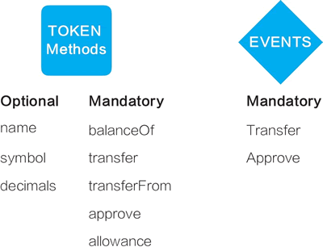

# ERC20 通证标准是什么？

ERC20 通证标准（ERC20 Token Standard）是通过以太坊创建通证时的一种规范。按照 ERC20 的规范可以编写一个智能合约，创建“可互换通证”。它并非强制要求，但遵循这个标准，所创建的通证可以与众多交易所、钱包等进行交互，它现在已被行业普遍接受。

## ERC 是什么

ERC 是 Ethereum Request for Comment 的缩写，20 是编号。征求修正意见书（Request for Comment，RFC）是互联网工程任务组（IETF）发布的一系列工作备忘录，后来演变为用来记录互联网规范、协议、过程等的标准文件。比如，常见的互联网协议的 RFC 编号分别是：IP，791；TCP，793；SMTP，2821。

现在，以太坊已经沿用比特币的提法，对比特币系统的改进提案现在被称为 BIP（Bitcoin Improvement Proposals），然后加上编号。与通证相关的标准沿用 ERC 的形式，但均被纳入 EIP（Ethereum Improvement Proposals）序列之中，以太坊 EIP 的标准序列包括 Core（核心改进）、Networking（网络层改进）、Interface（接口改进）、ERC（应用层意见征集）。

> 以太坊的改进提案网址为：[`eips.ethereum.org`](https://eips.ethereum.org)。

## ERC20 是什么

ERC20 通证标准最早由以太坊开发者费边·沃格尔斯特勒在开源社区中提出，后来以太坊创始人维塔利克（人称“V 神”）撰写了第一版文档，当时名为“标准化合约 API”（Standardized_Contract_APIs）。

> 最早的讨论文档见：[`github.com/ethereum/EIPs/issues/20`](https://github.com/ethereum/EIPs/issues/20)。

遵循 ERC20 标准，基于以太坊创建的通证是通用的，可以被以太坊和区块链世界的多数其他应用所使用。除了官方实现外，现在在以太坊网络中已经有了多种符合 ERC20 标准的软件实现。

## 详解 ERC20 通证标准

遵循 ERC20 通证标准可以编写智能合约。它需要实现的通证方法包括：可选的 name、symbol、decimals，必须有的 balanceOf、transfer、transferFrom、approve、allowance。它需要实现的事件响应包括 Transfer、Approve（见图 1）。

图 1：ERC20 智能合约程序的方法与事件
现在 ERC20 的文档见：[`github.com/ethereum/EIPs/blob/master/EIPS/eip-20.md`](https://github.com/ethereum/EIPs/blob/master/EIPS/eip-20.md)

除了 ERC20 之外，以太坊受关注的通证标准还有 ERC721。与 ERC20 不同，ERC721 是一种不可互换的通证标准（Non-fungible Token Standard，NFT）。

ERC20 的通证是可互换的、同质的，而 ERC721 的通证是不可互换的、非同质的；ERC20 通证是可无限分割细分的，而 ERC721 通证的最小单位是 1，无法再分割细分。

2018 年 6 月，ERC721 最终被以太坊社区正式接受，成为最终标准。之前大热的加密猫（cryptokitties，谜恋猫）所遵循的就是 ERC721 标准。