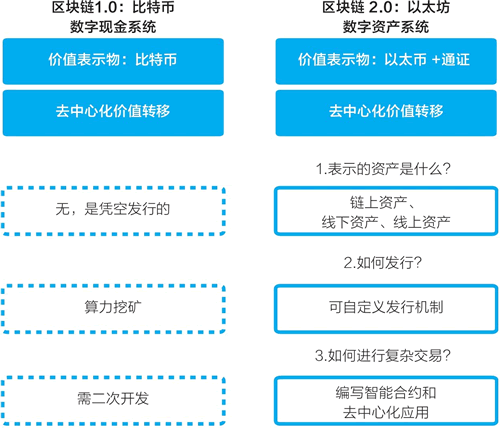
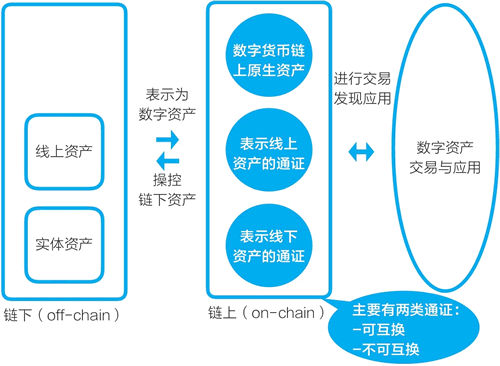
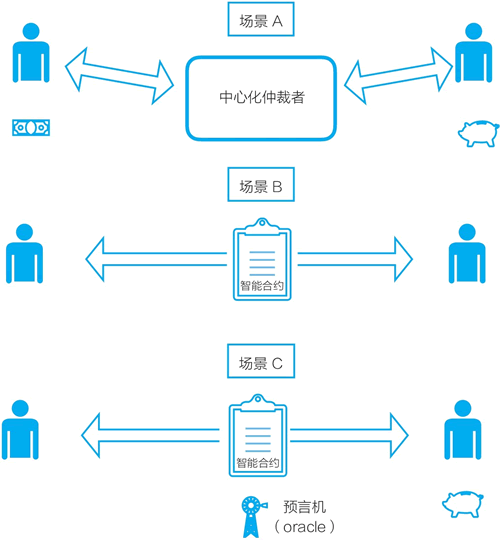
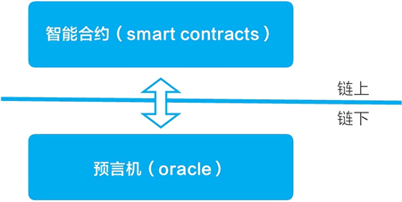
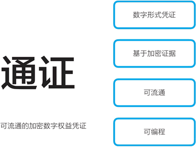
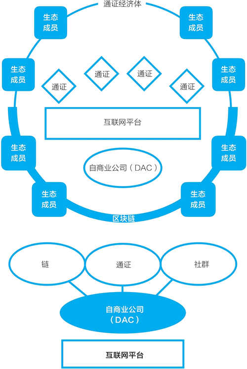
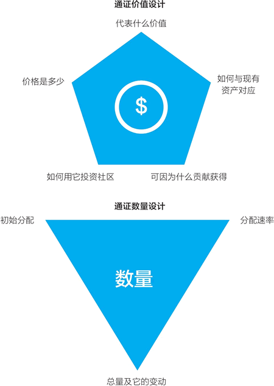
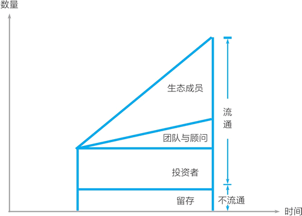
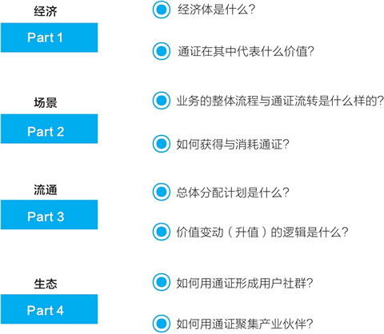
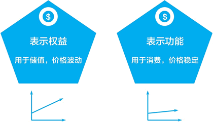

# 通证该如何设计？如何表示资产？

从比特币到以太坊，从区块链 1.0 的数字现金进展到区块链 2.0 的数字资产，人们关注的焦点在发生转移。在讨论比特币系统时，人们关注的是比特币、是加密数字货币，区块链是源自比特币的底层技术，比特币系统实现并验证了区块链的价值表示和价值转移这两个核心功能，并展示了这两者是可以完全去中心化的。

以太坊的重心则是区块链。以太坊也有类似于比特币的加密数字货币——以太币，但与中本聪没有为比特币设计用途不同，以太币被定位为以太坊区块链的燃料货币。以太坊白皮书说，以太币（ether，现在的代码为 ETH）是以太坊的主要内部加密燃料（crypto-fuel），用于支付交易费。在价值转移上，以太坊延续了比特币的区块链设计，依靠分布式账本来进行去中心化、点对点的价值转移。

以太坊还进一步带来了智能合约和通证。通过对比我们可以看到，比特币系统只有一种加密数字货币，而在以太坊区块链上，在以太币之外出现了众多表示价值的通证。

有了智能合约和通证之后，以太坊就有了新的用途——进行数字资产的表示与交易。链上的数字资产也有了一种相对统一的价值表示形式。因而以太坊开始往前一步，超越作为数字现金系统的比特币，开始解决数字资产系统的三个问题（见图 1）：

*   表示的资产是什么？
*   如何发行？
*   如何进行复杂交易？

图 1：数字资产系统要解决的三个问题
在实际运行中，以太坊被主要用于解决前两个问题——表示的资产是什么以及如何发行。有了数字资产和相关工具之后，人们会很自然地发挥创意，创建关于数字资产的各类复杂应用。

## 用通证将资产表示为链上的“数字资产”

来看看通证是如何在链上表示各种资产的。

一般来说，通证是资产在区块链上的价值表示物，涉及的资产包括三类：比特币和以太币等链上的原生资产、映射到链上的线上资产、映射到链上的线下资产。当它们被在链上表示后，我们将之统称为“数字资产”。特别地，用以太坊区块链和它的智能合约可以创建与发行代表价值的通证，然后用它去关联资产，形成现在较为通行的数字资产表示物（见图 2）。

在以太坊区块链上主要可以创建两种表示价值的通证：可互换的 ERC20 标准通证和不可互换的 ERC721 标准通证。可互换的通证可类比为现金，不可互换的通证可类比为房契。对表示为通证的数字资产，以太坊智能合约可以进行各种交易，如通证间的兑换、通证抵押、通证分配与消耗等，由此可以形成复杂的数字资产交易与应用。

图 2：数字资产的表示与应用
正如以太坊白皮书所展示的，它的系统设计和智能合约是为了更好地进行数字资产的交易。

这里涉及三种资产：链上资产、线上资产、线下资产。其中线上资产与线下资产均不在链上，可认为是链下资产。通常，我们需要辅以预言机（oracle）等工具来连接线上、线下的资产，然后通过智能合约在链上交易。

链上与链下的交互包括两大部分：一是将链下资产与通证关联，进行通证的发行与分配；二是在链上进行通证交易后，对链下资产进行相应的变动，并将变动在链上确认。

将资产表示成通证，即转变成数字资产，带来的好处有：一是市场交易帮助发现价格，二是在流动周转中增加资产价值。其中，关于流动增加总体价值的例子，我们在现实生活中也可以体验到：二手物品的流动让买方和卖方都收益，车辆与房屋的共享提升了资源的利用效率。

我们来看数字资产的几个交易场景，然后再讨论通证的特性、分类与发行等话题。

## 数字资产系统的去中心化交易场景

比特币系统只能进行比特币这种数字现金的去中心化交易。而以太坊作为数字资产系统，基于它的智能合约创建的各种通证都可以进行中心化或去中心化交易。

我们来对比三种场景，看看如何通过以太坊智能合约进行链上与链下资产的去中心化交易（见图 3）。

图 3：“智能合约”取代中心化仲裁者

#### 场景 A：在数字世界中通过中心化中介进行交易

在数字世界中，当两个人要进行数字资产的交易时，他们之间需要一个可信第三方，这个中介完成：

*   监督合约的执行。
*   作为双方之间的担保。
*   协助进行价值的记录。

以熟悉的电商购物（且特别的是购买一个电子文档）为例。假设我们在淘宝上进行交易，中心化的仲裁者又可细分为淘宝和支付宝两种角色：

*   买家在淘宝上下单，这是通过淘宝来签订一个购买协议。
*   买家通过支付宝付款，款项由支付宝代管，卖家发出文件，等买家确认后，支付宝将款项支付给卖家。
*   支付宝进行结算，支付宝对双方的账户进行记录的修改，完成金钱价值的转移。

那么，如果在以太坊区块链上，通过智能合约进行一次去中心化交易，过程是什么样的？

#### 场景 B：通过智能合约进行链上数字资产交易

假设我们编写一个合约，售卖一种基于 ERC721 的不可互换通证，如性质类似于收藏卡的“加密猫”。每个加密猫通证各不相同，预先在智能合约中设定价格均为 10 个以太币，购买方式是先到先得。

这时，去中心化的数字资产交易过程如下：

*   买方向智能合约地址转入 10 个以太币，即为发起购买邀约，智能合约担任第三方保管的角色。
*   卖方把该收藏卡（基于 ERC721 的通证）转入买方地址。
*   智能合约自动将以太币款项转入卖家账户。

由于这里仅涉及以太坊区块链上的数字资产（加密猫通证和以太币）的转移，因此在链上可以完成全部过程。

对比 A、B 两种场景我们看到，原本中心化的中介（如淘宝与支付宝）被按预先设定规则自动执行的智能合约所取代。中心化中介被区块链（即分布式账本和去中心网络）所取代。

#### 场景 C：通过智能合约进行涉及线下资产的交易

如果我们交易的标的不是一个链上的数字资产，比如交易是一个电子文档，甚至一个线下的房产资产，这时通常与智能合约联合起来使用的预言机就要出现了。

当交易的不是链上的数字资产时，智能合约和预言机是一对必备的组合。智能合约在链上，预言机在链下，它可以与链上的智能合约进行通信（见图 4）。

比如，当卖家把数字文件传递给买家，买家确认之后，连接链上和链下的预言机就发出消息通知智能合约。在接到消息后，智能合约执行后续的步骤，把以太币转入卖家账户。

图 4：智能合约在链上，预言机在链下
在涉及线下资产时，逻辑是相似的，只是过程更加复杂。比如，当购买一个实物商品时，买家要到线上的互联网界面中确认收货，而预言机会把消息传送到链上给智能合约，智能合约继续执行后续步骤。

通过这三种简单场景的对比，我们可以看到：

*   第一，有了智能合约，用通证表示的数字资产就是可编程的；
*   第二，它是可以由计算机自动处理的，也就是自动化的；
*   第三，如果数字资产交易各方形成一定的规则与逻辑，那么这些交易方之间可以进行完全自治的交易，可不需要人类的参与。

这些特性组合起来，可以大幅度降低资产流转交易的成本，提高效率，并可以实现智能化。

## 通证的四个特征

中关村区块链产业联盟理事长元道在与孟岩的对谈文章“通证是下一代互联网数字经济的关键”中指出，通证有三个要素，缺一不可。他讨论的三个要素如下：

*   第一是数字权益证明。通证必须是以数字形式存在的权益凭证，它必须代表的是一种权利，一种固有和内在的价值（intrinsic value）。
*   第二是加密。通证的真实性、防篡改性、保护隐私等特性，由密码学予以保障。每一个通证都是由密码学保护的一份权利。这种保护比任何法律、权威和枪炮提供的保护都更坚固、更可靠。
*   第三是可流通。通证必须能够在一个网络中流动，从而随时随地都可以验证。其中一部分通证是可以交易、兑换的。

> 通证是下一代互联网数字经济的关键——元道区块链对话之一，孟岩/文，2017 年 12 月 4 日，见 [`blog.csdn.net/myan/article/details/78712506`](https://blog.csdn.net/myan/article/details/78712506)。元道原名陈升，是世纪互联数据中心的创始人、董事长。

他还说：“事实上，通证可以代表一切权益证明，从身份证到学历文凭，从货币到票据，从钥匙、门票到积分、卡券，从股票到债券，人类社会的全部权益证明都可以用通证来代表。”

根据之前的讨论，值得补充的一点是：通证是可编程的（见图 5）。在区块链上，智能合约可以自动地或自治地处理通证，这是通证不同于过去的货币、证券、积分、收藏品等价值表示物的基本特征。比如，由于通证是可编程的，如果通证由一个社区内的成员持有，那么我们可以利用区块链和通证进行社区的链上治理。

图 5：通证的四个特征

## 通证经济系统设计和通证的发行与分配

比特币系统是一个最理想化的情形：它的通证发行是完全去中心化的，由计算机算力按规则竞争完成。但当用通证表示数字资产时，我们不得不从最理想化的发行去中心化往回退了一点，这步回退是让区块链投入使用的必要妥协。

回看以太坊最初的代币众筹过程，严格地说，以太币的发行是中心化的，是由以太坊基金会将以太币售卖给比特币的持有者。但这个过程是自动化的，由预先确定规则、编写后不能修改的智能合约自动执行。

用区块链上的通证来表示链上资产、线上资产、线下资产时，完全的去中心化，甚至完全无人介入的自动化通常是不可行的。资产的设计、发行的设计以及后续项目的运行，都需要有机构来发起。这个机构在一定程度上是区块链项目的中心。

这个发起机构的角色是进行协调，将线上资产、线下资产与通证进行对应。

这个发起机构的角色是发起和发行通证。当然与过去相比，这个机构是相对去中心化的，它并不掌握社区百分之百的“股权”，也不具有绝对的话语权，而必须是做社区的协调者。

这个发起机构的角色也是持续运行项目和社群，直到社区能够自行运转。在项目的发展过程中，随着社区的扩大与强大，中心才可能开始弱化，甚至最终达成去中心化社区状态。

要仔细地辨析发起机构的角色，因为要利用通证来表示资产，构建名为“通证经济体”的产业生态圈，它是关键的驱动者。之前各种理想化的讨论是故意弱化这些发起机构的角色，与事实有很大差异。

同时，在实践中，区块链项目的发起方多为注册在新加坡等地的非营利基金会，在一些国家与地区，这是一条合规的路径。但我们认为，区块链要实现商业落地，较为现实的路径仍是与现有各国的公司注册制度形成某种连接，并强调公司在项目实际运作地的注册和合规运转。因而我们建议将区块链项目的发起机构称为“自商业公司”（Decentralized Autonomous Company，DAC），由它来利用区块链技术与经济手段促成运用通证的产业生态圈。

通过以上讨论，我们可以看到通证经济体通常采取的设计如下：通证经济体是一个产业生态圈或社区；用通证来表示一个生态或社区的广义资产；借助通证来进行分配、交易。它包括各方共同推进三个核心事务（见图 6）：

*   链，区块链技术的落实。
*   通证，通证的建立、分配与管理。
*   社群，用户社区与投资社区等以价值共识形成的社群。

图 6：名为“通证经济体”的产业生态圈和它的发起者自商业公司（DAC）
发起通证的区块链项目实体（非营利性基金会或自商业公司）是社区和资产的创建者、协调者。

一个通证经济体的发起机构的关键任务之一是设计这个产业生态圈的“通证经济系统”。

通证经济系统设计包括两面，一面是和通证的价值相关的设计，另一面是和通证的数量相关的设计（见图 7）。

图 7：通证经济系统设计：价值设计与数量设计
一个通证所表示的价值是什么？如何与现有资产对应？可因什么贡献而获得？如何用它投资社区？如何确定它的价格？这些是通证的价值设计关心的问题。

通证的数量设计则包括初始分配、流转和总量控制等。下面我们重点讨论一下通证的数量设计。

通常，通证在四个群体中进行发行和分配：①投资者；②团队与顾问；③生态成员；④留存。留存的通证并不进入流通，除非它的状态被改变了。团队与顾问、生态成员这两方的通证会随着时间的流逝逐步进入流通：团队与顾问的通证按预设规则逐步解除锁定；生态成员通过贡献获得通证奖励，并按规则逐步解锁与流通（见图 8）。

图 8：通证的数量随时间的变化
假设用通证经济系统来改造一个线下社区，那么可能有一个初始分配：投资方、团队各获得一部分通证；现有社区的成员按照规则获得一部分通证；同时将一部分通证留存，以备社区发展之需。

其中，社区成员按一定规则获得通证，就是把线上资产映射到链上，用通证表示出来。

之后，通证将根据社区成员的贡献进行分配。项目团队要设计一个通证在社区内的使用场景：

*   生态成员如何获得通证？
*   生态成员如何消耗通证？从项目角度说，也即如何回收通证？
*   如何安排项目回收的通证？是再次发放与流通，是销毁，还是变更为留存状态？

另外，由于通证是一个经济系统，还会涉及其他与数量相关的经济逻辑，主要包括两点：

*   总量。通证的总量如何变化？是增多，是不变，还是因逐步销毁而减少？
*   解锁。被锁定的通证以什么样的速率和规则逐步释放？

确定一个通证的数量逻辑之后，我们就可以编写智能合约用代码实现它，并在区块链上自动甚至自治地运行了。

通证经济系统的设计清单如图 9 所示。

图 9：通证经济系统设计清单
最后特别讨论一个尚没有明确答案的话题：如果通证是对应的某种线上或线下资产，那么所有人都期待它是持续上涨的。而如果通证是代表某种功能的使用权，则它的价格应保持相对稳定，因为如果预计它将上涨，那么谁会提前使用它呢？

在讨论通证价值设计时，人们通常将通证分成两大类：一种代表权益，价格是波动的，并且从长期看是上涨的；一种代表功能使用权，用于消费，价格应该保持相对稳定（见图 10）。

图 10：通证经济系统设计清单
最后特别讨论一个尚没有明确答案的话题：如果通证是对应的某种线上或线下资产，那么所有人都期待它是持续上涨的。而如果通证是代表某种功能的使用权，则它的价格应保持相对稳定，因为如果预计它将上涨，那么谁会提前使用它呢？

在讨论通证价值设计时，人们通常将通证分成两大类：一种代表权益，价格是波动的，并且从长期看是上涨的；一种代表功能使用权，用于消费，价格应该保持相对稳定（见图 11）。

图 11：从价值设计的角度看通证：表示权益和表示功能
从目前看，这是一种天然存在的矛盾，虽然二者可以在实践中进行一些调和。目前在进行通证价值设计时，有一种新的思路是，在一个通证经济系统中采用双通证：一个用于表示权益，一个用于表示实用功能。当然，这样做的复杂性大大增加，目前还没有被广为接受的设计思路。在附录 B 中，我们会讨论 Steem 区块链的通证设计，这个早期区块链项目的多通证设计是已经在实际中运行的案例，经过多轮起起伏伏，虽然有很多问题，但有真实的运行数据可供分析。

> 孟岩在通证经济系统设计的相关演讲中认为，币值逻辑有四种：比特币模式、稳定模式、以太坊模式和双层代币模式。我们在讨论时统一采用通证说法，称为“双通证设计”。

## 以太坊：数字资产的基础设施

让我们把目光转回以太坊。以太坊区块链是当下用区块链表示数字资产的基础设施。一方面，它为价值表示提供了通证；另一方面，它也为通证数量逻辑的实现提供了编程语言、工具（智能合约）、标准（ERC20 等）和运行环境（EVM）。

以太坊区块链和它的智能合约、通证为数字资产的发行与交易提供了一整套去中心化的基础设施。之前，在以太坊的 ERC20 标准被广泛接纳之前，要发行一个原生数字资产需要自行开发一条链，而现在我们可以基于以太坊这条公链来创建一个数字资产的价值表示物。随着在以太坊上发行的通证越来越多，它吸引了更多的人在其上发行通证。

总的来说，以太坊让我们能方便地创建代表数字资产的通证，这使得通证变成一个基础功能，涌现出大量的在区块链上的、通证表示的数字资产。随着使用门槛和成本的降低，很多原本无法进行的应用会涌现出来。