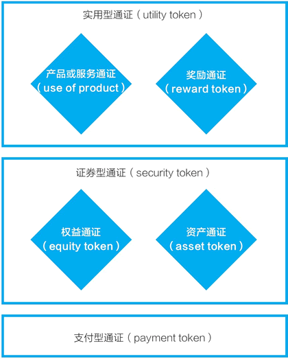

# 通证的分类（各种分类一览表）

通证是全新的事物，目前人们对于通证的分类仍未达成共识。这里将所见的各种分类列举如下，供你参考。

瑞士金融市场监管局（FINMA）将通证分成以下三种：

*   支付类通证（payment）。
*   实用类通证（utility）。
*   资产类通证（asset）。

其中，资产类通证可视为“证券类”（security），有时，实用类也被翻译成“功能类”。

按美国 SEC 的分类方式，通证被分成属于证券与不属于证券两类。SEC 通常用“Howey Test”来判定某一金融工具是否为“投资合同”进而构成“证券”，“Howey Test”包含了四要素：

*   资本投入；
*   投资于一个共同事业；
*   期待获取利润；
*   不直接参与经营，仅仅凭借发起人或第三方的努力。

在一次分享中，知名区块链专家、万向区块链董事长肖风将通证分为功能类、证券类和基金类。也有人从产业的角度将通证分为基础公有链、行业生态类、公司证券类。

通证宝创始人王玮将通证按有发行人和无发行人分成两大类。

*   有发行人的三种是：价值型、收益型、权利型；
*   无发行人的一种是：计算型。计算型是一个有意思的说法，这一名称表明诸如比特币、以太币等都是基于数学计算产生的。

现在通常认为，比特币、以太币等是接近于瑞士金融市场监管局中的支付类型通证分类。除此之外的通证可以按美国 SEC 分类（证券与非证券）延展进行分类。

在 2018 年 7 月的一个分类中，奥黛丽·奈斯比（Audrey Nesbitt）将通证分为两大类、四小类，我认为，这可能是易于在实际项目的通证模型设计中使用的一种分类（见图 1）。其中，两大类之间要进行相对严格的区分，但小类间不必进行明确的区分，她的分类如下：

*   第一大类：实用型通证（utility to ken）。
    *   产品或服务通证（use of product），代表公司的产品或服务的使用权。
    *   奖励通证（reward token），用户通过自己的行为获得奖励。
*   第二大类：证券型通证（security token）。
    *   权益通证（equity token），类似公司的股权、债券等。
    *   资产通证（asset token），对应实体世界中的资产，如不动产、黄金等。

图 1：通证的一种分类
当前市场中交易的通证，多数属于权益通证，但为了不受到当前各国法规中对证券的严格监管的影响，又往往通过各种设计将自己设计为实用型通证。

在相关通证设计中，最为独特的案例是 EOS 币，它是由 Block.one 公司发行的，但它被定义为“商品售卖”，而非公司“权益”。并且特别地，公司又通过免责条款免除了 EOS 币任何和实用性相关的特性。比如，EOS 的相关条款说：EOS 币没有明示或暗示的权利、用途、目的、属性、功能或特征。