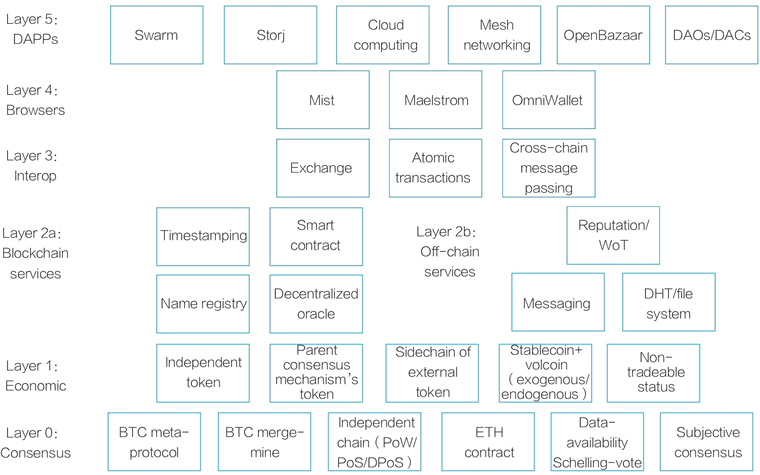
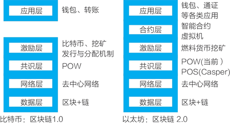

# 以太坊智能合约的技术与组件

要在以太坊上编写一个智能合约，所涉及的技术和组件有：

*   Solidity，以太坊的图灵完备编程语言，用于编写智能合约。
*   虚拟机（Ethereum Virtual Machine，EVM），即智能合约运营的环境。
*   预言机（Oracle），用于链上和链下数据信息的交换。
*   Web3.js，与以太坊区块链节点进行交互的 JavaScript API。

常见的以太坊通证标准有两种：

*   ERC20 标准，可互换通证。
*   ERC721 标准，不可互换通证。

2014 年 12 月 31 日，维塔利克曾画了一张名为“Silos”的图，展示了他理解的以太坊架构（见图 1），从下而上分别是：共识、经济、链上与链下服务、互操作、浏览器、分布式应用（DAPPs）。

一般来说，以太坊的体系架构可分为六层，与比特币系统对比，它的重要特点是把合约层从共识机制中分离出来（见图 2）。

图 1：2014 年版的以太坊架构（维塔利克绘制）

图 2：以太坊的体系架构