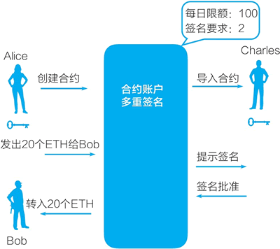

# 以太坊的账户（外部账户和合约账户）

以太坊是有账户的，每个用户都可以开设账户，账户余额是我们拥有的以太币或其他基于 ERC20 标准的通证。账户的设计使得以太坊与比特币不同，根据之前的讨论我们知道，比特币只有钱包地址和未使用的交易输出。

## 以太坊的两种账户：外部账户和合约账户

以太坊有两种账户，如下图所示：

*   外部账户（externally owned accounts），由密钥控制。
*   合约账户（contract accounts），由智能合约的代码控制。

图 1：以太坊的两种账户
以太坊的账户包括四个字段：一个随机数、账户的余额、合约代码（如果有的话）、存储（通常为空）。

只有合约账户才有代码，其中存储的是 codeHash（这个账户的以太坊虚拟机代码的哈希值）。这个字段在生成后是不可修改的，这意味着智能合约代码是不可修改的。

外部账户可以触发交易，而合约账户不能主动发起交易，只能在被触发后按预先编写的智能合约代码执行。

合约账户可以设置多重签名（multisign），比如一个简单示例是：现有一个合约账户，它要求一个转账由发起转账的人（Alice）和另一个人（Charles）签名均可。因此，当 Alice 通过这个合约向 Bob 转账 20 个 ETH 时，合约会通知 Charles 签名，在他签名后，Bob 才可以收到这 20 个 ETH（见图 2）。

图 2：以太坊合约账户的多重签名

## 以太坊的交易和它的区块中存的是什么

和比特币一样，以太坊的区块中存储的也是交易（transaction），它包括的字段主要有：接受者（接受的账户）、发送者的签名、发送者发给接受者的以太币金额等。

与比特币的区块中存储的是交易不同，以太坊的区块中以梅克尔帕特里夏树（Merkle Patricia Tree,MPT）形式存储的是相应的以太坊账户的状态。

以太坊的交易是所谓的状态转换函数，一个交易触发它的执行，它将相应的账户从一个状态转变成新状态，然后新状态被存储在区块链的数据区块中。

参考资料：[`github.com/ethereum/wiki/wiki/White-Paper`](https://github.com/ethereum/wiki/wiki/White-Paper)