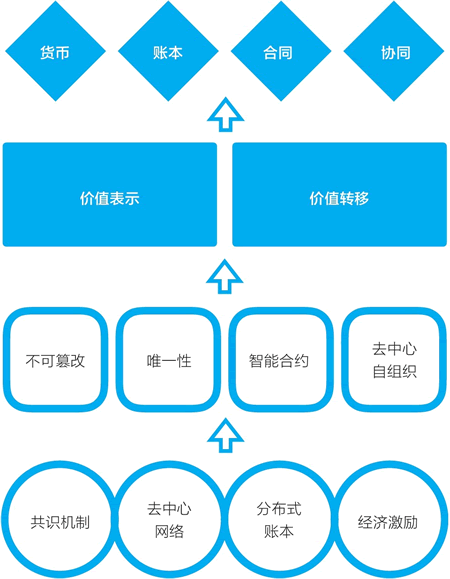
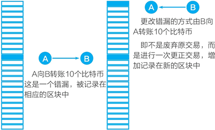
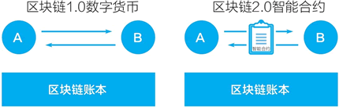
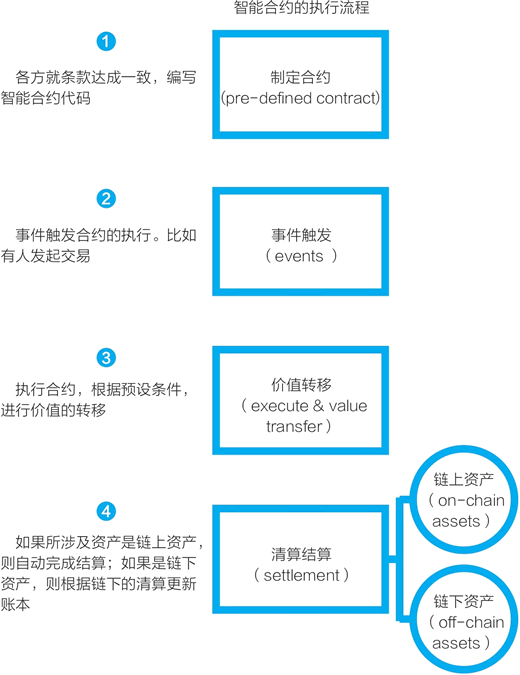
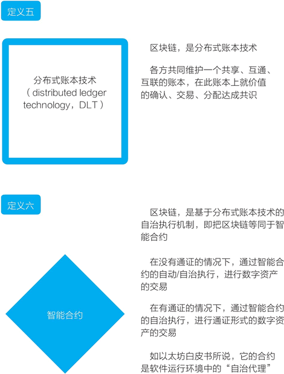
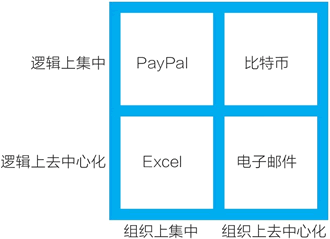

# 区块链的四大特征

在对比特币和以太坊这两个主要系统，讨论了区块链的价值表示和价值转移这两个基础功能，探讨了数字资产、通证与通证经济系统之后，我们再来看看区块链的特征与用途，尝试回答“区块链有什么用”这个问题。答案就藏在区块链的四个基础特性中。

在观察了以太坊带来的变化后，区块链特征以及与这些特征相关的应用已经较为清晰地展现在我们面前。这四个基础特征分别是：不可篡改，不可复制的唯一性，智能合约，去中心自组织或社区化（见图 1）。

区块链不只是技术，它还将从经济、管理、社会层面带来变化，它可能改变人类交易的方式，它将改变货币、账本、合同、协同等方面，这是我们将在后续章节中讨论的。

图 1：一张图看懂区块链：从基础到应用
接下来，我们先分别讨论区块链的这四个基础特性。

## 区块链的四大特征之一：不可篡改

区块链最容易被理解的特性是不可篡改的特性。

不可篡改是基于“区块+链”（block+chain）的独特账本而形成的：存有交易的区块按照时间顺序持续加到链的尾部。要修改一个区块中的数据，就需要重新生成它之后的所有区块。

共识机制的重要作用之一是使得修改大量区块的成本极高，从而几乎是不可能的。以采用工作量证明的区块链网络（比如比特币、以太坊）为例，只有拥有 51% 的算力才可能重新生成所有区块以篡改数据。但是，破坏数据并不符合拥有大算力的玩家的自身利益，这种实用设计增强了区块链上的数据可靠性。

通常，在区块链账本中的交易数据可以视为不能被“修改”，它只能通过被认可的新交易来“修正”。修正的过程会留下痕迹，这也是为什么说区块链是不可篡改的，篡改是指用作伪的手段改动或曲解。

在现在常用的文件和关系型数据中，除非采用特别的设计，否则系统本身是不记录修改痕迹的。区块链账本采用的是与文件、数据库不同的设计，它借鉴的是现实中的账本设计——留存记录痕迹。因此，我们不能不留痕迹地“修改”账本，而只能“修正”账本（见图 2）。

图 2：区块链账本“不能修改、只能修正”
区块链的数据存储被称为“账本”（leger，总账），这是非常符合其实质的名称。区块链账本的逻辑和传统的账本相似。比如，我可能因错漏转了一笔钱给你，这笔交易被区块链账本接受，记录在其中。修正错漏的方式不是直接修改账本，将它恢复到这个错误交易前的状态；而是进行一笔新的修正交易，你把这笔钱转回给我。当新交易被区块链账本接受，错漏就被修正，所有的修正过程都记录在账本之中，有迹可循。

将区块链投入使用的第一类设想正是利用它的不可篡改特性。农产品或商品溯源的应用是将它们的流通过程记录在区块链上，以确保数据记录不被篡改，从而提供追溯的证据。在供应链领域应用区块链的一种设想是，确保接触账本的人不能修改过往记录，从而保障记录的可靠性。

2018 年 3 月，在网络零售集团京东发布的《区块链技术实践白皮书》中，京东认为，区块链技术（分布式账本）的三种应用场景是：跨主体协作，需要低成本信任，存在长周期交易链条。这三个应用场景所利用的都是区块链的不可篡改特性。多主体在一个不可篡改的账本上协作，降低了信任成本。区块链账本中存储的是状态，未被涉及的数据的状态不会发生变化，且越早前的数据越难被篡改，这使得它适用于长周期交易。

## 区块链的四大特征之二：表示价值所需要的唯一性

不管是可互换通证（ERC20），还是不可互换通证（ERC721），又或者是其他提议中的通证标准，以太坊的通证都展示了区块链的一个重要特征：表示价值所需要的唯一性。

在数字世界中，最基本单元是比特，比特的根本特性是可复制。但是价值不能被复制，价值必须是唯一的。之前我们已经讨论过，这正是矛盾所在：在数字世界中，我们很难让一个文件是唯一的，至少很难普遍地做到这一点。这是现在我们需要中心化的账本来记录价值的原因。

在数字世界中，我们没法像拥有现金一样，手上拿着钞票。在数字世界中，我们需要银行等信用中介，我们的钱是由银行账本帮忙记录的。

比特币系统带来的区块链技术可以说第一次把“唯一性”普遍地带入了数字世界，而以太坊的通证将数字世界中的价值表示功能普及开来。

2018 年年初，中国的两位科技互联网企业领袖不约而同地强调了区块链带来的“唯一性”。腾讯主要创始人、CEO 马化腾说：“区块链确实是一项具有创新性的技术，用数字化表达唯一性，区块链可以模拟现实中的实物唯一性。”

百度创始人、CEO 李彦宏说：“区块链到来之后，可以真正使虚拟物品变得唯一，这样的互联网跟以前的互联网会是非常不一样的。”

对于通证经济的探讨和展望正是基于，在数字世界中，在网络基础层次上区块链提供了去中心化的价值表示和价值转移的方式。在以以太坊为代表的区块链 2.0 时代，出现了更通用的价值代表物——通证，从区块链 1.0 的数字现金时期进入到数字资产时期。

## 区块链的四大特征之三：智能合约

从比特币到以太坊，区块链最大的变化是“智能合约”（见图 3）。比特币系统是专为一种数字货币而设计的，它的 UTXO 和脚本也可以处理一些复杂的交易，但有很大的局限性。而维塔利克创建了以太坊区块链，他的核心目标都是围绕智能合约展开的：一个图灵完备的脚本语言、一个运行智能合约的虚拟机（EVM），以及后续发展出来的一系列标准化的用于不同类型通证的智能合约等。

图 3：区块链 2.0 的关键改进是“智能合约”
智能合约的出现使得基于区块链的两个人不只是可以进行简单的价值转移，而可以设定复杂的规则，由智能合约自动、自治地执行，这极大地扩展了区块链的应用可能性。

当前把焦点放在通证的创新性应用上的项目，在软件层面都是通过编写智能合约来实现的。利用智能合约，我们可以进行复杂的数字资产交易。

在讨论以太坊的发展过程时，在冷知识专栏“智能合约”“以太坊的智能合约”中，我们对智能合约进行了很多讨论，在此不再赘述。这里再借维塔利克的讨论，重复一下我们认同的智能合约的软件性质——它相当于一种特殊的服务端后台程序（daemon）。在以太坊白皮书中，维塔利克写道：

（合约）应被看成是存在于以太坊执行环境中的“自治代理”（autonomous agents），它拥有自己的以太坊账户，收到交易信息，它们就相当于被捅了一下，然后它就自动执行一段代码。

智能合约的执行流程如图 4 所示。区块链的第五、第六个定义如图 5 所示。

图 4：智能合约的执行流程
 
图 5：区块链的定义之五、之六

## 区块链的四大特征之四：去中心自组织

区块链的第四大特征是去中心自组织。到目前为止，主要区块链项目的自身组织和运作都与这个特征紧密相关。很多人对区块链项目的理想期待是，它们成为自治运转的一个社区或生态。

匿名的中本聪在完成比特币的开发和初期的迭代开发之后，就完全从互联网上消失了。但他创造的比特币系统持续地运转着：无论是比特币这个加密数字货币，比特币协议即它的发行与交易机制，比特币的分布式账本、去中心网络，还是比特币矿工和比特币开发，都去中心化、自组织地运转着。

我们可以合理地猜测，在比特币之后出现了众多修改参数分叉形成的竞争币、硬分叉形成的比特币现金（BCH），可能都符合中本聪的设想。他选择了“失控”，失控可视为自治的同义词。

到目前为止，以太坊项目仍在维塔利克的“领导”之下，但正如本章一开始讨论的，他是以领导一个开源组织的方式引领着这个项目，就像林纳斯领导开源的 Linux 操作系统和 Linux 基金会一样。

维塔利克可能是对去中心自组织思考得最多的人之一，他一直强调和采用基于区块链的治理方式。2016 年以太坊的硬分叉是他提议的，但需要通过链上的社区投票，获得通过方可施行。在以太坊社区中，包括 ERC20 等在内的众多标准是社区开发者自发形成的。

在《去中心化应用》一书中，作者西拉杰·拉瓦尔（Siraj Raval）还从另一个角度进行了区分，他的这个区分有助于我们更好地理解未来的应用与组织。他从两个维度看现有的互联网技术产品：一个维度是，在组织上是中心化的，还是去中心化的；另一个维度是，在逻辑上是中心化的，还是去中心化的。

他认为：“比特币在组织上去中心化，在逻辑上集中。”而电子邮件系统在组织上和逻辑上都是去中心化的（见图 6）。

图 6：比特币在组织上去中心化，在逻辑上集中
在设想未来的组织时，我们心中的理想原型常是比特币的组织：完全去中心化的自治组织。但在实践过程中，为了效率和能够推进，我们又会略微往中心化组织靠拢，最终找到一个合适的平衡点。

现在，在通过以太坊的智能合约创建和发放通证，并以社区或生态方式运行的区块链项目中，不少项目的理想状态是类似于比特币的组织，但实际情况是介于完全的去中心化组织和传统的公司之间。

在讨论区块链的第四个特征去中心自组织时，其实我们已经在从代码的世界往外走，涉及人的组织与协同了。现在，各种讨论和实际探索也揭示了区块链在技术之外的意义：它可能作为基础设施支持人类的生产组织和协同的变革。这正是区块链与互联网是完全同构的又一例证，互联网也不仅仅是一项技术，它改变了人们的组织和协同。

总的来说，以太坊把区块链带入了新的阶段。在讨论以太坊时，如果要总结两个关键词的话，那么这两个关键词分别是智能合约和通证；而如果只能说一个的话，我会选择“通证”。我会更愿意从互联网的历史中找寻它的意义，重复之前的类比：作为价值表示物的通证，它的角色类似于 HTML。在有了 HTML 之后，建什么样的网站完全取决于我们的想象力。

现在，很多人迫不及待地试图进入区块链 3.0 阶段，即不再仅把区块链用于数字资产的交易，而是希望将区块链应用于各个产业和领域中，从互联网赋能走向区块链赋能，从“互联网+”走向“区块链+”。继续拿信息互联网的发展历程作为对照来展望未来，信息互联网最早是传递文本信息，但它真正的爆发是后来出现的电商、社交、游戏以及和线下结合的 O2O——也就是应用。未来，真正展现区块链价值的也将是各种现在未知的应用。