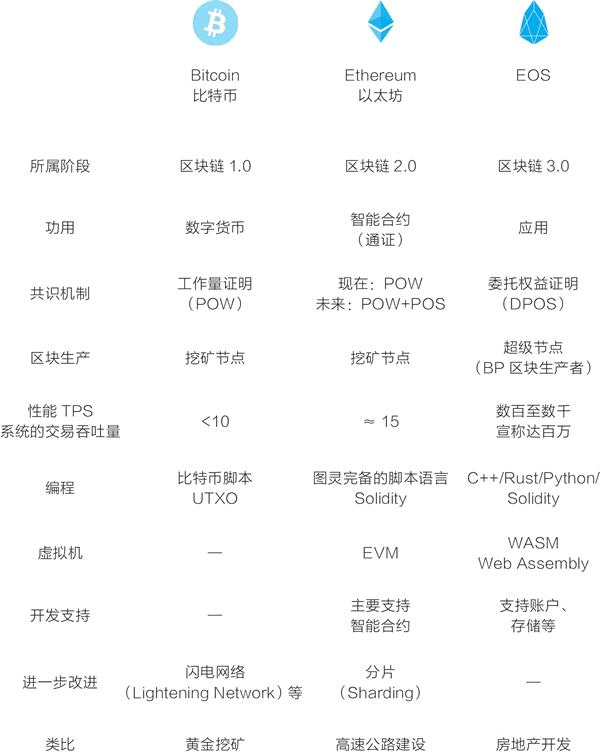
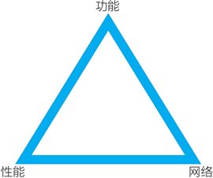

# EOS 是什么？EOS 和比特币、以太坊有什么区别？

现在从加密数字货币的市值看，除了比特币、以太坊等之外，市值最高的项目是企业操作系统（Enterprise Operating System，EOS）。从关注度看，EOS 也是 2017～2018 年的明星项目，并常被认为是区块链 3.0 的主要竞争者。

EOS 是由 Block.one 公司开发的一个新的区块链软件系统，它的目标是将一切去中心化（decentralize everything）。从 2017 年年中开始，经过一年的代币众筹后，它于 2018 年 6 月 15 通过由数十个区块生产者（block producer，BP，又称超级节点）组成的社区上线了主网，EOS 主网这条主要的区块链开始正式运转。

> 通过 EOS Tracker 可以查看 EOS 区块链网络（EOS 主网）的情况，网址为：[`eostracker.io/`](https://eostracker.io/)。对应地，以太坊的网络可通过如下网址查看：[`etherscan.io/`](https://etherscan.io/)；比特币网络可通过以下网址查看：[`blockchain.info/`](https://blockchain.info/)。
> 
> 要注意，虽然有一个 EOS 主网，但实际情况要复杂得多，任何人都可以用 EOS 提供的 EOSIO 开源软件建立自己的一条链，且 EOS 鼓励开发者这么做。

接下来，我们分几个主题介绍 EOS 这个基础公链和它的应用开发。EOS 这个基础公链可说是为应用而生的。

## EOS VS 以太坊

了解 EOS 的方式之一是拿它与以太坊、比特币进行比较。

从开发目标上来讲，比特币、以太坊、EOS 是渐进的，分别是区块链 1.0、区块链 2.0、区块链 3.0，重心分别是货币、合约、应用。以太坊在实际应用中是以通证为主的。以太坊、EOS 均是借鉴与延续之前的思路重新开发，以太坊是比特币的改进，EOS 是以太坊的改进。

这里先用比喻的方式来对比比特币、以太坊、EOS，见下图。

图 1：比特币、以太坊、EOS 的对比
比特币的设计思路类似于黄金。在数字世界中，按工作量证明共识机制，挖矿节点进行加密计算，获得比特币形式的挖矿奖励。挖矿节点也可以获得交易费收益，不过，虽然在比特币网络中的资产价值高，但交易并不频繁，交易费收益目前在矿工收益中的占比并不高。

以太坊的设计思路类似于高速公路。在这条收费高速公路上，车辆行驶需要付费。它早期募集资金，建设“高速公路”，早期投资者享有“高速公路”的主要权益。之后，一起建设与维护“高速公路”的挖矿节点也可以获得挖矿奖励与交易费收益。在以太坊网络中，由于各类项目已经基于它生成了大量的通证，以太坊网络的交易量相对较多，挖矿节点获得的交易费收益占比高于比特币。

EOS 的设计思路则类似于房地产开发。Block.one 公司在将土地售卖出去之后，逻辑上它用获得的资金进行基础的开发，此后每年再以类似填海造田的方式增加 5% 的土地出来。

EOS 的繁荣主要取决于，已经竞购得到大量土地的开发商是不是开发和经营好自己的地块？EOS 网络要依靠超级节点（即区块生产者）来各自建设、共同运营，按现在的设计，这些节点共同获得每年 1% 新增发的 EOS 作为回报。

与以太坊不同，EOS 网络的设计是不再收取网络交易费，持有 EOS 通证则拥有对应的网络使用权利。但是，如果一个应用的开发者不持有足够的 EOS 通证，可能就要从市场中购买和付费租用，以获得使用主网的权利。类比来看，这种设计类似于购买或租用办公楼。

当然，以上用比喻的方式讨论只是为了便于理解。EOS 实际的情况是：Block.one 公司募集资金开发一个名为 EOSIO 的开源软件。EOS 社区用这个软件来运行 EOS 主网，且从逻辑上来讲，这个主网并非由 Block.one 公司运行，而是由社区运行的。另外，其他人也用 EOSIO 这个开源软件建立替代网（altnet）。

> 替代网（altnet）是一个模仿替代币（altcoin）而创造出来的新词。在社区运行的 EOS 主网（mainnet）之外，EOS 鼓励其他人用 EOSIO 开源软件架设新的区块链网络，这些区块链网络是类似于替代币的替代网。比特币的替代币是与比特币的价值无关的，类似地，替代网也与 EOS 主网无关。

EOS 是对以太坊的改进，各个用 EOSIO 开源软件运行起来的区块链网络，可以做几乎所有以太坊能做的事，如编写智能合约、发行通证。

## 为什么 EOS 有超级节点竞选

EOS 所采用的共识机制是 DPOS（委托权益证明），即一些节点在获得足够多的投票支持后，成为见证人（witness）节点或 EOS 中所说的区块生产者（BP，也称超级节点），负责区块链的区块生成。

对于比特币系统，任何人都可以接入网络，以算力竞争记账权利，生成区块。而对于 EOS，只有超级节点才有资格生产区块。这是因为两者所采用的共识机制不同：比特币和以太坊采用的是工作量证明共识机制，而 EOS 采用的是 DPOS（委托权益证明）共识机制。

围绕 POW 与 DPOS 的比较，讨论主要集中在能源消耗、效率、安全等方面。但我们也可以从去中心网络形成的角度来看，为什么 DPOS 是一种可行的选择。

基于区块链的思路开发的软件系统有以下三个关键要求：

*   一是性能。它的去中心网络的整体性能能否支撑大量应用？
*   二是网络。它的共识机制、经济激励和社区运营能否吸引足够多的节点加入，形成一个安全、可靠的去中心网络？
*   三是功能。无论目标是通用类、功能类还是行业类，它是否提供了应用开发所需要的必备功能？

一个基础公链的成败关键正是以上三点：性能、功能与网络（见图 2）。EOS 已经在性能和功能上做了很多努力，而 DPOS 共识机制与超级节点竞选是 EOS 在“网络”这个角上所做的努力。

图 2：基础公链的三角：功能-性能-网络
对比特币和以太坊网络来说，在较长的周期内，它们以挖矿经济激励的方式，逐渐地吸引了足够多的节点加入。对于一些基础公链区块链项目，由于各种原因，它们的主要节点是由基金会或关联方运行的。其中较为典型的是小蚁（NEO），它拥有较大的交易吞吐量（TPS），但官方节点只有不到 10 个。

在 2017 年 12 月的报告中，NEO 理事会提到了其网络的去中心化计划，并解释道：“我们希望至少有 3 个节点由外部的实体运行……去中心化的初期阶段：2 个节点将由 City of Zion 运行，1 个节点将由社区运行，并将由社区资助（独立于基金会），2 个节点将由以盈利为目的的区块链公司运行，2 个节点将由 NEO 理事会运行。”

> NEO 的共识机制是 DBFT，全称为 Delegated Byzantine Fault Tolerant，是一种通过代理投票来实现大规模节点参与共识的拜占庭容错型共识机制（见 NEO 白皮书：[`docs.neo.org/zh-cn/`](http://docs.neo.org/zh-cn/)）。

EOS 则用超级节点竞选的方式来刺激形成一个活跃的去中心网络，并且，超级节点竞选是与其共识机制 DPOS（委托权益证明）高度匹配的。按现在的设计，获得投票的 21 个活跃生产者和 179 个候补生产者一起生产 EOS 这条区块链的区块，即运行这个区块链网络。这些区块生产者是动态的，时刻根据投票动态调整。

> EOS 的区块链生产者的收益分配机制是，区块生产者一共可获得每年新增出来的 1% 的 EOS 通证作为回报，其中 0.25% 按每个区块来进行奖励，0.75% 按所获投票来进行分配。可参见 2018 年 5 月 12 日项目发布的信息。

从 2018 年年初到 6 月 15 日 EOS 主网上线，围绕超级节点（BP）的竞争已经显示了，这个机制相对成功地调动了众多参与者竞争，促成了 EOS 去中心网络的形成。这是一条务实、有效的路径。

从另一个相关的机制设计上，我们也可以看到 EOS 团队的精心设计。与其他代币发行的项目不同，EOS 通证的发行持续了一年之久，这一方面吸引关注，另一方面或许更重要的是，这种做法使得 EOS 通证相对分散地存在于众多持有者手中，在一定程度上保障了它所使用的委托权益证明共识机制的有效性。

## EOS 的体系架构：与比特币、以太坊的对比

在讨论以太坊时，我们对比了比特币和以太坊的架构差异，现在，EOS 被认为是区块链 3.0 的有力竞争者，我们再来看下这三者体系架构的差异。其中，EOS 的体系架构参考了唐煜的文章“从 EOS 系统架构看 BM 的野心”，如图 3 所示。

> 从 EOS 系统架构看 BM 的野心，唐煜/文，2018 年 4 月 24 日，[`mp.weixin.qq.com/s/pJQmZngnginnQL-OwcVMag`](http://从 EOS 系统架构看 BM 的野心)。

图 3：EOS 体系架构
在最基础的层次——数据层和网络层上，EOS 和比特币、以太坊并没有多大的区别。

EOS 的共识机制采用了与之前较为不同的 DPOS（委托权益证明）共识机制。由于采用 DPOS 共识机制，EOS 网络的激励层就可以看成不再单独存在（图中也未表示出来）。EOS 网络每年新增发 5% 的 EOS 币，其中 1% 按一定的规则分配给区块生产者，另外 4% 进入社区的提案系统（worker proposal system）资金池待分配。

EOS 的智能合约和以太坊略有差异，但基本上采取了相似的设计。EOS 的应用也与以太坊相似。因此，对于合约层和应用层，两者是相似的。

EOS 的体系设计的创新在于工具层和生态层。

为了让 EOS 适用于应用开发，EOS 团队为它设计了账户、持续化数据库（Multi-Index DB）等工具与接口。因此，这里延续唐煜的分类，认为在合约层和应用层之间存在一个工具层，这使得在 EOS 区块链上开发应用更为便利。

EOS 的另一个特殊设计在于，它将自己的 EOS 主网和 EOSIO 软件分开，鼓励开发者采用 EOSIO 软件建立行业专用、领域专用的区块链网络（应采用新的网络名），并建立自己的一系列应用。在体系架构的最上层可能出现一个生态层，这一层是采用 EOSIO 软件的区块链，比如专为游戏、物流、金融、社交、能源、医疗开发的公链。