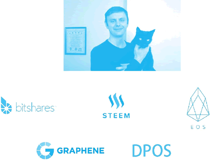

# 丹尼尔·拉瑞莫(BM)：EOS 的主要开发者

EOS 的主要开发者是区块链的传奇人物丹尼尔·拉瑞莫（Daniel Larimer），他的网名为 ByteMaster，在网上他也被称为 BM。BM 个人参与创建了三个主要的区块链公链项目，EOS 是第三个，如下图所示。

图 1：丹尼尔·拉瑞莫开发了三个主要区块链项目与一个共识机制
BM 开发的第一个主要区块链项目是比特股（Bitshares X，BTS），这个项目创建了一个去中心化的银行和交易所，使用区块链账本来创造可互换数字资产，这些资产可以市场化锚定美元、黄金、汽油等任何东西的价值。

这个区块链的共识机制正是所谓的 DPOS 共识机制（[`bitshares.org/technology/delegated-proof-of-stake-consensus/`](https://bitshares.org/technology/delegated-proof-of-stake-consensus/)）。DPOS 是 BM 于 2013 年 12 月 8 日提出的，在同年的 7 月他已经利用这一共识机制开发了比特股。比比特股的 DPOS 共识机制被抽象成了石墨烯（graphene）框架，在业界被广泛使用，技术文档参见：http://docs.bitshares.org/。

BM 开发的第二个主要区块链项目是内容区块链 Steem 和基于它的博客平台 Steemit。在加密数字货币发展的初期，这个博客平台激励了很多关于数字货币、区块链的内容写作。Steem 区块链所采用的共识机制也是 DPOS。

BM 曾经与中本聪在邮件组进行交流，并提出要改变比特币的工作量证明共识机制，以让交易进行得更快。中本聪在回应了去中心化的重要性后，给 BM 的回应成为比特币与区块链世界中的名言：如果你没理解或者不相信，我也没空去说服你，抱歉。（“If you don’t believe me or don’t get it,I don’t have time to try to convince you,sorry.”）在中文世界中，这几句话也被戏谑地翻译并戏称为区块链世界的信条：“爱信信，不信滚。”

BM 曾透露，自己的理想是“找到一个能够保障人们生活、自由和财产安全的自由市场方案”（to find free market solutions to secure life,liberty,and property for all.）。

BM 的故事还可参考如下报道文章：DAN LARIMER:Visionary Programmer of BitShares,Steem and EOS，网址为：[`hackernoon.com/dan-larimer-visionary-programmer-of-bitshares-steem-and-eos-7e6d94b241d7`](https://hackernoon.com/dan-larimer-visionary-programmer-of-bitshares-steem-and-eos-7e6d94b241d7)。

EOS 创始人 BM（Dan Larimer）的小传见：[`zhuanlan.zhihu.com/p/33771609`](https://zhuanlan.zhihu.com/p/33771609)。