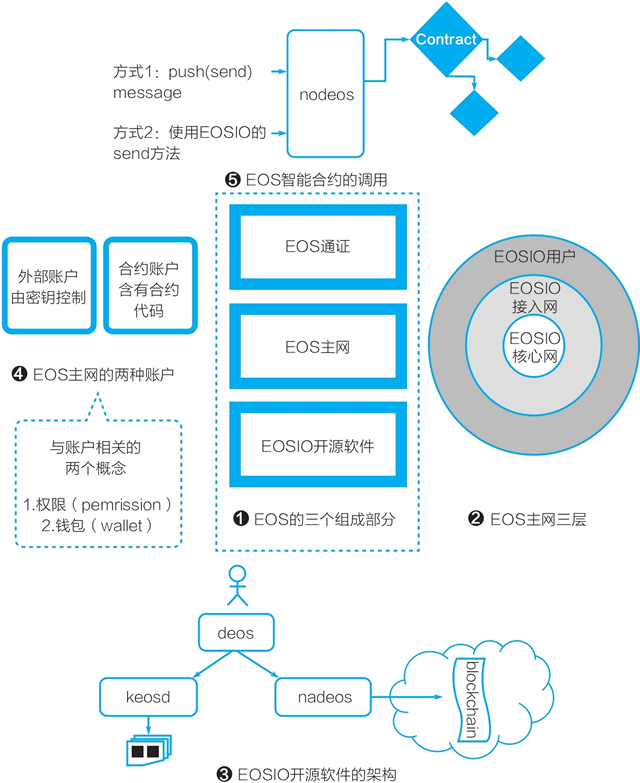

# 一张图理解 EOS 是什么

从比特币到以太坊，再到 EOS，它们背后的组织渐趋复杂。比特币处在完全自运转的状态。以太坊由以太坊基金会开发软件和运转该区块链网络。出于各种原因，EOS 显得更为复杂。初看，它至少包括以下三个部分。

*   第一，EOSIO 软件。这个开源软件是由 Block.one 公司开发的。当然严格来说，这是一个社区开发的开源软件，任何人都可以参与开发、提交代码。
*   第二，EOS 币（EOS 通证）。EOS 币由 Block.one 公司在以太坊上按 ERC20 通证标准发售。按发售条款，发售获得的 ETH 资金归属 Block.one 公司。历时一年的发售于 2018 年 6 月 2 日结束，之后，EOS 币被映射到上线的 EOS 主网上，它现在是 EOS 主网的原生数字货币。
*   第三，EOS 主网。通过竞选，一批区块生产者（BP，超级节点）被选出来，它们启动 EOS 主网。EOS 主网于 2018 年 6 月初由 EOS 社区上线。但可以合理地推测，在 EOS 社区中，Block.one 公司有着非常大的影响力。

在主网之外还出现了一些未获得 EOS 社区广泛认同的，可视为 EOS 替代网（altnet，这是我们造的一个与之前的替代币（altcoin）、替代链（alt chain）相对应的词）。

EOSIO 是一个开源软件，Block.one 公司也支持各方使用这个开源软件来架设自己的区块链网络。不过也出现了一些有争议的替代网，比如有的替代网试图混淆自己与 EOS 主网。开发者还可以用 EOSIO 软件建立单节点测试网、多节点测试网。

到此我们可以看到，EOS 的组成部分与多数基础公链项目一致，包括三个部分（一条链、一个通证、一个软件）：EOS 主网、EOS 通证、EOSIO 开源软件。EOS 主网也是由分布式账本和去中心网络组成的。与其他基础公链的一个较大不同是，它鼓励更多的人在主网之外使用和运行 EOSIO 开源软件。

如图 1 所示，EOS 的主网包括三层：最核心层是由区块生产者（BP）组成的 EOSIO 核心网，中间层是 EOSIO 接入网，外层是 EOSIO 用户。

EOSIO 开源软件包括一系列软件，其中主要有三个：nodeos、cleos、keosd。

*   nodeos：即 EOS 的核心程序，它是 EOS 节点的后台程序。
*   cleos：管理 EOS 区块链和钱包的命令程序。
*   keosd：管理 EOS 钱包的程序。

EOS 主网的账户包括两种：外部账户（由私钥控制的外部账户）和合约账户。和账户相关的概念是钱包与权限，钱包是保存密钥的客户端，而权限包括两个基础权限类别（owner 与 active），应用可自定义各种权限。

图 1：一张图看懂 EOS 区块链与 EOSIO 开源软件

## EOS 的智能合约

EOS 的智能合约是关联在各个合约账户上的。在 EOSIO 系统中，“合约”是沿用了区块链的专业术语，但其含义非常接近于 Linux 操作系统的后台应用，比如节点在启动时会包括四个缺省合约，如 eosio.bios、eosio.token 等。

EOS 的智能合约可以通过两种方式调用，一是用户通过命令调用，二是通过 EOSIO 软件的 send 方法调用。一个账户通过转账等动作触发另一个合约账户中的合约运行之后，这个合约可以通过软件代码调用其他的合约（见图 3-11）。

EOS 智能合约现在是用 C++ 语言编写的，文件格式分别为`*.hpp/*.cpp`，编译后变为 WebAssembly 格式文件 WASM（*.wast）与应用头文件（*.abi）。